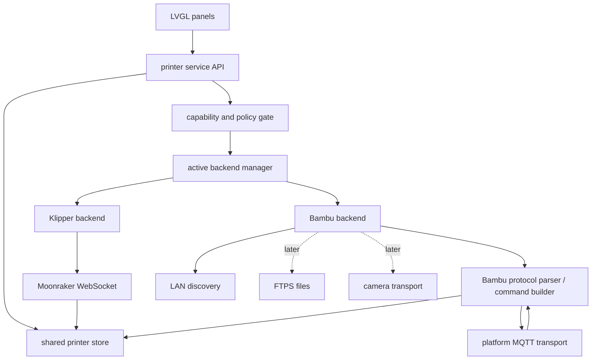

# Bambu Lab 接入调研与架构草案

> 调研日期：2026-09-11
> BambuHelper 参考快照：`a3d8ba46b7e58d5ab05f88ec9ce0cf1d6c9b0c2d`
> 本文是开发前的设计依据，不表示这些非官方协议得到 Bambu Lab 的兼容性承诺。

## 1. 先说结论

Bambu 接入不能只设计成“云端只读、局域网可控”两个布尔分支。至少要分开描述三个维度：

1. **打印机生态**：Klipper 或 Bambu。
2. **连接通道**：Moonraker、Bambu Cloud MQTT 或 Bambu LAN MQTT。
3. **当前能力**：状态、灯光、暂停、温控、移动、文件、摄像头等各自是否可用。

Bambu 的云连接在未获得官方授权的情况下应按**状态监视器**设计。官方资料仍明确保留状态读取，并曾明确保留 LED 控制；打印启动、运动、温控、风扇、AMS 设置和校准等关键操作受授权机制限制。局域网 Developer Mode 会开放 MQTT、视频和 FTP，适合自定义控制器，但这些通信协议仍被官方标注为“不提供正式支持”。因此即使处于 LAN，也必须根据连接结果、机型和固件动态生成能力集合，不能直接假定所有操作都可用。

建议首个可用版本同时完成两条路径：

- **Cloud Monitor**：实时状态、温度、进度、剩余时间、层数、AMS 和故障；产品策略默认不显示控制入口。
- **LAN Developer**：先完成相同的监视能力，再逐项开放已经在真机上验证过的控制。

## 2. 资料可信度

| 等级 | 来源 | 本文如何使用 |
|---|---|---|
| 官方政策 | [Firmware Update Introducing New Authorization Control System](https://blog.bambulab.com/firmware-update-introducing-new-authorization-control-system-2/)、[Updates and Third-Party Integration with Bambu Connect](https://blog.bambulab.com/updates-and-third-party-integration-with-bambu-connect/) | 判断哪些操作受授权限制，以及 Developer Mode 的官方定位 |
| 官方客户端接口 | [BambuStudio `NetworkAgent.hpp`](https://github.com/bambulab/BambuStudio/blob/master/src/slic3r/Utils/NetworkAgent.hpp) | 证明官方 Studio 将网络能力放在独立 Network Plugin 后面；不把它当作开放协议文档 |
| 社区协议文档 | [OpenBambuAPI MQTT](https://github.com/Doridian/OpenBambuAPI/blob/main/mqtt.md)、[FTPS](https://github.com/Doridian/OpenBambuAPI/blob/main/ftp.md)、[TLS](https://github.com/Doridian/OpenBambuAPI/blob/main/tls.md)、[Video](https://github.com/Doridian/OpenBambuAPI/blob/main/video.md) | 整理线上的消息格式、端口和常见命令；实现后必须真机验证 |
| 中国区登录对照 | [OpenBambuAPI Cloud HTTP](https://github.com/Doridian/OpenBambuAPI/blob/main/cloud-http.md)、[中国区登录流程样例](https://gist.github.com/crhan/144811b5f2c2b688f377474e7b9ecb17) | 对照手机号、短信验证码和验证码登录的请求字段；仍须用真实账号验证 |
| 重点参考实现 | [Keralots/BambuHelper](https://github.com/Keralots/BambuHelper/tree/a3d8ba46b7e58d5ab05f88ec9ce0cf1d6c9b0c2d) | 核对 ESP32 上的 TLS/MQTT 内存、云端保活、增量状态合并、发现和多机型数据差异 |

官方没有公开一套稳定、完整、面向普通开源硬件的 Bambu API。合作伙伴技术资料需要另外联系 Bambu Lab。下面标为“社区协议”的内容可能随固件和云服务变化。

## 3. 官方授权边界

2025 年的官方说明把以下操作列为需要授权的关键操作：

- 绑定和解绑打印机；
- 启动远程视频；
- 固件升级；
- 通过 LAN 或云端发起打印；
- 运动、温度、风扇、AMS 设置和校准等控制。

官方明确表示状态推送不受该机制影响，例如 Home Assistant 使用的 MQTT 状态；同一份 FAQ 还列出了温度、位置、速度等读取和 LED 控制。暂停、继续、取消并没有得到足够清晰的逐项承诺，本项目应先视为受限控制，只有收到成功响应并完成真机验证后才开放。

Developer Mode 的官方描述是手动开放 MQTT、直播和 FTP，由用户自行承担局域网安全责任。它与“是否登录云账号”不是同一个概念，也不应在配置里合并为同一个字段。新机型和不同固件上的菜单名称、是否要求 LAN-only、开放的端口都可能不同，所以设置页只说明前置条件，最终权限由运行时探测决定。

## 4. 已知通信面

### 4.1 MQTT 连接

社区协议和 BambuHelper 当前实现一致使用 MQTT over TLS 端口 `8883`。

| 通道 | Broker | 用户名 | 密码/凭据 | TLS |
|---|---|---|---|---|
| LAN | `printer_ip:8883` | `bblp` | 打印机 LAN access code | 应信任 Bambu CA，并用打印机序列号做 SNI/证书名称校验 |
| Cloud（欧美） | `us.mqtt.bambulab.com:8883` | `u_{user_id}` | Bambu access token | 公网 CA 完整校验 |
| Cloud（中国） | `cn.mqtt.bambulab.com:8883` | `u_{user_id}` | Bambu access token | 公网 CA 完整校验 |

不要照搬 BambuHelper 在 LAN 上直接 `setInsecure()` 的做法。OpenBambuAPI 已记录 Bambu CA 和序列号 SNI 的校验方式；如果某个平台暂时无法完成主机名校验，应把降级行为限制在明确的兼容选项里，而不是默认关闭证书校验。

### 4.2 MQTT Topic 与消息封装

| Topic | 方向 | 用途 |
|---|---|---|
| `device/{serial}/report` | 打印机 → 客户端 | 状态增量、完整状态、命令应答 |
| `device/{serial}/request` | 客户端 → 打印机 | 请求完整状态或发送控制命令 |

请求基本格式：

```json
{
  "pushing": {
    "sequence_id": "1",
    "command": "pushall",
    "version": 1,
    "push_target": 1
  }
}
```

命令应答通常在同一业务对象中带回相同 `sequence_id`、`result` 和可选 `reason`。实现必须用序列号关联应答，不能把 MQTT publish 成功当作打印机已经执行成功。

### 4.3 状态是“完整快照 + 增量”

`pushing.pushall` 请求完整状态，常规上报通常是 `print.command = push_status`。P1/A1 等机型会只发送发生变化的字段，因此解析器必须把消息作为 patch 合入当前状态，缺字段表示“保持原值”，不能清零。

首版需要解析的公共字段：

| 公共模型 | Bambu 常见字段 |
|---|---|
| 打印状态 | `gcode_state`、`mc_print_stage`、`print_error`、`hms` |
| 文件与进度 | `subtask_name` / `gcode_file`、`mc_percent`、`layer_num`、`total_layer_num`、`mc_remaining_time` |
| 温度 | `nozzle_temper`、`nozzle_target_temper`、`bed_temper`、`bed_target_temper`、`chamber_temper` |
| 速度与风扇 | `spd_lvl`、`spd_mag`、`cooling_fan_speed`、`big_fan1_speed`、`big_fan2_speed`、`heatbreak_fan_speed` |
| 设备状态 | `wifi_signal`、`lights_report`、`ipcam`、门状态（字段依机型变化） |
| AMS | `ams.ams[]`、tray、当前/目标 tray、湿度、温度、剩余量和烘干状态 |

完整状态消息会明显大于 Moonraker 的常规增量。BambuHelper 为 MQTT payload 预留 `40 KiB`，并记录 H2C 加三套 AMS 的消息约 `33 KiB`。本项目应默认允许 `48 KiB` 可配置上限，并支持 ESP-MQTT 的分片重组；有 PSRAM 时优先放 PSRAM，无 PSRAM 板型只维持一个活动打印机连接。

`pushall` 只在首次连接、状态恢复和明确的手动刷新时使用。OpenBambuAPI 对 P1P 给出的经验限制是不应高于每五分钟一次；BambuHelper 也为云端恢复设计了更低频率。不要用固定 30 秒轮询代替增量订阅。

### 4.4 已知控制命令

以下是社区协议中已有实现或样例的能力。表中的“首版策略”是本项目的产品决策，不表示协议本身做不到。

| 能力 | Bambu 消息 | Cloud Monitor | LAN Developer | 首版策略 |
|---|---|---:|---:|---|
| 请求完整状态 | `pushing.pushall` | 是，限频 | 是，限频 | 实现 |
| 灯光 | `system.ledctrl` | 官方曾明确保留 | 是 | Cloud 默认仍隐藏，LAN 可开放 |
| 暂停/继续/取消 | `print.pause` / `resume` / `stop` | 不作承诺 | 通常可用 | 真机验证后开放 |
| 打印速度档 | `print.print_speed`，1..4 | 不作承诺 | 通常可用 | 真机验证后开放 |
| 喷嘴/热床温度 | `print.gcode_line` 中的 `M104` / `M140` | 受限 | Developer Mode 下待验证 | 第二批开放 |
| 点动/归位/挤出 | `print.gcode_line` | 受限 | Developer Mode 下待验证 | 单独真机验证，不与温控一起放开 |
| 发起 SD 卡打印 | `print.project_file` / `gcode_file` | 受限 | 依机型和文件格式 | 文件层完成后再做 |
| AMS 设置/换料 | 多个 `print.ams_*` 命令 | 受限 | 依机型 | 后续专用 UI |

**Bambu 的 `print.stop` 只是取消当前任务，不能当作 Klipper 的 `M112` 紧急停止。** 在找到并验证等价语义前，Bambu 模式下必须隐藏或禁用“急停”，也不能把“固件重启”按钮映射成不相关命令。

### 4.5 发现、文件和视频

- **发现**：BambuHelper 同时监听 `239.255.255.250:1990` 和 `:2021` 的 SSDP 风格广播，从 `USN`、`Location`、`DevName.bambu.com` 和 `DevModel.bambu.com` 取序列号、IP、名称和型号。发现只能帮助填写地址，不能证明控制权限。
- **文件**：社区协议记录的传统 LAN 文件通道是 implicit FTPS `990`，用户名 `bblp`，密码为 access code。新机型可能使用不同的隧道或关闭传统通道，应通过能力探测隔离。
- **视频**：P1/A1 常见为 TLS `6000` 上的 JPEG 帧；X1 和部分新机型使用 RTSPS `322`。视频协议、授权和内存开销差异很大，不进入首版核心范围。

## 5. Cloud Monitor 的认证设计与当前实现

BambuHelper 支持账号密码、邮件验证码和手工 token，并通过账号接口取得用户 ID 与绑定设备列表。它使用的登录端点和网页代理行为不是公开稳定 API，不适合直接固化进首版固件。

Windows 桌面端现已实现首个可测试闭环：

1. 登录页可切换中国区（`.cn`）和全球区（`.com`）。
2. 全球区使用 Email；中国区允许手机号和 Email 二选一。两者都支持密码登录，验证码登录分别走短信和邮件；密码登录后也支持验证器应用提供的 TFA 验证码。
3. 登录成功后立即读取账号绑定的打印机列表，并把用户选择的序列号、型号和名称关联到当前打印机槽位。
4. 密码和验证码只存在于当前进程内存，工作线程用完立即清零；不会写入配置或日志。
5. access token 和账号使用 Windows DPAPI 加密后存入独立的 `bambu_cloud.secret`，不进入 `moonraker.conf`。退出登录会清空该文件。
6. 网络请求在独立工作线程执行，LVGL 线程只读取加锁快照，因此慢连接不会阻塞界面或旋钮。
7. Windows 产品端使用 MQTT 3.1.1 over TLS 订阅所选机器的
   `device/{serial}/report`，连接后发送一次 `pushall`，随后把
   `push_status` 当作增量 patch 合并。TLS 使用 Windows 系统根证书并校验 Broker
   主机名；OpenSSL 静态链接，不给发行包增加运行时 DLL。
8. 已接入公共打印机模型的实时字段包括打印状态、任务名、进度、剩余时间、层数、
   喷嘴和热床的当前/目标温度。云端能力集合仍为只读，状态同步不会开放控制按钮。

access token 可能是 JWT，也可能是不能本地解析的短令牌。实时通道优先从 JWT
载荷读取 `uid/sub/user_id`；失败时在线程中调用 Profile API 取得 `uidStr/uid`，
避免在 LVGL 线程中等待网络。Bambu 云只提供剩余分钟而没有可靠的已用时间字段，
当前 UI 用进度与剩余时间估算“已用”，其余数据均直接来自打印机上报。

当前登录链路基于 BambuHelper 和中国区登录样例使用的网页/API 组合：密码及验证码登录走
`/v1/user-service/user/login`；邮件验证码走 `sendemail/code`，中国区短信验证码走
`sendsmscode`。验证器 TFA 先从网站端取得 CSRF Cookie，再提交
`/api/sign-in/tfa`；设备列表使用网站代理下的
`/api/v1/iot-service/api/user/bind`。这些仍是非官方稳定接口，后续变化应只影响
`bambu_cloud` 端口层。

嵌入式端当前仍保留空实现，避免把账号密码键盘和会变化的网页认证协议塞进固件。
下一阶段把桌面端取得的 cloud profile 配对到 ESP32 时遵守以下边界：

1. 固件只接受 `region + user_id + access_token + printer_serial`，不保存 Bambu 账号密码。
2. 如果官方网页接口变化，只更新桌面端登录模块，不迫使所有 ESP32 固件跟着变化。
3. UI 明确展示“凭据已过期/认证失败”，不要只显示“打印机离线”。
4. 同一账号的 token 是账户级凭据，多个打印机槽只引用一个 cloud profile，不重复存六份。
5. 日志、诊断页和崩溃信息永远不输出 token、access code 或完整账号 ID。

秘密存储不应继续塞进当前 `moonraker.conf`：token 可接近 1 KiB，而且普通文本文件没有保护。Windows 已使用 DPAPI 独立保存；ESP32 配对阶段再增加独立 NVS blob。如果设备未启用 flash encryption，设置页需要诚实说明物理读取仍可能取得凭据。

## 6. 现有代码的问题

当前 UI 已经只通过 `printer.h` 读取大部分打印机状态，这是正确的起点；但实现仍把“公共打印机模型”和“Klipper 后端”写在同一个 `printer_model.c` 中：

- 初始化函数直接启动 `moonraker_start()`；
- 控制函数直接生成 Klipper G-code 或调用 `klipper_api`；
- 文件列表直接调用 Moonraker RPC；
- 连接状态和 RTT 的注释、错误文本、枚举都带 Moonraker/Klippy 语义；
- `panel_main.c`、`panel_printers.c`、`panel_moonraker.c` 仍有少量直接依赖 Moonraker。

如果直接往这些函数里加入 `if (Bambu)`，协议分叉会扩散到每个 UI 面板，而且 Cloud Monitor 的禁用逻辑只能靠面板各自记住。后续添加 AMS、双喷头、摄像头时会再次失控。

## 7. 目标架构



### 7.1 `printer_store`：只保存领域状态

把当前 `printer_model.c` 拆成不认识 Moonraker 和 MQTT 的状态仓库。建议用一次快照代替继续增加全局 getter：

```c
typedef struct {
    uint32_t revision;
    printer_state_t state;
    printer_connection_state_t connection;
    printer_capabilities_t capabilities;

    printer_temperature_t nozzle[2];
    uint8_t nozzle_count;
    printer_temperature_t bed;
    printer_temperature_t chamber;

    int progress_permille;
    uint32_t elapsed_s;
    uint32_t remaining_s;
    uint32_t layer_current;
    uint32_t layer_total;
    char job_name[96];

    printer_ams_state_t ams;
    printer_error_t last_error;
} printer_snapshot_t;
```

现有 `printer_temp_ext()` 等访问器先继续保留，并从快照读取，避免一次改完所有面板。后端只能提交 patch 或连接事件，不能直接操作 LVGL 对象。

### 7.2 `printer_backend`：生命周期和命令映射

```c
typedef struct printer_backend_vtable {
    bool (*start)(const printer_profile_t *profile);
    void (*stop)(void);
    void (*poll)(void);
    printer_capabilities_t (*capabilities)(void);
    printer_cmd_result_t (*command)(const printer_command_t *cmd);
    bool (*files_refresh)(printer_files_cb cb, void *ud);
} printer_backend_vtable_t;
```

后端管理器只运行当前槽位的一个连接。切换打印机时按 `stop old → clear transient state → start new` 执行，避免 CYD 一类无 PSRAM 板为六个槽位同时维持 TLS/MQTT 会话。后台多打印机监控以后再作为可选能力增加。

### 7.3 能力集合，而不是模式判断

```c
enum {
    PRINTER_CAP_STATUS          = 1ull << 0,
    PRINTER_CAP_JOB_PROGRESS    = 1ull << 1,
    PRINTER_CAP_AMS_READ        = 1ull << 2,
    PRINTER_CAP_LIGHT_CONTROL   = 1ull << 3,
    PRINTER_CAP_PAUSE           = 1ull << 4,
    PRINTER_CAP_RESUME          = 1ull << 5,
    PRINTER_CAP_CANCEL          = 1ull << 6,
    PRINTER_CAP_TEMP_CONTROL    = 1ull << 7,
    PRINTER_CAP_MOVE            = 1ull << 8,
    PRINTER_CAP_EXTRUDE         = 1ull << 9,
    PRINTER_CAP_FILES           = 1ull << 10,
    PRINTER_CAP_PRINT_START     = 1ull << 11,
    PRINTER_CAP_EMERGENCY_STOP  = 1ull << 12,
    PRINTER_CAP_CAMERA          = 1ull << 13,
};
```

能力来自三层交集：

```text
编译进固件的功能 ∩ 当前连接策略允许的功能 ∩ 真机/固件确认可用的功能
```

UI 只查询能力位。控制命令返回 `QUEUED / OFFLINE / UNSUPPORTED / AUTH_REQUIRED / REJECTED / INVALID`，界面据此禁用入口或展示明确原因。MQTT 返回 `access_denied` 等结果时，后端立即撤掉对应动态能力，不能让用户反复点击一个必然失败的按钮。

### 7.4 推荐目录

```text
src/core/printer/
  printer_service.c
  printer_store.c
  printer_backend.h
  printer_types.h
  backend_klipper.c

src/core/bambu/
  backend_bambu.c
  bambu_protocol.c
  bambu_status.c
  bambu_commands.c
  bambu_discovery.h
  bambu_cloud_profile.c

src/ports/esp32/bambu/
  bambu_mqtt_esp32.c
  bambu_discovery_esp32.c

src/ports/desktop/bambu/
  bambu_mqtt_desktop.c
  bambu_discovery_desktop.c
```

协议解析和命令构造保持纯 C、无 LVGL、无 socket 依赖。这样 Windows 模拟器可以喂固定 MQTT fixture，Windows 产品和 ESP32 再各自接真实 transport。

## 8. 配置模型

当前 `machine_mode_N` 已经是每槽字段，但 Bambu 配置不能继续借用 `host_N/port_N/api_key_N` 的 Moonraker 语义。建议迁移成通用打印机 profile，并保留旧文件自动导入：

```ini
active=2

slot_0_type=klipper
slot_0_name=Voron
slot_0_host=192.168.1.20
slot_0_port=7125
slot_0_api_key=

slot_2_type=bambu
slot_2_name=P1S
slot_2_bambu_link=lan
slot_2_host=192.168.1.35
slot_2_serial=01P...
slot_2_secret_ref=bambu_lan_2

slot_3_type=bambu
slot_3_name=X1C Cloud
slot_3_bambu_link=cloud
slot_3_serial=00M...
slot_3_cloud_profile=0
```

`printers.conf` 只保存非秘密配置；access code、token 放 `bsp_secret`。`bambu_link` 与 `machine type` 分开，使同一台 Bambu 打印机以后可以在 LAN 不可达时切换到 Cloud Monitor，而不会把它伪装成另一种机型。

设置页建议流程：

- 选择 **Klipper / Bambu**；
- Bambu 下选择 **局域网控制 / 云端监视**；
- LAN 页面提供扫描，选中后自动填写 IP、序列号、名称和型号，再输入 access code；
- Cloud 页面选择区域和云账号 profile，再从账号设备列表选择序列号；
- 连接成功后显示实际能力，例如“状态、AMS、灯光、暂停可用；温控被固件拒绝”。

## 9. Kconfig 边界

建议增加：

```text
CONFIG_KR_BACKEND_BAMBU
CONFIG_KR_BAMBU_LAN
CONFIG_KR_BAMBU_CLOUD_MONITOR
CONFIG_KR_BAMBU_DISCOVERY
CONFIG_KR_BAMBU_MQTT_BUFFER_SIZE=49152
CONFIG_KR_BAMBU_FILES             # 后续
CONFIG_KR_BAMBU_CAMERA            # 后续，依赖 PSRAM/大屏
```

Cloud 登录网页、保存账号密码和摄像头不应成为默认固件的一部分。桌面产品编译 Klipper、LAN Bambu 和 Cloud Monitor；嵌入式板型可按 flash/RAM 关闭 Cloud、文件或摄像头，但公共 UI 和能力判断保持一致。

## 10. 实施顺序

### 阶段 A：无行为变化的核心拆分

- 建立 `printer_store`、backend vtable、能力位和带结果的命令 API；
- 把现有 Moonraker 实现装进 Klipper backend；
- 清除 UI 对 `moonraker_client.h` 的直接依赖；
- Windows 产品、模拟器和四个 ESP32 目标保持现有行为。

### 阶段 B：Bambu 状态最小闭环

- Bambu profile、secret 接口、LAN discovery；
- MQTT transport、分片重组、TLS、report/request topic；
- `pushall` + `push_status` 增量合并；
- 使用保存的 MQTT fixture 在 Windows 模拟器展示温度、状态、进度和 AMS；
- 真机只读验证 LAN 与 Cloud 各一台。

### 阶段 C：LAN 基础控制

- 灯光、暂停、继续、取消、速度档；
- 对每条命令检查对应 `sequence_id/result/reason`；
- 真机成功后才设置能力位；
- 温控、点动、归位和挤出分别验证，避免一次开放整组高风险控制。

### 阶段 D：文件与启动打印

- FTPS 文件列表和删除；
- 解析 3MF plate/AMS mapping；
- 为 Bambu 单独设计启动打印确认页，不能复用 Klipper 的“文件名 → 立即打印”参数模型；
- 新机型如果不提供传统 FTPS，能力保持关闭，不在协议层伪装成功。

### 阶段 E：扩展能力

- 摄像头；
- AMS 换料和耗材设置；
- 双喷头、腔温和新机型专有字段；
- 可选的多打印机后台监控。

## 11. 开工前需要确认的产品决定

1. **Cloud Monitor 是否严格只读**：建议首版连官方仍允许的 LED 控制也隐藏，使“云端监视”语义清楚；以后可以单独增加“允许云端灯光”。
2. **首批 LAN 控制范围**：建议先做灯光、暂停/继续/取消、速度，再做温控；运动、挤出和发起打印等待真机逐项验证。
3. **云凭据入口**：建议首版手工 token，随后由 Windows 配对助手登录并写入 ESP32；不在 ESP32 的 HTTP 页面收账号密码。
4. **首批真机矩阵**：至少需要一台 P/A/X 系列 Developer Mode 机器。H2/P2 等新机型由运行时探测支持，不在第一版写死“完整控制”。
5. **急停 UI**：在 Bambu 没有已验证的等价命令前隐藏急停，保留普通“取消打印”。

确认这些决定后，先实施阶段 A，再用 Bambu MQTT fixture 做阶段 B；这样第一次接真机时验证的是协议和模型，不会同时承担 UI、配置和旧 Klipper 回归三类问题。
