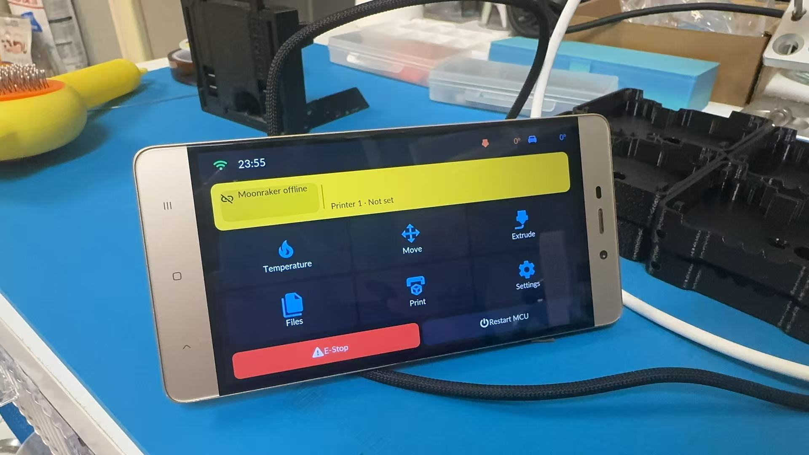

# Supported boards

| Board | Build target | Display | Touch | MCU / Flash | Status |
|---|---|---|---|---|---|
| [CYD 2432S028R](#cyd-2432s028r) | `cyd_2432s028r` | 2.8" 240×320 ILI9341 SPI | XPT2046 resistive | ESP32 / 4MB | ✅ Stable |
| [CYD 2432S028R-PLUS](#cyd-2432s028r-plus) | `cyd_2432s028r_plus` | 2.8" 240×320 ST7789 SPI | XPT2046 resistive | ESP32-WROOM-32E / 4MB | 🆕 New, CYD pinout |
| [E32R35T](#e32r35t) | `e32r35t` | 3.5" 320×480 ST7796U SPI | XPT2046 resistive | ESP32-32E / 4MB | ✅ Stable |
| [esp32s3-st7789-320_240-ec11](#esp32s3-st7789-320_240-ec11) | `esp32s3-st7789-320_240-ec11` | 240×320 ST7789 SPI | None, rotary only | ESP32-S3 N16R8 / 16MB | ✅ Official reference, contributor tested |
| [esp32-st7735s-128_160-ec11](#esp32-st7735s-128_160-ec11) | `esp32-st7735s-128_160-ec11` | 1.8" 128×160 ST7735S SPI | None, rotary only | ESP32 / 4MB | 🆕 New, CYD-compatible pinout |
| [esp32-st7789-320_240-ec11](#esp32-st7789-320_240-ec11) | `esp32-st7789-320_240-ec11` | 240×320 ST7789 SPI | None, rotary only | ESP32 / 4MB | 🆕 New, CYD-compatible pinout |
| [esp32-ILI9341-320_240-ec11](#esp32-ili9341-320_240-ec11) | `esp32-ILI9341-320_240-ec11` | 240×320 ILI9341 SPI | None, rotary only | ESP32 / 4MB | 🆕 New, CYD-compatible pinout |
| [esp32-ST7796-320_240-ec11](#esp32-st7796-320_240-ec11) | `esp32-ST7796-320_240-ec11` | 240×320 ST7796 SPI | None, rotary only | ESP32 / 4MB | 🆕 New, CYD-compatible pinout |
| [esp32s3-st7796-480_320-xpt2046-ec11](#esp32s3-st7796-480_320-xpt2046-ec11) | `esp32s3-st7796-480_320-xpt2046-ec11` | 480×320 ST7796S SPI | XPT2046 resistive (shared bus) + EC11 | ESP32-S3 N16R8 / 16MB | 🆕 New |
| [esp32s3-ILI9488-480_320-xpt2046-ec11](#esp32s3-ili9488-480_320-xpt2046-ec11) | `esp32s3-ILI9488-480_320-xpt2046-ec11` | 3.5" 480×320 ILI9488 SPI | XPT2046 resistive (shared bus) + EC11 | ESP32-S3 N16R8 / 16MB | 🆕 New, MKS PI-TS35 |
| [esp32s3-ILI9341-320_240-xpt2046-ec11](#esp32s3-ili9341-320_240-xpt2046-ec11) | `esp32s3-ILI9341-320_240-xpt2046-ec11` | 320×240 ILI9341 SPI | XPT2046 resistive (shared bus) + EC11 | ESP32-S3 N16R8 / 16MB | 🆕 New |
| [JC8048W550](#jc8048w550) | `jc8048w550` | 5" 800×480 ST7262 RGB parallel | GT911 capacitive | ESP32-S3 / 16MB | ✅ Stable |
| [SenseCAP Indicator](#sensecap-indicator) | `esp32s3-sensecap-indicator` | 4" 480×480 ST7701S RGB parallel | FT5x06 capacitive | ESP32-S3 N8R8 / 8MB | 🆕 New |
| [JLC SZP ESP32-S3](#jlc-szp-esp32-s3) | `esp32s3-JLC-SZP` | 2.0" 240×320 ST7789 SPI | FT6336 capacitive | ESP32-S3 N16R8 / 16MB | ✅ Verified |
| [esp32s3-retro-go](#esp32s3-retro-go) | `esp32s3-retro-go` | 3.2" 240×320 ST7789 SPI | None, GPIO buttons | ESP32-S3 / 16MB | 🆕 New |
| [esp32c3-st7789-320_240-ec11](#esp32c3-st7789-320_240-ec11) | `esp32c3-st7789-320_240-ec11` | 240×320 ST7789 SPI | None, rotary only | ESP32-C3 / 4MB | 🆕 New, LuatOS CORE & Super Mini |

Flash packages are named `ESP-IDFv5.5-<board>.zip` (asset names carry no version, so the links below always point to the latest stable release). Please report problems in [Issues](https://github.com/umeiko/KlipperScreen-esp/issues).

| Board | Flash package (latest stable) |
|---|---|
| CYD 2432S028R | [ESP-IDFv5.5-cyd_2432s028r.zip](https://github.com/umeiko/KlipperScreen-esp/releases/latest/download/ESP-IDFv5.5-cyd_2432s028r.zip) |
| CYD 2432S028R-PLUS | [ESP-IDFv5.5-cyd_2432s028r_plus.zip](https://github.com/umeiko/KlipperScreen-esp/releases/latest/download/ESP-IDFv5.5-cyd_2432s028r_plus.zip) |
| E32R35T | [ESP-IDFv5.5-e32r35t.zip](https://github.com/umeiko/KlipperScreen-esp/releases/latest/download/ESP-IDFv5.5-e32r35t.zip) |
| esp32s3-st7789-320_240-ec11 | [ESP-IDFv5.5-esp32s3-st7789-320_240-ec11.zip](https://github.com/umeiko/KlipperScreen-esp/releases/latest/download/ESP-IDFv5.5-esp32s3-st7789-320_240-ec11.zip) |
| esp32-st7735s-128_160-ec11 | [ESP-IDFv5.5-esp32-st7735s-128_160-ec11.zip](https://github.com/umeiko/KlipperScreen-esp/releases/latest/download/ESP-IDFv5.5-esp32-st7735s-128_160-ec11.zip) |
| esp32-st7789-320_240-ec11 | [ESP-IDFv5.5-esp32-st7789-320_240-ec11.zip](https://github.com/umeiko/KlipperScreen-esp/releases/latest/download/ESP-IDFv5.5-esp32-st7789-320_240-ec11.zip) |
| esp32-ILI9341-320_240-ec11 | [ESP-IDFv5.5-esp32-ILI9341-320_240-ec11.zip](https://github.com/umeiko/KlipperScreen-esp/releases/latest/download/ESP-IDFv5.5-esp32-ILI9341-320_240-ec11.zip) |
| esp32-ST7796-320_240-ec11 | [ESP-IDFv5.5-esp32-ST7796-320_240-ec11.zip](https://github.com/umeiko/KlipperScreen-esp/releases/latest/download/ESP-IDFv5.5-esp32-ST7796-320_240-ec11.zip) |
| esp32s3-st7796-480_320-xpt2046-ec11 | [ESP-IDFv5.5-esp32s3-st7796-480_320-xpt2046-ec11.zip](https://github.com/umeiko/KlipperScreen-esp/releases/latest/download/ESP-IDFv5.5-esp32s3-st7796-480_320-xpt2046-ec11.zip) |
| esp32s3-ILI9488-480_320-xpt2046-ec11 | [ESP-IDFv5.5-esp32s3-ILI9488-480_320-xpt2046-ec11.zip](https://github.com/umeiko/KlipperScreen-esp/releases/latest/download/ESP-IDFv5.5-esp32s3-ILI9488-480_320-xpt2046-ec11.zip) |
| esp32s3-ILI9341-320_240-xpt2046-ec11 | [ESP-IDFv5.5-esp32s3-ILI9341-320_240-xpt2046-ec11.zip](https://github.com/umeiko/KlipperScreen-esp/releases/latest/download/ESP-IDFv5.5-esp32s3-ILI9341-320_240-xpt2046-ec11.zip) |
| JC8048W550 | [ESP-IDFv5.5-jc8048w550.zip](https://github.com/umeiko/KlipperScreen-esp/releases/latest/download/ESP-IDFv5.5-jc8048w550.zip) |
| SenseCAP Indicator | [ESP-IDFv5.5-esp32s3-sensecap-indicator.zip](https://github.com/umeiko/KlipperScreen-esp/releases/latest/download/ESP-IDFv5.5-esp32s3-sensecap-indicator.zip) |
| JLC SZP ESP32-S3 | [ESP-IDFv5.5-esp32s3-JLC-SZP.zip](https://github.com/umeiko/KlipperScreen-esp/releases/latest/download/ESP-IDFv5.5-esp32s3-JLC-SZP.zip) |
| esp32s3-retro-go | [ESP-IDFv5.5-esp32s3-retro-go.zip](https://github.com/umeiko/KlipperScreen-esp/releases/latest/download/ESP-IDFv5.5-esp32s3-retro-go.zip) |
| esp32c3-st7789-320_240-ec11 | [ESP-IDFv5.5-esp32c3-st7789-320_240-ec11.zip](https://github.com/umeiko/KlipperScreen-esp/releases/latest/download/ESP-IDFv5.5-esp32c3-st7789-320_240-ec11.zip) |
| Windows desktop simulator | [desktop-win-x86_64.zip](https://github.com/umeiko/KlipperScreen-esp/releases/latest/download/desktop-win-x86_64.zip) |
| Linux host (x86_64) | [desktop-linux-x86_64.tar.gz](https://github.com/umeiko/KlipperScreen-esp/releases/latest/download/desktop-linux-x86_64.tar.gz) |
| Linux host (arm64) | [desktop-linux-arm64.tar.gz](https://github.com/umeiko/KlipperScreen-esp/releases/latest/download/desktop-linux-arm64.tar.gz) |

---

## CYD 2432S028R

*The "Cheap Yellow Display" (yellow-PCB 2.8" dev board), the reference board of this project.* Photo: [Random Nerd Tutorials](https://randomnerdtutorials.com/cheap-yellow-display-esp32-2432s028r/)

Logical resolution **320×240 landscape**.

- MCU: ESP32 (dual-core 240MHz, 520KB SRAM), 4MB QIO flash
- Display: ILI9341, SPI2 @ 40MHz, DMA double buffering (2 × 40 lines)
- Touch: XPT2046 resistive on a **dedicated SPI3 bus** (sharing the LCD bus was measured to return all-zero MISO); factory touch calibration is pre-installed
- Backlight: GPIO21, LEDC PWM 8bit/5kHz, active high

| Function | GPIO | Notes |
|---|---|---|
| LCD SCLK / MOSI / MISO | 14 / 13 / 12 | SPI2 |
| LCD CS / DC / RST | 15 / 2 / 4 | |
| LCD backlight | 21 | LEDC PWM |
| Touch SCLK / MOSI / MISO | 25 / 32 / 39 | SPI3, separate from LCD |
| Touch CS / IRQ | 33 / 36 | |
| BOOT button | 0 | Screen off / wake |

**Optional EC11 rotary encoder**

The CYD firmware ships with rotary-encoder support enabled (PCNT hardware quadrature decoding). Wire a bare EC11 to the extended IO header; the encoder works alongside the touchscreen — rotate to move the focus, press to confirm.

| EC11 pin | GPIO | Notes |
|---|---|---|
| A | 35 | **Needs an external ~10kΩ pull-up to 3V3** — GPIO35 is input-only and has no internal pull-up |
| B | 22 | Internal pull-up |
| SW (push) | 27 | Internal pull-up, active-low |
| C / GND | GND | Common contact of A/B/SW to GND |

Encoder modules that already provide pull-ups on A/B can be wired directly.

## CYD 2432S028R-PLUS

*The ST7789 variant of the CYD (ESP32-WROOM-32E module). Same board family, same pinout — only the display driver IC and the reset line differ.*

Logical resolution **320×240 landscape**. Display and touch wiring is **identical to the CYD 2432S028R above** (LCD on SPI2: SCLK 14 / MOSI 13 / MISO 12 / CS 15 / DC 2 / BL 21; XPT2046 touch on the dedicated SPI3: SCLK 25 / MOSI 32 / MISO 39 / CS 33 / IRQ 36; BOOT key GPIO0 for screen off/wake). The differences, all handled by the firmware:

- Display: **ST7789** (instead of ILI9341), BGR colour order as required by the vendor documentation; SPI2 @ 40MHz, DMA double buffering
- **No LCD reset pin** (`TFT_RST = -1`) — the driver relies on the in-sequence software reset
- Touch controller, calibration flow and factory defaults are shared with the CYD (`caltouch` recalibrates any time)

**Optional EC11 rotary encoder** — on this board the encoder uses the **CN3 header: A=GPIO23 (MOSI) / B=GPIO19 (MISO) / SW=GPIO18 (SCK)**, common contact to GND. All three pins have internal pull-ups, so a bare EC11 wires up directly with no external resistors. Note these three pins are shared with the on-board SD card slot — don't use the SD slot at the same time.

If the picture looks flipped on your unit, toggle **Settings → Display → 180° rotation**; if colours look inverted, toggle the invert option on the same page — no rewiring or rebuild needed.

## E32R35T

*ESP32-32E 3.5" display module ([lcdwiki product page](https://www.lcdwiki.com/3.5inch_ESP32-32E_Display), touch version SKU: E32R35T).* Photo: lcdwiki

Logical resolution **480×320 landscape**.

- MCU: ESP32-WROOM-32E (dual-core 240MHz), 4MB QIO flash
- Display: ST7796U, SPI2 @ 40MHz; **shares the SPI bus with the touch panel** (vendor design); no dedicated RST (tied to ESP32 EN, the driver performs a software reset)
- Touch: XPT2046 resistive on the shared SPI2 bus; factory touch calibration is pre-installed (extracted from a real unit; recalibrate via the serial CLI `caltouch` if needed)
- Backlight: GPIO27, active high

| Function | GPIO | Notes |
|---|---|---|
| LCD+touch SCLK / MOSI / MISO | 14 / 13 / 12 | SPI2, shared by both devices |
| LCD CS / DC | 15 / 2 | |
| LCD RST | — | tied to EN |
| LCD backlight | 27 | LEDC PWM |
| Touch CS / IRQ | 33 / 36 | XPT2046 |
| RGB status LED R / G / B | 22 / 16 / 17 | common anode, active low (unused by firmware) |
| MicroSD CS / MOSI / SCLK / MISO | 5 / 23 / 18 / 19 | separate SPI group (unused by firmware) |
| Audio enable / DAC out | 4 / 26 | speaker connector (unused by firmware) |
| Battery voltage ADC | 34 | input |
| BOOT button | 0 | Screen off / wake |

## esp32s3-st7789-320_240-ec11

This official reference can be assembled directly with jumper wires: **ESP32-S3-DevKitC-1 N16R8 + an 8-pin 240×320 ST7789 SPI display + a KY-040/EC11 encoder module**. It follows the display and encoder pins tested by the contributor in [PR #6](https://github.com/umeiko/KlipperScreen-esp/pull/6) and [Issue #5](https://github.com/umeiko/KlipperScreen-esp/issues/5), while keeping only the two peripherals required by the minimal system. Logical resolution is **320×240 landscape**.

Download and edit the [Fritzing source (.fzz)](hardware/ec11_knob_minimal.fzz), or inspect the [SVG exported by Fritzing](hardware/ec11_knob_minimal_breadboard.svg). The drawing uses a generic 8-pin ST7789 module with the same pin order; PCB shape, colour, and label placement vary between sellers.

| Module pin | ESP32-S3 pin | Purpose |
|---|---|---|
| ST7789 GND | GND | Ground |
| ST7789 VCC | 3V3 | Display power |
| ST7789 SCL / SCK | GPIO21 | SPI clock |
| ST7789 SDA / MOSI | GPIO47 | SPI data out |
| ST7789 CS | GPIO41 | Chip select |
| ST7789 DC / RS | GPIO40 | Data/command select |
| ST7789 RST / RES | GPIO45 | Display reset |
| ST7789 BL / LED / BLK | GPIO42 | Backlight, active high |
| EC11 CLK / A | GPIO13 | Encoder phase A |
| EC11 DT / B | GPIO14 | Encoder phase B |
| EC11 SW / KEY | GPIO46 | Encoder press |
| EC11 + / VCC | 3V3 | Module power |
| EC11 GND | GND | Ground |
| Screen-off button (add-on) | GPIO39 → button → GND | One-key screen off / wake; internal pull-up, active-low |

Power the DevKit from USB-C. Many SPI display boards label clock and data as `SCL` and `SDA`; here they still mean **SPI SCLK and MOSI**, not I2C. Rotation and press provide all navigation, and either action wakes the display after its timeout. This target has no touch layer and never enters touch calibration.

**Screen-off / wake buttons.** Wire a momentary button between GPIO39 and GND (the firmware enables the internal pull-up; the press pulls the pin low, release returns high). Press once to blank the screen, press again to wake. The DevKit's on-board BOOT key (GPIO0) works the same way — both buttons are active in parallel, and either one toggles the screen.

## esp32-st7735s-128_160-ec11

*Typical 1.8" 128×160 ST7735S SPI module. Header pins top to bottom: GND / VCC / SCL / SDA / RES / DC / CS / BLK — note that `SCL`/`SDA` here are SPI SCLK and MOSI, not I2C.*

A minimal rotary-only build on the **same ESP32 MCU as the CYD 2432S028R**: a 1.8" 128×160 ST7735S SPI display plus an EC11 encoder, no touch. Every IO assignment mirrors the CYD's on-board LCD header and its optional EC11 hookup, so a CYD base board (or the same wiring on any ESP32 dev board) works out of the box. Logical resolution **160×128 landscape**.

- MCU: ESP32 (dual-core 240MHz, 520KB SRAM), 4MB QIO flash
- Display: ST7735S via the ST7789-compatible esp_lcd driver with inversion enabled (INVON is mandatory on ST7735S); SPI2 @ 40MHz, DMA double buffering
- Input: EC11 only (PCNT hardware quadrature); no touch layer, never enters touch calibration
- Backlight: GPIO21, LEDC PWM 8bit/5kHz, active high
- Screen off / wake: on-board BOOT key (GPIO0)

| Module pin | ESP32 pin | Purpose |
|---|---|---|
| ST7735S VCC | 3V3 | Display power |
| ST7735S GND | GND | Ground |
| ST7735S SCL / SCK | GPIO14 | SPI clock |
| ST7735S SDA / MOSI | GPIO13 | SPI data out |
| ST7735S CS | GPIO15 | Chip select |
| ST7735S DC / RS | GPIO2 | Data/command select |
| ST7735S RST / RES | GPIO4 | Display reset |
| ST7735S BL / LED / BLK | GPIO21 | Backlight, active high |
| EC11 CLK / A | GPIO35 | **Needs an external ~10kΩ pull-up to 3V3** — GPIO35 is input-only with no internal pull-up |
| EC11 DT / B | GPIO22 | Internal pull-up |
| EC11 SW / KEY | GPIO27 | Internal pull-up, active-low |
| EC11 C / GND | GND | Common contact of A/B/SW to GND |

ST7735S modules vary between sellers: if the picture is mirrored or shows a coloured offset band at an edge, adjust `LCD_MIRROR_X/Y` and `LCD_GAP_X/Y` at the top of `src/bsp/esp32/bsp_ec11_knob_esp32.c` and rebuild. Rotation and press provide all navigation, and either action wakes the display after its timeout.

## esp32-st7789-320_240-ec11

*Typical 240×320 ST7789 SPI module paired with an EC11 encoder. Header pins are usually labelled GND / VCC / SCL / SDA / RES / DC / CS / BLK — `SCL`/`SDA` here are SPI SCLK and MOSI, not I2C.*

A mid-size rotary-only build on the **same ESP32 MCU and the exact same pinout as esp32-st7735s-128_160-ec11** (all IO aligned to the CYD 2432S028R): a 240×320 ST7789 SPI display plus an EC11 encoder, no touch. Logical resolution **320×240 landscape** — the standard layout class, same as the CYD. Only the display panel changes versus the ST7735S build; every wire stays where it is.

- MCU: ESP32 (dual-core 240MHz, 520KB SRAM), 4MB QIO flash
- Display: ST7789 via the esp_lcd driver (normal colour with the default INVOFF — no forced inversion); SPI2 @ 40MHz, DMA double buffering (2×320×40)
- Input: EC11 only (PCNT hardware quadrature); no touch layer, never enters touch calibration
- Backlight: GPIO21, LEDC PWM 8bit/5kHz, active high
- Screen off / wake: on-board BOOT key (GPIO0)

| Module pin | ESP32 pin | Purpose |
|---|---|---|
| ST7789 VCC | 3V3 | Display power |
| ST7789 GND | GND | Ground |
| ST7789 SCL / SCK | GPIO14 | SPI clock |
| ST7789 SDA / MOSI | GPIO13 | SPI data out |
| ST7789 CS | GPIO15 | Chip select |
| ST7789 DC / RS | GPIO2 | Data/command select |
| ST7789 RST / RES | GPIO4 | Display reset |
| ST7789 BL / LED / BLK | GPIO21 | Backlight, active high |
| EC11 CLK / A | GPIO35 | **Needs an external ~10kΩ pull-up to 3V3** — GPIO35 is input-only with no internal pull-up |
| EC11 DT / B | GPIO22 | Internal pull-up |
| EC11 SW / KEY | GPIO27 | Internal pull-up, active-low |
| EC11 C / GND | GND | Common contact of A/B/SW to GND |

ST7789 modules vary between sellers: if the picture is mirrored or shows a coloured offset band at an edge, adjust `LCD_MIRROR_X/Y` and `LCD_GAP_X/Y` at the top of `src/bsp/esp32/bsp_ec11_knob_esp32_st7789.c` and rebuild. Rotation and press provide all navigation, and either action wakes the display after its timeout.

## esp32-ILI9341-320_240-ec11

*A 240×320 ILI9341 SPI display with an EC11 encoder knob (shown: an Anycubic Kobra 2 Neo stock display unit). Header pins are usually labelled GND / VCC / SCL / SDA / RES / DC / CS / BLK — `SCL`/`SDA` here are SPI SCLK and MOSI, not I2C.*

A mid-size rotary-only build on the **same ESP32 MCU and the exact same pinout as esp32-st7789-320_240-ec11** (all IO aligned to the CYD 2432S028R): a 240×320 ILI9341 SPI display plus an EC11 encoder, no touch. Logical resolution **320×240 landscape** — the standard layout class, same as the CYD. Only the display panel changes versus the ST7789 build; every wire stays where it is. Reference project: [kobra2neo-klipper](https://github.com/cheadrian/kobra2neo-klipper).

- MCU: ESP32 (dual-core 240MHz, 520KB SRAM), 4MB QIO flash
- Display: ILI9341 via the esp_lcd driver (BGR panel, normal colour with the default INVOFF — no forced inversion; panel parameters follow the CYD's proven values); SPI2 @ 40MHz, DMA double buffering (2×320×40)
- Input: EC11 only (PCNT hardware quadrature); no touch layer, never enters touch calibration
- Backlight: GPIO21, LEDC PWM 8bit/5kHz, active high
- Screen off / wake: on-board BOOT key (GPIO0)

| Module pin | ESP32 pin | Purpose |
|---|---|---|
| ILI9341 VCC | 3V3 | Display power |
| ILI9341 GND | GND | Ground |
| ILI9341 SCL / SCK | GPIO14 | SPI clock |
| ILI9341 SDA / MOSI | GPIO13 | SPI data out |
| ILI9341 CS | GPIO15 | Chip select |
| ILI9341 DC / RS | GPIO2 | Data/command select |
| ILI9341 RST / RES | GPIO4 | Display reset |
| ILI9341 BL / LED / BLK | GPIO21 | Backlight, active high |
| EC11 CLK / A | GPIO35 | **Needs an external ~10kΩ pull-up to 3V3** — GPIO35 is input-only with no internal pull-up |
| EC11 DT / B | GPIO22 | Internal pull-up |
| EC11 SW / KEY | GPIO27 | Internal pull-up, active-low |
| EC11 C / GND | GND | Common contact of A/B/SW to GND |

ILI9341 modules vary between sellers: if the picture is mirrored or shows a coloured offset band at an edge, adjust `LCD_MIRROR_X/Y` and `LCD_GAP_X/Y` at the top of `src/bsp/esp32/bsp_esp32_ili9341_ec11.c` and rebuild. Rotation and press provide all navigation, and either action wakes the display after its timeout.

## esp32-ST7796-320_240-ec11

*A 240×320 ST7796 SPI display with an EC11 encoder knob — the ST7796 twin of esp32-ILI9341-320_240-ec11 (no photo of this exact build yet). Header pins are usually labelled GND / VCC / SCL / SDA / RES / DC / CS / BLK — `SCL`/`SDA` here are SPI SCLK and MOSI, not I2C.*

A mid-size rotary-only build on the **same ESP32 MCU and the exact same pinout as esp32-ILI9341-320_240-ec11** (all IO aligned to the CYD 2432S028R): a 240×320 ST7796 SPI display plus an EC11 encoder, no touch. Logical resolution **320×240 landscape** — the standard layout class, same as the CYD. Only the display controller changes versus the ILI9341 build; every wire stays where it is.

- MCU: ESP32 (dual-core 240MHz, 520KB SRAM), 4MB QIO flash
- Display: ST7796 via the esp_lcd driver (BGR panel, normal colour with the default INVOFF — driver, colour order and inversion semantics reused from the proven E32R35T / esp32s3-st7796-480_320-xpt2046-ec11 implementations); SPI2 @ 40MHz, DMA double buffering (2×320×40)
- Input: EC11 only (PCNT hardware quadrature); no touch layer, never enters touch calibration
- Backlight: GPIO21, LEDC PWM 8bit/5kHz, active high
- Screen off / wake: on-board BOOT key (GPIO0)

| Module pin | ESP32 pin | Purpose |
|---|---|---|
| ST7796 VCC | 3V3 | Display power |
| ST7796 GND | GND | Ground |
| ST7796 SCL / SCK | GPIO14 | SPI clock |
| ST7796 SDA / MOSI | GPIO13 | SPI data out |
| ST7796 CS | GPIO15 | Chip select |
| ST7796 DC / RS | GPIO2 | Data/command select |
| ST7796 RST / RES | GPIO4 | Display reset |
| ST7796 BL / LED / BLK | GPIO21 | Backlight, active high |
| EC11 CLK / A | GPIO35 | **Needs an external ~10kΩ pull-up to 3V3** — GPIO35 is input-only with no internal pull-up |
| EC11 DT / B | GPIO22 | Internal pull-up |
| EC11 SW / KEY | GPIO27 | Internal pull-up, active-low |
| EC11 C / GND | GND | Common contact of A/B/SW to GND |

ST7796 modules at the 320×240 window vary between sellers: if the picture is mirrored/upside-down or shows a coloured offset band at an edge, adjust `LCD_MIRROR_X/Y` and `LCD_GAP_X/Y` at the top of `src/bsp/esp32/bsp_esp32_st7796_ec11.c` and rebuild (the initial values follow the proven 480×320 ST7796 landscape semantics and still need on-hardware confirmation). Rotation and press provide all navigation, and either action wakes the display after its timeout.

## esp32s3-st7796-480_320-xpt2046-ec11

*A typical board for this target — the Makerbase MKS TS35 V2.0: 480×320 ST7796S display with XPT2046 resistive touch and an integrated EC11 encoder knob.*

A 480×320 resistive-touch build on the **same ESP32-S3-DevKitC-1 N16R8 base as esp32s3-st7789-320_240-ec11**: an ST7796S SPI display and an XPT2046 touch controller **sharing one SPI bus**, plus the EC11 encoder on the unchanged reference pins. Logical resolution **480×320 landscape** (same layout class as the E32R35T). Factory touch calibration is pre-installed (extracted from a real MKS TS35 V2.0 two-point calibration); recalibrate any time via the serial CLI `caltouch` — the result is stored in `touch.json` and loaded on boot.

| Module pin | ESP32-S3 pin | Purpose |
|---|---|---|
| SCK | GPIO21 | SPI clock — display + touch shared |
| MOSI (SDA / DIN) | GPIO47 | SPI data out — display data + touch DIN shared |
| MISO (DOUT) | GPIO2 | SPI data in — XPT2046 coordinate readback |
| TFT_CS | GPIO41 | Display chip select |
| TFT_DC (RS / A0) | GPIO40 | Data/command select |
| TOUCH_CS | GPIO1 | Touch controller chip select |
| RST / RES | GPIO45 | Display reset; optional — tie to 3.3V or share the MCU reset (the driver also issues a software reset) |
| BL / LED / BLK | GPIO42 | Backlight, active high (LEDC PWM) |
| TOUCH_INT (T_IRQ) | — | Leave unconnected — the driver polls; touch wake/tap/drag all work without it |
| EC11 CLK / A | GPIO13 | Encoder phase A |
| EC11 DT / B | GPIO14 | Encoder phase B |
| EC11 SW / KEY | GPIO46 | Encoder press |
| EC11 + / VCC | 3V3 | Module power |
| EC11 GND / C | GND | Common contact of A/B/SW to GND |
| Screen-off button (add-on) | GPIO39 → button → GND | One-key screen off / wake; internal pull-up, active-low. The on-board BOOT key (GPIO0) works the same way |

Power the DevKit over USB-C. Both touch and the encoder work at the same time — the touch drives pointer gestures and the encoder drives the focus navigation. Display mirror/rotation follow the E32R35T panel defaults; if your unit looks flipped, toggle **Settings → Display → 180° rotation** instead of rewiring.

This configuration drives the **Makerbase MKS TS35 V2.0** as-is — wire it according to this photo:

## esp32s3-ILI9488-480_320-xpt2046-ec11

*A typical board for this target — the Makerbase MKS PI-TS35 V1.0: a 3.5" 480×320 ILI9488 SPI display with XPT2046 resistive touch (the stock screen of the MKS PI / SKIPR Klipper host boards). Any ILI9488 + XPT2046 SPI module works the same way.*

An ILI9488 twin of [esp32s3-st7796-480_320-xpt2046-ec11](#esp32s3-st7796-480_320-xpt2046-ec11): **same ESP32-S3-DevKitC-1 N16R8 base, same wiring** — the display and the XPT2046 share one SPI bus, the EC11 encoder sits on the unchanged reference pins. Logical resolution **480×320 landscape**. With no factory touch data for this panel, **first boot runs the two-point touch calibration automatically**; the result is stored in `touch.json`, and the serial CLI `caltouch` forces recalibration any time.

| Module pin | ESP32-S3 pin | Purpose |
|---|---|---|
| SCK | GPIO21 | SPI clock — display + touch shared |
| MOSI (SDA / DIN) | GPIO47 | SPI data out — display data + touch DIN shared |
| MISO (DOUT) | GPIO2 | SPI data in — XPT2046 coordinate readback |
| TFT_CS | GPIO41 | Display chip select |
| TFT_DC (RS / A0) | GPIO40 | Data/command select |
| TOUCH_CS | GPIO1 | Touch controller chip select |
| RST / RES | GPIO45 | Display reset; optional — tie to 3.3V or share the MCU reset (the driver also issues a software reset) |
| BL / LED / BLK | GPIO42 | Backlight, active high (LEDC PWM) |
| TOUCH_INT (T_IRQ) | — | Leave unconnected — the driver polls; touch wake/tap/drag all work without it |
| EC11 CLK / A | GPIO13 | Encoder phase A |
| EC11 DT / B | GPIO14 | Encoder phase B |
| EC11 SW / KEY | GPIO46 | Encoder press |
| EC11 + / VCC | 3V3 | Module power |
| EC11 GND / C | GND | Common contact of A/B/SW to GND |
| Screen-off button (add-on) | GPIO39 → button → GND | One-key screen off / wake; internal pull-up, active-low. The on-board BOOT key (GPIO0) works the same way |

ILI9488 specifics handled by the firmware:

- Over 4-wire SPI the ILI9488 only accepts **18-bit RGB666 pixels** (COLMOD=0x66). The panel driver ([atanisoft/esp_lcd_ili9488](https://components.espressif.com/components/atanisoft/esp_lcd_ili9488)) converts the framebuffer from RGB565 internally, so pixel traffic is 3 bytes/pixel (~50% more than ST7796 at the same clock)
- If the picture on your unit looks like a negative or is flipped, use **Settings → Display → Invert colours / 180° rotation / Mirror horizontally** — no reflash needed
- The PI-TS35 plugs into a 2×20 header on the MKS PI host; to wire it to the DevKit, match the header nets (SCK/MOSI/MISO/CS/DC/RST/BL/T_CS) to the table above using the [MKS-TFT-Hardware](https://github.com/makerbase-mks/MKS-TFT-Hardware) schematic

## esp32s3-ILI9341-320_240-xpt2046-ec11

A 320×240 resistive-touch build on the **ESP32-S3-DevKitC-1 N16R8 base**: an ILI9341 SPI display and an XPT2046 touch controller **sharing one SPI bus**, plus an EC11 encoder on the side. Logical resolution **320×240 landscape**. With no factory touch data, **first boot runs the two-point touch calibration automatically**; the result is stored in `touch.json`, and the serial CLI `caltouch` forces recalibration any time.

| Module pin | ESP32-S3 pin | Purpose |
|---|---|---|
| SCK | GPIO21 | SPI clock — display + touch shared |
| MOSI (SDA / DIN) | GPIO47 | SPI data out — display data + touch DIN shared |
| MISO (DOUT) | GPIO2 | SPI data in — XPT2046 coordinate readback |
| TFT_CS | GPIO41 | Display chip select |
| TFT_DC (RS / A0) | GPIO40 | Data/command select |
| TOUCH_CS | GPIO1 | Touch controller chip select |
| RST / RES | GPIO45 | Display reset; optional — tie to 3.3V or share the MCU reset (the driver also issues a software reset) |
| BL / LED / BLK | GPIO42 | Backlight, active high (LEDC PWM) |
| TOUCH_INT (T_IRQ) | — | Leave unconnected — the driver polls; touch wake/tap/drag all work without it |
| EC11 CLK / A | GPIO13 | Encoder phase A |
| EC11 DT / B | GPIO14 | Encoder phase B |
| EC11 SW / KEY | GPIO46 | Encoder press |
| EC11 + / VCC | 3V3 | Module power |
| EC11 GND / C | GND | Common contact of A/B/SW to GND |
| Screen-off button (add-on) | GPIO39 → button → GND | One-key screen off / wake; internal pull-up, active-low. The on-board BOOT key (GPIO0) works the same way |

Power the DevKit over USB-C. The ILI9341 setup reuses the CYD-proven panel parameters (BGR colour order, inversion off); if the picture on your unit looks like a negative or is flipped, use **Settings → Display → Invert colours / 180° rotation / Mirror horizontally** — no reflash needed.

## JC8048W550

*Guition 5" capacitive display module (ESP32-S3).* Photo: [openHASP hardware page](https://www.openhasp.com/0.7.0/hardware/guition/jc8048w550/)

Logical resolution **800×480**. The full RGB-parallel tearing/underflow investigation is documented in the [developer notes](jc8048w550-rgb-display-guide.md) (Chinese).

- MCU: ESP32-S3, 16MB flash + PSRAM (dual framebuffers, 2×768KB in PSRAM)
- Display: ST7262 RGB parallel (RGB565), PCLK **must be 16MHz**; custom rgb44 driver (IDF-4.4-style transfer model + vsync page flip)
- Touch: GT911 capacitive, I2C0, polled without INT, no calibration needed
- Backlight: GPIO2, active high, with hardware-curve compensation in the 80–100% range

| Function | GPIO |
|---|---|
| LCD DE / VSYNC / HSYNC / PCLK | 40 / 41 / 39 / 42 |
| LCD B0..B4 | 8, 3, 46, 9, 1 |
| LCD G0..G5 | 5, 6, 7, 15, 16, 4 |
| LCD R0..R4 | 45, 48, 47, 21, 14 |
| LCD backlight | 2 |
| Touch SDA / SCL / RST | 19 / 20 / 38 |
| BOOT button (screen off / wake) | 0 |

## SenseCAP Indicator

*Seeed SenseCAP Indicator (the D1/D1S/D1L/D1Pro variants share the same display hardware): a 4" 480×480 square capacitive display with an ESP32-S3 + RP2040 dual-MCU design. Hardware docs: [Seeed Wiki](https://wiki.seeedstudio.com/SenseCAP_Indicator_ESP32_4_inch_Touch_Screen/).*

Logical resolution **480×480**.

- MCU: ESP32-S3-WROOM-1-N8R8, 8MB QIO flash + 8MB Octal PSRAM @ 80MHz
- Display: ST7701S RGB parallel (RGB565), PCLK 12MHz (~42fps); same custom **rgb44** driver as JC8048W550 (IDF-4.4-style transfer model + vsync page flip, LVGL DIRECT double framebuffer, 2×450KB in PSRAM). Panel init runs over bit-banged 3-wire 9-bit SPI — SCK/MOSI are real GPIOs while CS/RST sit on the TCA9535 expander — with the init sequence copied from the official Seeed SDK
- IO expander: TCA9535 on I2C0 (probed at 0x20, falls back to 0x39 for later batches); it also holds the RP2040 reset line (driven high to release it — the RP2040 runs its own factory firmware, unrelated to this project)
- Touch: FT5x06 capacitive, shares I2C0 with the expander, TP_RST also on the expander (pulsed before driver init), no calibration needed
- Backlight: GPIO45, LEDC PWM, active high (a strapping pin — the official SDK uses it the same way)
- Screen off / wake: side button (GPIO38, active low)
- Flash via the **"USB-SERIAL" (CH340) Type-C port** — the ESP32-S3 side, console on UART0 @ 115200. The other port is the RP2040's native USB: do **not** use it

| Function | GPIO | Notes |
|---|---|---|
| LCD HSYNC / VSYNC / DE / PCLK | 16 / 17 / 18 / 21 | RGB parallel |
| LCD B0..B4 | 15, 14, 13, 12, 11 | |
| LCD G0..G5 | 10, 9, 8, 7, 6, 5 | |
| LCD R0..R4 | 4, 3, 2, 1, 0 | |
| LCD backlight | 45 | LEDC PWM, active high |
| Init SPI SCK / MOSI | 41 / 48 | Bit-banged 3-wire 9-bit |
| LCD CS / LCD RST | TCA9535 P4 / P5 | IO expander, I2C 0x20 (0x39 on some batches) |
| TP RST / RP2040 RST | TCA9535 P7 / P8 | |
| Touch + expander SDA / SCL | 39 / 40 | I2C0 @ 100kHz |
| Side button (screen off / wake) | 38 | Active low, internal pull-up |

## JLC SZP ESP32-S3

*LCSC "ShiZhanPai" (立创实战派) ESP32-S3 development board with an on-board 2.0" capacitive display.*

Logical resolution **320×240 landscape**.

- MCU: ESP32-S3-WROOM-1-N16R8, 16MB QIO flash + 8MB Octal PSRAM @ 80MHz
- Display: ST7789 (240×320 native), SPI3 @ 80MHz **mode 3**, DMA double buffering (2 × 40 lines); BGR, landscape MADCTL=0x68 (MX|MV|BGR), **INVON required** (INVOFF inverts the whole screen; `bsp_disp_set_invert` semantics flipped accordingly)
- **LCD CS is not a GPIO**: it sits on a PCA9557 (I2C 0x19) P0, and the panel requires a **CS falling edge on every SPI transaction** (CS stuck low or high both yield a black screen). Since esp_lcd cannot toggle CS over an I2C expander, this BSP bypasses the esp_lcd panel driver and bit-bangs CS/DC around plain SPI-master transfers — mirroring the proven [Arduino reference project](https://github.com/umeiko/jlc-shizhanpai-esp32s3-arduino-lvgl) whose TFT_eSPI fork hooks CS_L/CS_H to the PCA9557. No RST pin: the init sequence must start with SWRESET (0x01) + 150ms
- Remaining PCA9557 pins follow the Arduino project's proven state: P1 left as input, P2=0 ("camera power" on — apparently shared with TFT logic power; P2=1 gives a lit backlight with a black screen)
- Touch: FT6336 capacitive, on the same I2C0 bus as the PCA9557, polled without INT/RST, no calibration needed
- Backlight: GPIO42, LEDC PWM 10bit/5kHz, **active low** (driven with `output_invert`)
- Screen off / wake: on-board user button (GPIO0)

| Function | GPIO | Notes |
|---|---|---|
| LCD MOSI / SCLK / DC | 40 / 41 / 39 | SPI3 @ mode 3, no MISO |
| LCD CS | PCA9557 P0 (I2C 0x19) | Toggled per transaction (idle high); P1 left as input, P2=0 camera/TFT power |
| LCD RST | — | Not connected; init must issue SWRESET |
| LCD backlight | 42 | LEDC PWM, active low |
| Touch / PCA9557 SDA / SCL | 1 / 2 | I2C0 @ 100kHz |
| User button (screen off / wake) | 0 | Active low, internal pull-up |

## esp32s3-retro-go

*Chaeng's retro-go ESP32-S3 handheld main board (T320-S3): 3.2" IPS display plus a full gamepad-style button cluster, no touch. Firmware source of the pinout: [retro-go_chaeng](https://github.com/Chaeng3/retro-go_chaeng) (`components/retro-go/targets/t320-s3`); open hardware page: [oshwhub.com/chaeng/project_jofcnupz](https://oshwhub.com/chaeng/project_jofcnupz).*

Logical resolution **320×240 landscape**.

- MCU: ESP32-S3 (dual-core 240MHz), 16MB QIO flash + 8MB Octal PSRAM @ 80MHz
- Display: T320B7-C12-16 3.2" IPS (ST7789, native 240×320), SPI2 @ 40MHz, DMA double buffering (2 × 40 lines); RGB colour order, landscape MADCTL (MV|MY), **INVON required** (`bsp_disp_set_invert` semantics flipped accordingly)
- Input: no touch layer — navigation runs entirely on the on-board GPIO buttons through the semantic 6-key layer (up / down / left / right / OK / back). OK is bound to **A, START and SELECT in parallel** (any of the three confirms), BACK is **B**. All buttons use the internal pull-up and are active-low. **KEY_MENU (GPIO18), KEY_OPTION (GPIO8) and KEY_BOOT (GPIO0) are reserved and unmapped** — GPIO0 is intentionally *not* used as a screen-off button on this board
- Backlight: GPIO39, LEDC PWM 8bit/5kHz, active high
- The SD slot, I2S speaker, microphone, battery ADC and WS2812 status LED exist on the board but are **unused by this firmware**

| Function | GPIO | Used by this firmware |
|---|---|---|
| TFT MOSI / CLK | 12 / 48 | Yes — SPI2 @ 40MHz |
| TFT CS / DC / RST | 14 / 47 / 3 | Yes |
| TFT backlight | 39 | Yes — active high |
| UP / DOWN / LEFT / RIGHT | 7 / 20 / 19 / 6 | Yes — focus navigation |
| A / START / SELECT | 15 / 17 / 16 | Yes — all three are OK (confirm) |
| B | 5 | Yes — BACK |
| MENU / OPTION / BOOT | 18 / 8 / 0 | No — reserved, unmapped |
| SD CMD(MOSI) / CLK / DATA(MISO) / CD(CS) | 11 / 13 / 9 / 10 | No (SDSPI on SPI3) |
| Speaker DOUT / BCLK / LRCK | 40 / 41 / 42 | No (I2S) |
| MIC WS / SCK / DIN | 1 / 2 / 21 | No |
| Battery voltage ADC | 4 | No (ADC1_CH3) |
| STATUS_LED (WS2812) | 38 | No |

Direction keys move the focus, OK activates the focused control, and BACK closes dialogs or returns to the previous panel — the same behaviour as the desktop keyboard. After the screen blanks on timeout, the first button press only wakes it.

## esp32c3-st7789-320_240-ec11

A rotary-only build for the tiny **ESP32-C3** boards: a 240×320 ST7789 SPI display plus an EC11 encoder, no touch. Logical resolution **320×240 landscape** — the standard layout class. One firmware image covers both target boards (they share the same wiring):

- **LuatOS CORE ESP32-C3** — use the **USB-direct version (non-CH340)**; flashing and the serial CLI both go straight through the Type-C port (USB-Serial-JTAG), no driver needed on Windows 8+
- **ESP32-C3 Super Mini** — only GPIO0–10/20/21 are pinned out, and every wire of this build lands inside GPIO0–10

ESP32-C3 differs from the other targets in three ways, all handled by the firmware: it is **single-core** (the LVGL task runs unpinned), it has **no PCNT peripheral** (the EC11 uses a 2 ms timer-polling software quadrature decoder instead — no GPIO interrupts, so floating/noisy inputs can't cause an interrupt storm), and the LuatOS board wires its flash in **two-wire DIO mode** (the firmware is built with `FLASHMODE_DIO`, which also works on the Super Mini). Heads-up: the C3 has 400KB SRAM and no PSRAM option, so free heap is tighter than on the ESP32 boards — Klipper/Moonraker is the primary use case.

- MCU: ESP32-C3 (single-core RISC-V 160MHz, 400KB SRAM), 4MB flash @ 80MHz **DIO**
- Display: ST7789 via the esp_lcd driver (normal colour with the default INVOFF); SPI2 @ 40MHz, DMA double buffering (2×320×40)
- Input: EC11 only (timer-polling software quadrature); no touch layer, never enters touch calibration
- Backlight: GPIO4, LEDC PWM 8bit/5kHz, active high
- Screen off / wake: on-board BOOT key (GPIO9)

| Module pin | ESP32-C3 pin | Purpose |
|---|---|---|
| ST7789 VCC | 3V3 | Display power |
| ST7789 GND | GND | Ground |
| ST7789 SCL / SCK | GPIO2 | SPI clock |
| ST7789 SDA / MOSI | GPIO3 | SPI data out |
| ST7789 CS | GPIO7 | Chip select |
| ST7789 DC / RS | GPIO6 | Data/command select |
| ST7789 RST / RES | GPIO5 | Display reset |
| ST7789 BL / LED / BLK | GPIO4 | Backlight, active high |
| EC11 CLK / A | GPIO0 | Internal pull-up |
| EC11 DT / B | GPIO1 | Internal pull-up |
| EC11 SW / KEY | GPIO10 | Internal pull-up, active-low |
| EC11 C / GND | GND | Common contact of A/B/SW to GND |

Deliberately avoided pins: GPIO8 (Super Mini on-board LED), GPIO12/13 (LuatOS on-board LEDs, and flash is DIO so QIO would not boot), GPIO18/19 (USB), GPIO20/21 (UART0). ST7789 modules vary between sellers: if the picture is mirrored or shows a coloured offset band at an edge, adjust `LCD_MIRROR_X/Y` and `LCD_GAP_X/Y` at the top of `src/bsp/esp32/bsp_esp32c3_st7789_ec11.c` and rebuild. Rotation and press provide all navigation, and either action wakes the display after its timeout.

## Linux host

*No ESP32 at all — run the same UI directly on the printer's Linux host (shown: a retired Redmi 4 phone, aarch64 Ubuntu 24.04, weston kiosk backend).*

The desktop build targets Debian/Ubuntu-family Linux hosts (glibc ≥ 2.35, x86_64 and arm64) as a lightweight KlipperScreen alternative: prebuilt static binaries, one-line installer, systemd fullscreen service (weston/X11) or a plain desktop app. See [Linux host](linux.md) for the install command and details.
