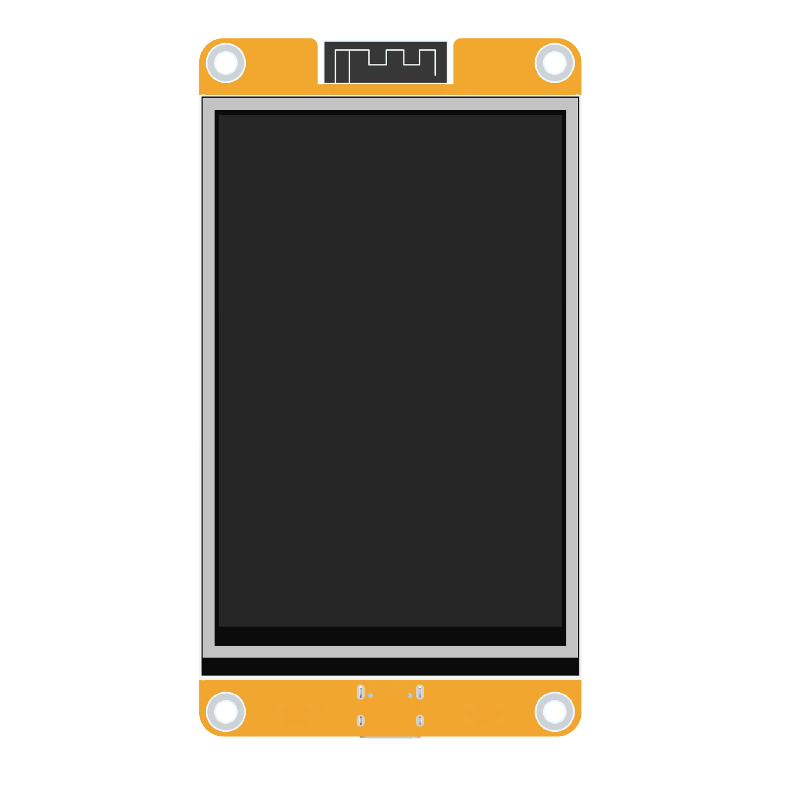
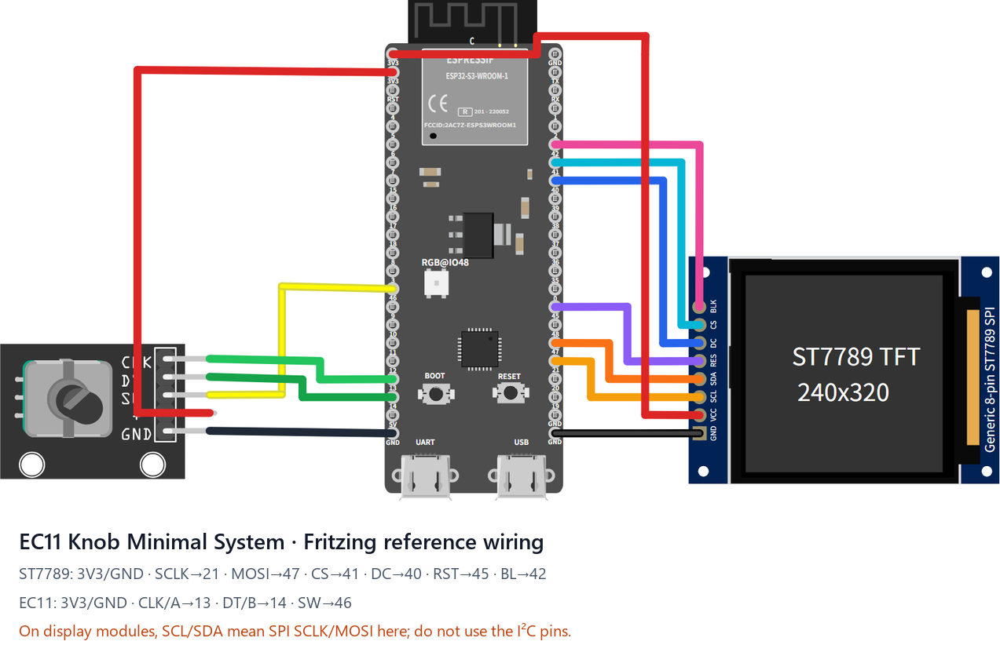

# Supported boards

| Board | Build target | Display | Touch | MCU / Flash | Status |
|---|---|---|---|---|---|
| [CYD 2432S028R](#cyd-2432s028r) | `cyd_2432s028r` | 2.8" 240×320 ILI9341 SPI | XPT2046 resistive | ESP32 / 4MB | ✅ Stable |
| [E32R35T](#e32r35t) | `e32r35t` | 3.5" 320×480 ST7796U SPI | XPT2046 resistive | ESP32-32E / 4MB | ✅ Stable |
| [EC11 Knob Minimal System](#ec11-knob-minimal-system) | `ec11_knob_minimal` | 240×320 ST7789 SPI | None, rotary only | ESP32-S3 N16R8 / 16MB | ✅ Official reference, contributor tested |
| [JC8048W550](#jc8048w550) | `jc8048w550` | 5" 800×480 ST7262 RGB parallel | GT911 capacitive | ESP32-S3 / 16MB | ✅ Stable |

Flash packages are named `klipper-remote-esp32-<board>.zip` (asset names carry no version, so the links below always point to the latest stable release). Please report problems in [Issues](https://github.com/umeiko/KlipperScreen-esp/issues).

| Board | Flash package (latest stable) |
|---|---|
| CYD 2432S028R | [klipper-remote-esp32-cyd_2432s028r.zip](https://github.com/umeiko/KlipperScreen-esp/releases/latest/download/klipper-remote-esp32-cyd_2432s028r.zip) |
| E32R35T | [klipper-remote-esp32-e32r35t.zip](https://github.com/umeiko/KlipperScreen-esp/releases/latest/download/klipper-remote-esp32-e32r35t.zip) |
| EC11 Knob Minimal System | [klipper-remote-esp32-ec11_knob_minimal.zip](https://github.com/umeiko/KlipperScreen-esp/releases/latest/download/klipper-remote-esp32-ec11_knob_minimal.zip) |
| JC8048W550 | [klipper-remote-esp32-jc8048w550.zip](https://github.com/umeiko/KlipperScreen-esp/releases/latest/download/klipper-remote-esp32-jc8048w550.zip) |
| Windows desktop simulator | [klipper-remote-desktop-win-x86_64.zip](https://github.com/umeiko/KlipperScreen-esp/releases/latest/download/klipper-remote-desktop-win-x86_64.zip) |

---

## CYD 2432S028R

*The "Cheap Yellow Display" (yellow-PCB 2.8" dev board), the reference board of this project.* Photo: [Random Nerd Tutorials](https://randomnerdtutorials.com/cheap-yellow-display-esp32-2432s028r/)

Logical resolution **320×240 landscape**.

- MCU: ESP32 (dual-core 240MHz, 520KB SRAM), 4MB QIO flash
- Display: ILI9341, SPI2 @ 40MHz, DMA double buffering (2 × 40 lines)
- Touch: XPT2046 resistive on a **dedicated SPI3 bus** (sharing the LCD bus was measured to return all-zero MISO); factory touch calibration is pre-installed
- Backlight: GPIO21, LEDC PWM 8bit/5kHz, active high

| Function | GPIO | Notes |
|---|---|---|
| LCD SCLK / MOSI / MISO | 14 / 13 / 12 | SPI2 |
| LCD CS / DC / RST | 15 / 2 / 4 | |
| LCD backlight | 21 | LEDC PWM |
| Touch SCLK / MOSI / MISO | 25 / 32 / 39 | SPI3, separate from LCD |
| Touch CS / IRQ | 33 / 36 | |
| BOOT button | 0 | Screen off / wake |

## E32R35T

*ESP32-32E 3.5" display module ([lcdwiki product page](https://www.lcdwiki.com/3.5inch_ESP32-32E_Display), touch version SKU: E32R35T).* Photo: lcdwiki

Logical resolution **480×320 landscape**.

- MCU: ESP32-WROOM-32E (dual-core 240MHz), 4MB QIO flash
- Display: ST7796U, SPI2 @ 40MHz; **shares the SPI bus with the touch panel** (vendor design); no dedicated RST (tied to ESP32 EN, the driver performs a software reset)
- Touch: XPT2046 resistive on the shared SPI2 bus; factory touch calibration is pre-installed (extracted from a real unit; recalibrate via the serial CLI `caltouch` if needed)
- Backlight: GPIO27, active high

| Function | GPIO | Notes |
|---|---|---|
| LCD+touch SCLK / MOSI / MISO | 14 / 13 / 12 | SPI2, shared by both devices |
| LCD CS / DC | 15 / 2 | |
| LCD RST | — | tied to EN |
| LCD backlight | 27 | LEDC PWM |
| Touch CS / IRQ | 33 / 36 | XPT2046 |
| RGB status LED R / G / B | 22 / 16 / 17 | common anode, active low (unused by firmware) |
| MicroSD CS / MOSI / SCLK / MISO | 5 / 23 / 18 / 19 | separate SPI group (unused by firmware) |
| Audio enable / DAC out | 4 / 26 | speaker connector (unused by firmware) |
| Battery voltage ADC | 34 | input |
| BOOT button | 0 | Screen off / wake |

## EC11 Knob Minimal System

This official reference can be assembled directly with jumper wires: **ESP32-S3-DevKitC-1 N16R8 + an 8-pin 240×320 ST7789 SPI display + a KY-040/EC11 encoder module**. It follows the display and encoder pins tested by the contributor in [PR #6](https://github.com/umeiko/KlipperScreen-esp/pull/6) and [Issue #5](https://github.com/umeiko/KlipperScreen-esp/issues/5), while keeping only the two peripherals required by the minimal system. Logical resolution is **320×240 landscape**.

Download and edit the [Fritzing source (.fzz)](hardware/ec11_knob_minimal.fzz), or inspect the [SVG exported by Fritzing](hardware/ec11_knob_minimal_breadboard.svg). The drawing uses a generic 8-pin ST7789 module with the same pin order; PCB shape, colour, and label placement vary between sellers.

| Module pin | ESP32-S3 pin | Purpose |
|---|---|---|
| ST7789 GND | GND | Ground |
| ST7789 VCC | 3V3 | Display power |
| ST7789 SCL / SCK | GPIO21 | SPI clock |
| ST7789 SDA / MOSI | GPIO47 | SPI data out |
| ST7789 CS | GPIO41 | Chip select |
| ST7789 DC / RS | GPIO40 | Data/command select |
| ST7789 RST / RES | GPIO45 | Display reset |
| ST7789 BL / LED / BLK | GPIO42 | Backlight, active high |
| EC11 CLK / A | GPIO13 | Encoder phase A |
| EC11 DT / B | GPIO14 | Encoder phase B |
| EC11 SW / KEY | GPIO46 | Encoder press |
| EC11 + / VCC | 3V3 | Module power |
| EC11 GND | GND | Ground |
| Screen-off button (add-on) | GPIO39 → button → GND | One-key screen off / wake; internal pull-up, active-low |

Power the DevKit from USB-C. Many SPI display boards label clock and data as `SCL` and `SDA`; here they still mean **SPI SCLK and MOSI**, not I2C. Rotation and press provide all navigation, and either action wakes the display after its timeout. This target has no touch layer and never enters touch calibration.

**Screen-off / wake buttons.** Wire a momentary button between GPIO39 and GND (the firmware enables the internal pull-up; the press pulls the pin low, release returns high). Press once to blank the screen, press again to wake. The DevKit's on-board BOOT key (GPIO0) works the same way — both buttons are active in parallel, and either one toggles the screen.

## JC8048W550

*Guition 5" capacitive display module (ESP32-S3).* Photo: [openHASP hardware page](https://www.openhasp.com/0.7.0/hardware/guition/jc8048w550/)

Logical resolution **800×480**. The full RGB-parallel tearing/underflow investigation is documented in the [developer notes](jc8048w550-rgb-display-guide.md) (Chinese).

- MCU: ESP32-S3, 16MB flash + PSRAM (dual framebuffers, 2×768KB in PSRAM)
- Display: ST7262 RGB parallel (RGB565), PCLK **must be 16MHz**; custom rgb44 driver (IDF-4.4-style transfer model + vsync page flip)
- Touch: GT911 capacitive, I2C0, polled without INT, no calibration needed
- Backlight: GPIO2, active high, with hardware-curve compensation in the 80–100% range

| Function | GPIO |
|---|---|
| LCD DE / VSYNC / HSYNC / PCLK | 40 / 41 / 39 / 42 |
| LCD B0..B4 | 8, 3, 46, 9, 1 |
| LCD G0..G5 | 5, 6, 7, 15, 16, 4 |
| LCD R0..R4 | 45, 48, 47, 21, 14 |
| LCD backlight | 2 |
| Touch SDA / SCL / RST | 19 / 20 / 38 |
| BOOT button (screen off / wake) | 0 |
