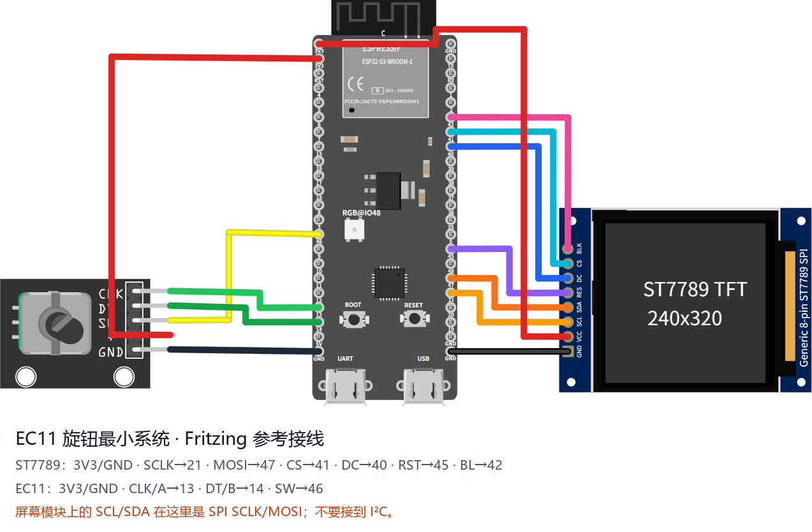
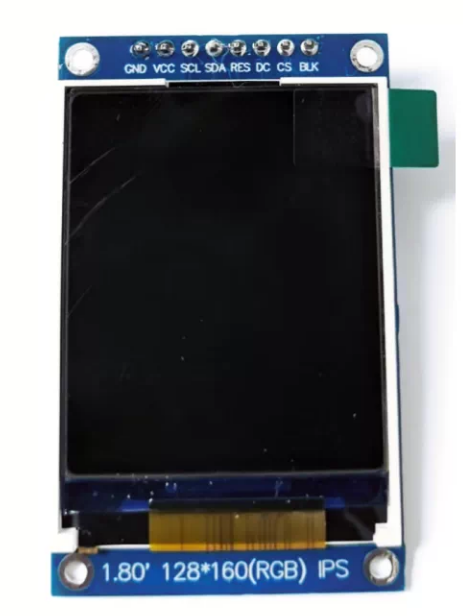
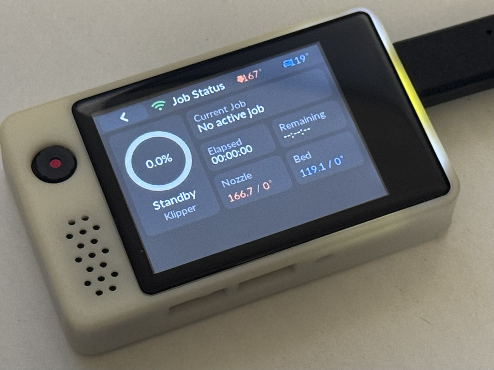

# 支持的板子

| 板型 | 构建目标 | 屏幕 | 触摸 | 主控 / Flash | 状态 |
|---|---|---|---|---|---|
| [CYD 2432S028R](#cyd-2432s028r) | `cyd_2432s028r` | 2.8" 240×320 ILI9341 SPI | XPT2046 电阻 | ESP32 / 4MB | ✅ 稳定 |
| [E32R35T](#e32r35t) | `e32r35t` | 3.5" 320×480 ST7796U SPI | XPT2046 电阻 | ESP32-32E / 4MB | ✅ 稳定 |
| [EC11 旋钮最小系统](#ec11) | `ec11_knob_minimal` | 240×320 ST7789 SPI | 无，纯旋钮 | ESP32-S3 N16R8 / 16MB | ✅ 官方参考，贡献者实机验证 |
| [EC11 旋钮 ESP32 最小系统](#ec11-旋钮-esp32-最小系统) | `ec11_knob_esp32` | 1.8" 128×160 ST7735S SPI | 无，纯旋钮 | ESP32 / 4MB | 🆕 新机型，引脚兼容 CYD |
| [JC8048W550](#jc8048w550) | `jc8048w550` | 5" 800×480 ST7262 RGB 并口 | GT911 电容 | ESP32-S3 / 16MB | ✅ 稳定 |
| [立创实战派 ESP32-S3](#立创实战派-esp32-s3) | `esp32s3-JLC-SZP` | 2.0" 240×320 ST7789 SPI | FT6336 电容 | ESP32-S3 N16R8 / 16MB | ✅ 已实机验证 |

刷机包命名：`klipper-remote-esp32-<board>.zip`（资产名不带版本号，下面的直链永远指向最新正式版）。遇到问题请到 [Issues](https://github.com/umeiko/KlipperScreen-esp/issues) 反馈。

| 板型 | 刷机包直链（最新正式版） |
|---|---|
| CYD 2432S028R | [klipper-remote-esp32-cyd_2432s028r.zip](https://github.com/umeiko/KlipperScreen-esp/releases/latest/download/klipper-remote-esp32-cyd_2432s028r.zip) |
| E32R35T | [klipper-remote-esp32-e32r35t.zip](https://github.com/umeiko/KlipperScreen-esp/releases/latest/download/klipper-remote-esp32-e32r35t.zip) |
| EC11 旋钮最小系统 | [klipper-remote-esp32-ec11_knob_minimal.zip](https://github.com/umeiko/KlipperScreen-esp/releases/latest/download/klipper-remote-esp32-ec11_knob_minimal.zip) |
| EC11 旋钮 ESP32 最小系统 | [klipper-remote-esp32-ec11_knob_esp32.zip](https://github.com/umeiko/KlipperScreen-esp/releases/latest/download/klipper-remote-esp32-ec11_knob_esp32.zip) |
| JC8048W550 | [klipper-remote-esp32-jc8048w550.zip](https://github.com/umeiko/KlipperScreen-esp/releases/latest/download/klipper-remote-esp32-jc8048w550.zip) |
| 立创实战派 ESP32-S3 | [klipper-remote-esp32-esp32s3-JLC-SZP.zip](https://github.com/umeiko/KlipperScreen-esp/releases/latest/download/klipper-remote-esp32-esp32s3-JLC-SZP.zip) |
| Windows 桌面模拟器 | [klipper-remote-desktop-win-x86_64.zip](https://github.com/umeiko/KlipperScreen-esp/releases/latest/download/klipper-remote-desktop-win-x86_64.zip) |

---

## CYD 2432S028R

*"Cheap Yellow Display"（黄色 PCB 的 2.8" 开发板），本项目的参考板型。* 图：[Random Nerd Tutorials](https://randomnerdtutorials.com/cheap-yellow-display-esp32-2432s028r/)

逻辑分辨率 **320×240 横屏**。

- 主控：ESP32（双核 240MHz，520KB SRAM），4MB QIO Flash
- 显示：ILI9341，SPI2 @ 40MHz，DMA 双缓冲（2 × 40 行）
- 触摸：XPT2046 电阻屏，**独立 SPI3 总线**（实测与 LCD 共享总线时 MISO 无应答）；出厂触摸校准已内置
- 背光：GPIO21，LEDC PWM 8bit/5kHz，高电平点亮

| 功能 | GPIO | 备注 |
|---|---|---|
| LCD SCLK / MOSI / MISO | 14 / 13 / 12 | SPI2 |
| LCD CS / DC / RST | 15 / 2 / 4 | |
| LCD 背光 | 21 | LEDC PWM |
| 触摸 SCLK / MOSI / MISO | 25 / 32 / 39 | SPI3，与 LCD 不同总线 |
| 触摸 CS / IRQ | 33 / 36 | |
| BOOT 按键 | 0 | 息屏/唤醒 |

### 可选 EC11 旋转编码器

CYD 固件默认已启用旋转编码器支持（PCNT 硬件正交解码）。把裸 EC11 接到扩展 IO 口即可，编码器与触摸并存——旋转移动焦点，按下确认。

| EC11 引脚 | GPIO | 备注 |
|---|---|---|
| A | 35 | **需外接 ~10kΩ 上拉电阻到 3V3**——GPIO35 为输入专用脚，无内部上拉 |
| B | 22 | 内部上拉 |
| SW（按下） | 27 | 内部上拉，低电平有效 |
| C / GND | GND | A/B/SW 的公共端接 GND |

自带 A/B 上拉的编码器模块可直接接线。

## E32R35T

*ESP32-32E 3.5" 显示模组（[lcdwiki 资料页](https://www.lcdwiki.com/zh/3.5inch_ESP32-32E_Display)，触摸版 SKU：E32R35T）。* 图：lcdwiki

逻辑分辨率 **480×320 横屏**。

- 主控：ESP32-WROOM-32E（双核 240MHz），4MB QIO Flash
- 显示：ST7796U，SPI2 @ 40MHz；**与触摸屏共用 SPI 总线**（厂商设计）；无独立 RST（与 ESP32 EN 共用，驱动走软件复位）
- 触摸：XPT2046 电阻屏，共用 SPI2；出厂触摸校准已内置（提取自真机，免校准；个体差异可用串口 CLI `caltouch` 重校）
- 背光：GPIO27，高电平点亮

| 功能 | GPIO | 备注 |
|---|---|---|
| LCD+触摸 SCLK / MOSI / MISO | 14 / 13 / 12 | SPI2，两设备共用 |
| LCD CS / DC | 15 / 2 | |
| LCD RST | — | 与 EN 共用 |
| LCD 背光 | 27 | LEDC PWM |
| 触摸 CS / IRQ | 33 / 36 | XPT2046 |
| RGB 三色灯 R / G / B | 22 / 16 / 17 | 共阳极，低电平点亮（固件未使用） |
| MicroSD CS / MOSI / SCLK / MISO | 5 / 23 / 18 / 19 | 独立 SPI 组（固件未使用） |
| 音频使能 / DAC 输出 | 4 / 26 | 喇叭接口（固件未使用） |
| 电池电压 ADC | 34 | 输入 |
| BOOT 按键 | 0 | 息屏/唤醒 |

## EC11 旋钮最小系统

这是一个可以直接用杜邦线搭起来的官方参考机型：**ESP32-S3-DevKitC-1 N16R8 + 8 针 240×320 ST7789 SPI 屏 + KY-040/EC11 旋钮模块**。它沿用贡献者在 [PR #6](https://github.com/umeiko/KlipperScreen-esp/pull/6) 和 [Issue #5](https://github.com/umeiko/KlipperScreen-esp/issues/5) 中实机验证的屏幕与旋钮引脚，只保留最小系统需要的两件外设。逻辑分辨率为 **320×240 横屏**。

可下载并修改 [Fritzing 源文件（.fzz）](hardware/ec11_knob_minimal.fzz)，也可以查看 [Fritzing 导出的 SVG](hardware/ec11_knob_minimal_breadboard.svg)。图中的 ST7789 是引脚顺序相同的通用 8 针模块；不同卖家的 PCB 外形、颜色和丝印位置可能不同。

| 模块引脚 | 接到 ESP32-S3 | 用途 |
|---|---|---|
| ST7789 GND | GND | 地 |
| ST7789 VCC | 3V3 | 屏幕供电 |
| ST7789 SCL / SCK | GPIO21 | SPI 时钟 |
| ST7789 SDA / MOSI | GPIO47 | SPI 数据输出 |
| ST7789 CS | GPIO41 | 片选 |
| ST7789 DC / RS | GPIO40 | 数据/命令选择 |
| ST7789 RST / RES | GPIO45 | 屏幕复位 |
| ST7789 BL / LED / BLK | GPIO42 | 背光，高电平点亮 |
| EC11 CLK / A | GPIO13 | 编码器 A 相 |
| EC11 DT / B | GPIO14 | 编码器 B 相 |
| EC11 SW / KEY | GPIO46 | 旋钮按下 |
| EC11 + / VCC | 3V3 | 模块供电 |
| EC11 GND | GND | 地 |
| 息屏按钮（外挂） | GPIO39 ── 按键 ── GND | 一键息屏/唤醒，内部上拉、低电平有效 |

开发板本身从 USB-C 供电。很多 SPI 屏把时钟和数据写成 `SCL`、`SDA`，这里仍然是 **SPI SCLK、MOSI**，不要接到 I2C 引脚。EC11 的旋转与按下都能导航，屏幕自动熄灭后再次操作旋钮即可唤醒；本机型没有触摸层，也不会进入触摸校准。

**息屏/唤醒按钮。** 在 GPIO39 与 GND 之间接一个轻触按键即可（固件开启内部上拉、下拉关闭：松开为高电平 1，按下接地为低电平 0，低电平有效）。按一下息屏，再按一下唤醒。开发板板载的 BOOT 键（GPIO0）功能相同——两个按钮同时生效，任意一个都能切换息屏/唤醒。

## EC11 旋钮 ESP32 最小系统

*常见的 1.8" 128×160 ST7735S SPI 模组。排针从上到下：GND / VCC / SCL / SDA / RES / DC / CS / BLK——注意这里的 `SCL`/`SDA` 是 SPI 的 SCLK 和 MOSI，不是 I2C。*

与 CYD 2432S028R **同款主控（ESP32）** 的纯旋钮最小系统：1.8" 128×160 ST7735S SPI 屏 + EC11 编码器，无触摸。所有 IO 分配都与 CYD 的板载 LCD 排针及其外挂 EC11 接法一一对应，CYD 底板（或任意 ESP32 开发板按同样接线）可直接使用。逻辑分辨率 **160×128 横屏**。

- 主控：ESP32（双核 240MHz，520KB SRAM），4MB QIO Flash
- 显示：ST7735S，走 ST7789 兼容的 esp_lcd 驱动并开启反色（ST7735S 必须 INVON）；SPI2 @ 40MHz，DMA 双缓冲
- 输入：仅 EC11（PCNT 硬件正交解码）；无触摸层，不会进入触摸校准
- 背光：GPIO21，LEDC PWM 8bit/5kHz，高电平点亮
- 息屏/唤醒：板载 BOOT 键（GPIO0）

| 模块引脚 | ESP32 引脚 | 用途 |
|---|---|---|
| ST7735S VCC | 3V3 | 屏幕供电 |
| ST7735S GND | GND | 地 |
| ST7735S SCL / SCK | GPIO14 | SPI 时钟 |
| ST7735S SDA / MOSI | GPIO13 | SPI 数据输出 |
| ST7735S CS | GPIO15 | 片选 |
| ST7735S DC / RS | GPIO2 | 数据/命令选择 |
| ST7735S RST / RES | GPIO4 | 屏幕复位 |
| ST7735S BL / LED / BLK | GPIO21 | 背光，高电平点亮 |
| EC11 CLK / A | GPIO35 | **需外接 ~10kΩ 上拉到 3V3**——GPIO35 只能输入且无内部上拉 |
| EC11 DT / B | GPIO22 | 内部上拉 |
| EC11 SW / KEY | GPIO27 | 内部上拉，低电平有效 |
| EC11 C / GND | GND | A/B/SW 公共端接地 |

不同卖家的 ST7735S 模组有差异：画面镜像或边缘出现彩边/偏移时，改 `src/bsp/esp32/bsp_ec11_knob_esp32.c` 顶部的 `LCD_MIRROR_X/Y` 与 `LCD_GAP_X/Y` 重新编译即可。EC11 的旋转与按下都能导航，屏幕自动熄灭后再次操作旋钮即可唤醒。

## JC8048W550

*Guition 5" 电容屏模组（ESP32-S3）。* 图：[openHASP 硬件页](https://www.openhasp.com/0.7.0/hardware/guition/jc8048w550/)

逻辑分辨率 **800×480**。RGB 并口屏的撕裂/抽动排障全过程见[开发笔记](jc8048w550-rgb-display-guide.md)。

- 主控：ESP32-S3，16MB Flash + PSRAM（双帧缓冲 2×768KB 放在 PSRAM）
- 显示：ST7262 RGB 并口（RGB565），PCLK **必须 16MHz**；自研 rgb44 驱动（IDF 4.4 传输模型 + vsync 换页）
- 触摸：GT911 电容屏，I2C0，轮询无 INT，无需校准
- 背光：GPIO2，高电平点亮，80–100% 区间有硬件曲线补偿

| 功能 | GPIO |
|---|---|
| LCD DE / VSYNC / HSYNC / PCLK | 40 / 41 / 39 / 42 |
| LCD B0..B4 | 8, 3, 46, 9, 1 |
| LCD G0..G5 | 5, 6, 7, 15, 16, 4 |
| LCD R0..R4 | 45, 48, 47, 21, 14 |
| LCD 背光 | 2 |
| 触摸 SDA / SCL / RST | 19 / 20 / 38 |
| BOOT 按键（息屏/唤醒） | 0 |

## 立创实战派 ESP32-S3

*立创"实战派" ESP32-S3 开发板，板载 2.0" 电容触摸屏。*

逻辑分辨率 **320×240 横屏**。

- 主控：ESP32-S3-WROOM-1-N16R8，16MB QIO Flash + 8MB Octal PSRAM @ 80MHz
- 显示：ST7789（原生 240×320），SPI3 @ 80MHz **mode 3**，DMA 双缓冲（2 × 40 行）；BGR，横屏 MADCTL=0x68（MX|MV|BGR），**必须 INVON**（INVOFF 全屏反色；`bsp_disp_set_invert` 开关语义已取反）
- **LCD CS 不是 GPIO**：在 PCA9557（I2C 0x19）P0 上，且面板要求**每笔 SPI 交易都有 CS 下降沿**（CS 常低/常高均全黑）。esp_lcd 无法经 I2C 扩展器逐笔翻 CS，故本板 BSP 不用 esp_lcd 面板驱动，直接 SPI master + 手动控 CS/DC（复刻实测可亮的 [Arduino 参考工程](https://github.com/umeiko/jlc-shizhanpai-esp32s3-arduino-lvgl) 及其 TFT_eSPI fork 的 CS 挂钩方案）；无 RST 脚，初始化必须先 SWRESET(0x01)+150ms
- PCA9557 其余引脚按 Arduino 工程实测状态：P1 保持输入，P2=0（"摄像头电源"开启，疑似与 TFT 逻辑供电共用，P2=1 时背光亮但整屏黑）
- 触摸：FT6336 电容屏，与 PCA9557 同一条 I2C0 总线，轮询无 INT/RST，无需校准
- 背光：GPIO42，LEDC PWM 10bit/5kHz，**低电平点亮**（`output_invert` 方式驱动）
- 息屏/唤醒：板载用户键（GPIO0）

| 功能 | GPIO | 备注 |
|---|---|---|
| LCD MOSI / SCLK / DC | 40 / 41 / 39 | SPI3 @ mode 3，无 MISO |
| LCD CS | PCA9557 P0（I2C 0x19） | 逐笔交易翻转（空闲高）；P1 保持输入，P2=0 摄像头/TFT 电源 |
| LCD RST | — | 未连接，初始化必须 SWRESET |
| LCD 背光 | 42 | LEDC PWM，低电平点亮 |
| 触摸 / PCA9557 SDA / SCL | 1 / 2 | I2C0 @ 100kHz |
| 用户键（息屏/唤醒） | 0 | 低电平有效，内部上拉 |
