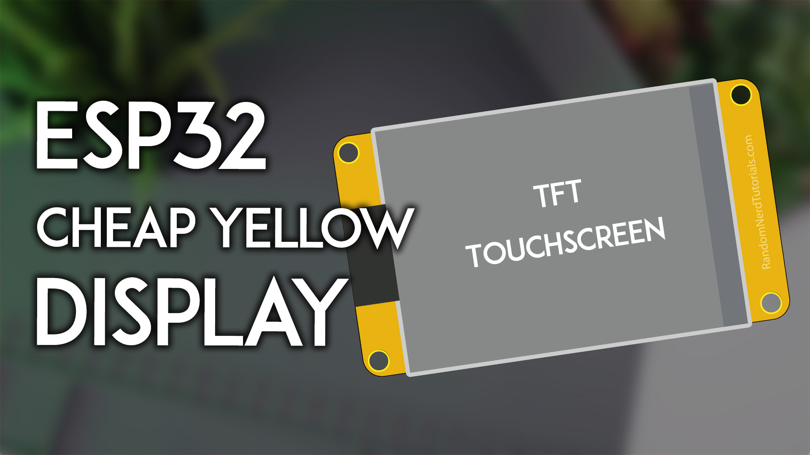
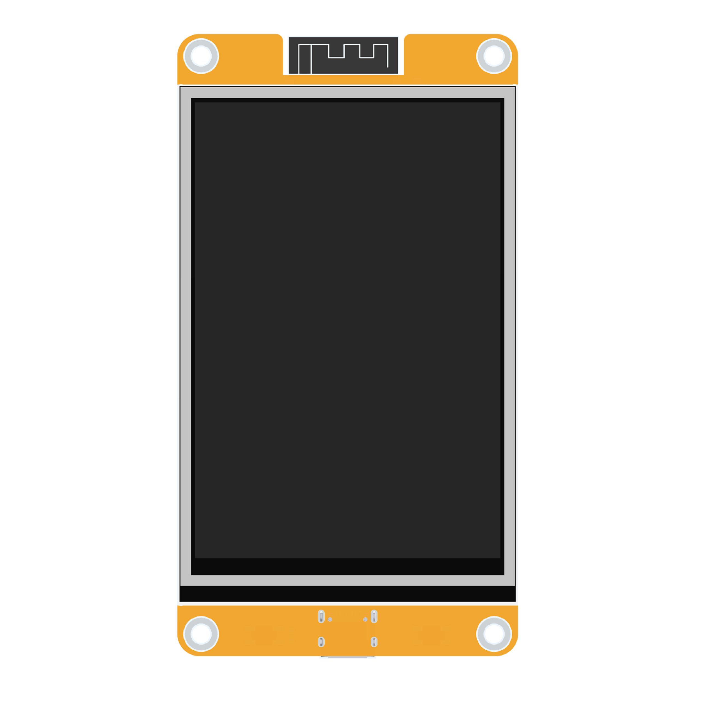
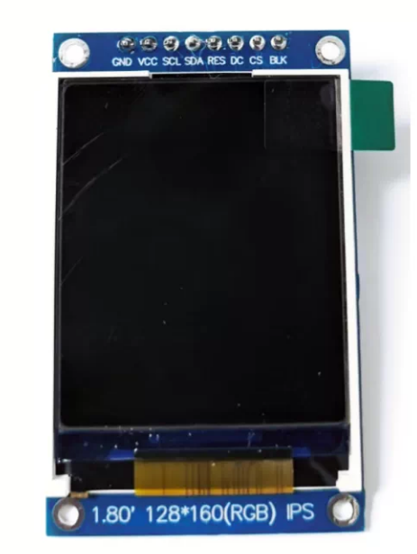

# ESP32 boards

Boards built on the classic ESP32 (dual-core 240MHz, 4MB flash, no PSRAM). Each section lists its flash package, wiring and pinout table.

## CYD 2432S028R

**Flash package**: [ESP-IDFv5.5-cyd_2432s028r.zip](https://github.com/umeiko/KlipperScreen-esp/releases/latest/download/ESP-IDFv5.5-cyd_2432s028r.zip)

*The "Cheap Yellow Display" (yellow-PCB 2.8" dev board), the reference board of this project.* Photo: [Random Nerd Tutorials](https://randomnerdtutorials.com/cheap-yellow-display-esp32-2432s028r/)

Logical resolution **320×240 landscape**.

- MCU: ESP32 (dual-core 240MHz, 520KB SRAM), 4MB QIO flash
- Display: ILI9341, SPI2 @ 40MHz, DMA double buffering (2 × 40 lines)
- Touch: XPT2046 resistive on a **dedicated SPI3 bus**, separate from the LCD bus; factory touch calibration is pre-installed
- Backlight: GPIO21, LEDC PWM 8bit/5kHz, active high

| Function | GPIO | Notes |
|---|---|---|
| LCD SCLK / MOSI / MISO | 14 / 13 / 12 | SPI2 |
| LCD CS / DC / RST | 15 / 2 / 4 | |
| LCD backlight | 21 | LEDC PWM |
| Touch SCLK / MOSI / MISO | 25 / 32 / 39 | SPI3, separate from LCD |
| Touch CS / IRQ | 33 / 36 | |
| BOOT button | 0 | Screen off / wake |

**Optional EC11 rotary encoder**

The CYD firmware ships with rotary-encoder support enabled (PCNT hardware quadrature decoding). Wire a bare EC11 to the extended IO header; the encoder works alongside the touchscreen — rotate to move the focus, press to confirm.

| EC11 pin | GPIO | Notes |
|---|---|---|
| A | 35 | **Needs an external ~10kΩ pull-up to 3V3** — GPIO35 is input-only and has no internal pull-up |
| B | 22 | Internal pull-up |
| SW (push) | 27 | Internal pull-up, active-low |
| C / GND | GND | Common contact of A/B/SW to GND |

Encoder modules that already provide pull-ups on A/B can be wired directly.

## CYD 2432S028R-PLUS

**Flash package**: [ESP-IDFv5.5-cyd_2432s028r_plus.zip](https://github.com/umeiko/KlipperScreen-esp/releases/latest/download/ESP-IDFv5.5-cyd_2432s028r_plus.zip)

*The ST7789 variant of the CYD (ESP32-WROOM-32E module). Same board family, same pinout — only the display driver IC and the reset line differ.*

Logical resolution **320×240 landscape**. Display and touch wiring is **identical to the CYD 2432S028R above** (LCD on SPI2: SCLK 14 / MOSI 13 / MISO 12 / CS 15 / DC 2 / BL 21; XPT2046 touch on the dedicated SPI3: SCLK 25 / MOSI 32 / MISO 39 / CS 33 / IRQ 36; BOOT key GPIO0 for screen off/wake). The differences, all handled by the firmware:

- Display: **ST7789** (instead of ILI9341), BGR colour order as required by the vendor documentation; SPI2 @ 40MHz, DMA double buffering
- **No LCD reset pin** (`TFT_RST = -1`) — the driver relies on the in-sequence software reset
- Touch controller, calibration flow and factory defaults are shared with the CYD (`caltouch` recalibrates any time)

**Optional EC11 rotary encoder** — on this board the encoder uses the **CN3 header: A=GPIO23 (MOSI) / B=GPIO19 (MISO) / SW=GPIO18 (SCK)**, common contact to GND. All three pins have internal pull-ups, so a bare EC11 wires up directly with no external resistors. Note these three pins are shared with the on-board SD card slot — don't use the SD slot at the same time.

If the picture looks flipped on your unit, toggle **Settings → Display → 180° rotation**; if colours look inverted, toggle the invert option on the same page — no rewiring or rebuild needed.

## E32R35T

**Flash package**: [ESP-IDFv5.5-e32r35t.zip](https://github.com/umeiko/KlipperScreen-esp/releases/latest/download/ESP-IDFv5.5-e32r35t.zip)

*ESP32-32E 3.5" display module ([lcdwiki product page](https://www.lcdwiki.com/3.5inch_ESP32-32E_Display), touch version SKU: E32R35T).* Photo: lcdwiki

Logical resolution **480×320 landscape**.

- MCU: ESP32-WROOM-32E (dual-core 240MHz), 4MB QIO flash
- Display: ST7796U, SPI2 @ 40MHz; **shares the SPI bus with the touch panel** (vendor design); no dedicated RST (tied to ESP32 EN, the driver performs a software reset)
- Touch: XPT2046 resistive on the shared SPI2 bus; factory touch calibration is pre-installed (recalibrate via the serial CLI `caltouch` if needed)
- Backlight: GPIO27, active high

| Function | GPIO | Notes |
|---|---|---|
| LCD+touch SCLK / MOSI / MISO | 14 / 13 / 12 | SPI2, shared by both devices |
| LCD CS / DC | 15 / 2 | |
| LCD RST | — | tied to EN |
| LCD backlight | 27 | LEDC PWM |
| Touch CS / IRQ | 33 / 36 | XPT2046 |
| RGB status LED R / G / B | 22 / 16 / 17 | common anode, active low (unused by firmware) |
| MicroSD CS / MOSI / SCLK / MISO | 5 / 23 / 18 / 19 | separate SPI group (unused by firmware) |
| Audio enable / DAC out | 4 / 26 | speaker connector (unused by firmware) |
| Battery voltage ADC | 34 | input |
| BOOT button | 0 | Screen off / wake |

## esp32-st7735s-128_160-ec11

**Flash package**: [ESP-IDFv5.5-esp32-st7735s-128_160-ec11.zip](https://github.com/umeiko/KlipperScreen-esp/releases/latest/download/ESP-IDFv5.5-esp32-st7735s-128_160-ec11.zip)

*Typical 1.8" 128×160 ST7735S SPI module. Header pins top to bottom: GND / VCC / SCL / SDA / RES / DC / CS / BLK — note that `SCL`/`SDA` here are SPI SCLK and MOSI, not I2C.*

A minimal rotary-only build on the **same ESP32 MCU as the CYD 2432S028R**: a 1.8" 128×160 ST7735S SPI display plus an EC11 encoder, no touch. Every IO assignment mirrors the CYD's on-board LCD header and its optional EC11 hookup, so a CYD base board (or the same wiring on any ESP32 dev board) works out of the box. Logical resolution **160×128 landscape**.

- MCU: ESP32 (dual-core 240MHz, 520KB SRAM), 4MB QIO flash
- Display: ST7735S via the ST7789-compatible esp_lcd driver with inversion enabled (INVON is mandatory on ST7735S); SPI2 @ 40MHz, DMA double buffering
- Input: EC11 only (PCNT hardware quadrature); no touch layer, never enters touch calibration
- Backlight: GPIO21, LEDC PWM 8bit/5kHz, active high
- Screen off / wake: on-board BOOT key (GPIO0)

| Module pin | ESP32 pin | Purpose |
|---|---|---|
| ST7735S VCC | 3V3 | Display power |
| ST7735S GND | GND | Ground |
| ST7735S SCL / SCK | GPIO14 | SPI clock |
| ST7735S SDA / MOSI | GPIO13 | SPI data out |
| ST7735S CS | GPIO15 | Chip select |
| ST7735S DC / RS | GPIO2 | Data/command select |
| ST7735S RST / RES | GPIO4 | Display reset |
| ST7735S BL / LED / BLK | GPIO21 | Backlight, active high |
| EC11 CLK / A | GPIO35 | **Needs an external ~10kΩ pull-up to 3V3** — GPIO35 is input-only with no internal pull-up |
| EC11 DT / B | GPIO22 | Internal pull-up |
| EC11 SW / KEY | GPIO27 | Internal pull-up, active-low |
| EC11 C / GND | GND | Common contact of A/B/SW to GND |

ST7735S modules vary between sellers: if the picture is mirrored or shows a coloured offset band at an edge, adjust `LCD_MIRROR_X/Y` and `LCD_GAP_X/Y` at the top of `src/bsp/esp32/bsp_ec11_knob_esp32.c` and rebuild. Rotation and press provide all navigation, and either action wakes the display after its timeout.

## esp32-st7789-320_240-ec11

**Flash package**: [ESP-IDFv5.5-esp32-st7789-320_240-ec11.zip](https://github.com/umeiko/KlipperScreen-esp/releases/latest/download/ESP-IDFv5.5-esp32-st7789-320_240-ec11.zip)

*Typical 240×320 ST7789 SPI module paired with an EC11 encoder. Header pins are usually labelled GND / VCC / SCL / SDA / RES / DC / CS / BLK — `SCL`/`SDA` here are SPI SCLK and MOSI, not I2C.*

A mid-size rotary-only build on the **same ESP32 MCU and the exact same pinout as esp32-st7735s-128_160-ec11** (all IO aligned to the CYD 2432S028R): a 240×320 ST7789 SPI display plus an EC11 encoder, no touch. Logical resolution **320×240 landscape** — the standard layout class, same as the CYD. Only the display panel changes versus the ST7735S build; every wire stays where it is.

- MCU: ESP32 (dual-core 240MHz, 520KB SRAM), 4MB QIO flash
- Display: ST7789 via the esp_lcd driver (normal colour with the default INVOFF — no forced inversion); SPI2 @ 40MHz, DMA double buffering (2×320×40)
- Input: EC11 only (PCNT hardware quadrature); no touch layer, never enters touch calibration
- Backlight: GPIO21, LEDC PWM 8bit/5kHz, active high
- Screen off / wake: on-board BOOT key (GPIO0)

| Module pin | ESP32 pin | Purpose |
|---|---|---|
| ST7789 VCC | 3V3 | Display power |
| ST7789 GND | GND | Ground |
| ST7789 SCL / SCK | GPIO14 | SPI clock |
| ST7789 SDA / MOSI | GPIO13 | SPI data out |
| ST7789 CS | GPIO15 | Chip select |
| ST7789 DC / RS | GPIO2 | Data/command select |
| ST7789 RST / RES | GPIO4 | Display reset |
| ST7789 BL / LED / BLK | GPIO21 | Backlight, active high |
| EC11 CLK / A | GPIO35 | **Needs an external ~10kΩ pull-up to 3V3** — GPIO35 is input-only with no internal pull-up |
| EC11 DT / B | GPIO22 | Internal pull-up |
| EC11 SW / KEY | GPIO27 | Internal pull-up, active-low |
| EC11 C / GND | GND | Common contact of A/B/SW to GND |

ST7789 modules vary between sellers: if the picture is mirrored or shows a coloured offset band at an edge, adjust `LCD_MIRROR_X/Y` and `LCD_GAP_X/Y` at the top of `src/bsp/esp32/bsp_ec11_knob_esp32_st7789.c` and rebuild. Rotation and press provide all navigation, and either action wakes the display after its timeout.

## esp32-ILI9341-320_240-ec11

**Flash package**: [ESP-IDFv5.5-esp32-ILI9341-320_240-ec11.zip](https://github.com/umeiko/KlipperScreen-esp/releases/latest/download/ESP-IDFv5.5-esp32-ILI9341-320_240-ec11.zip)

*A 240×320 ILI9341 SPI display with an EC11 encoder knob (shown: an Anycubic Kobra 2 Neo stock display unit). Header pins are usually labelled GND / VCC / SCL / SDA / RES / DC / CS / BLK — `SCL`/`SDA` here are SPI SCLK and MOSI, not I2C.*

A mid-size rotary-only build on the **same ESP32 MCU and the exact same pinout as esp32-st7789-320_240-ec11** (all IO aligned to the CYD 2432S028R): a 240×320 ILI9341 SPI display plus an EC11 encoder, no touch. Logical resolution **320×240 landscape** — the standard layout class, same as the CYD. Only the display panel changes versus the ST7789 build; every wire stays where it is.

- MCU: ESP32 (dual-core 240MHz, 520KB SRAM), 4MB QIO flash
- Display: ILI9341 via the esp_lcd driver (BGR panel, normal colour with the default INVOFF); SPI2 @ 40MHz, DMA double buffering (2×320×40)
- Input: EC11 only (PCNT hardware quadrature); no touch layer, never enters touch calibration
- Backlight: GPIO21, LEDC PWM 8bit/5kHz, active high
- Screen off / wake: on-board BOOT key (GPIO0)

| Module pin | ESP32 pin | Purpose |
|---|---|---|
| ILI9341 VCC | 3V3 | Display power |
| ILI9341 GND | GND | Ground |
| ILI9341 SCL / SCK | GPIO14 | SPI clock |
| ILI9341 SDA / MOSI | GPIO13 | SPI data out |
| ILI9341 CS | GPIO15 | Chip select |
| ILI9341 DC / RS | GPIO2 | Data/command select |
| ILI9341 RST / RES | GPIO4 | Display reset |
| ILI9341 BL / LED / BLK | GPIO21 | Backlight, active high |
| EC11 CLK / A | GPIO35 | **Needs an external ~10kΩ pull-up to 3V3** — GPIO35 is input-only with no internal pull-up |
| EC11 DT / B | GPIO22 | Internal pull-up |
| EC11 SW / KEY | GPIO27 | Internal pull-up, active-low |
| EC11 C / GND | GND | Common contact of A/B/SW to GND |

ILI9341 modules vary between sellers: if the picture is mirrored or shows a coloured offset band at an edge, adjust `LCD_MIRROR_X/Y` and `LCD_GAP_X/Y` at the top of `src/bsp/esp32/bsp_esp32_ili9341_ec11.c` and rebuild. Rotation and press provide all navigation, and either action wakes the display after its timeout.

## esp32-ST7796-320_240-ec11

**Flash package**: [ESP-IDFv5.5-esp32-ST7796-320_240-ec11.zip](https://github.com/umeiko/KlipperScreen-esp/releases/latest/download/ESP-IDFv5.5-esp32-ST7796-320_240-ec11.zip)

*A 240×320 ST7796 SPI display with an EC11 encoder knob — the ST7796 twin of esp32-ILI9341-320_240-ec11 (no photo of this exact build yet). Header pins are usually labelled GND / VCC / SCL / SDA / RES / DC / CS / BLK — `SCL`/`SDA` here are SPI SCLK and MOSI, not I2C.*

A mid-size rotary-only build on the **same ESP32 MCU and the exact same pinout as esp32-ILI9341-320_240-ec11** (all IO aligned to the CYD 2432S028R): a 240×320 ST7796 SPI display plus an EC11 encoder, no touch. Logical resolution **320×240 landscape** — the standard layout class, same as the CYD. Only the display controller changes versus the ILI9341 build; every wire stays where it is.

- MCU: ESP32 (dual-core 240MHz, 520KB SRAM), 4MB QIO flash
- Display: ST7796 via the esp_lcd driver (BGR panel, normal colour with the default INVOFF); SPI2 @ 40MHz, DMA double buffering (2×320×40)
- Input: EC11 only (PCNT hardware quadrature); no touch layer, never enters touch calibration
- Backlight: GPIO21, LEDC PWM 8bit/5kHz, active high
- Screen off / wake: on-board BOOT key (GPIO0)

| Module pin | ESP32 pin | Purpose |
|---|---|---|
| ST7796 VCC | 3V3 | Display power |
| ST7796 GND | GND | Ground |
| ST7796 SCL / SCK | GPIO14 | SPI clock |
| ST7796 SDA / MOSI | GPIO13 | SPI data out |
| ST7796 CS | GPIO15 | Chip select |
| ST7796 DC / RS | GPIO2 | Data/command select |
| ST7796 RST / RES | GPIO4 | Display reset |
| ST7796 BL / LED / BLK | GPIO21 | Backlight, active high |
| EC11 CLK / A | GPIO35 | **Needs an external ~10kΩ pull-up to 3V3** — GPIO35 is input-only with no internal pull-up |
| EC11 DT / B | GPIO22 | Internal pull-up |
| EC11 SW / KEY | GPIO27 | Internal pull-up, active-low |
| EC11 C / GND | GND | Common contact of A/B/SW to GND |

ST7796 modules at the 320×240 window vary between sellers: if the picture is mirrored/upside-down or shows a coloured offset band at an edge, adjust `LCD_MIRROR_X/Y` and `LCD_GAP_X/Y` at the top of `src/bsp/esp32/bsp_esp32_st7796_ec11.c` and rebuild. Rotation and press provide all navigation, and either action wakes the display after its timeout.
