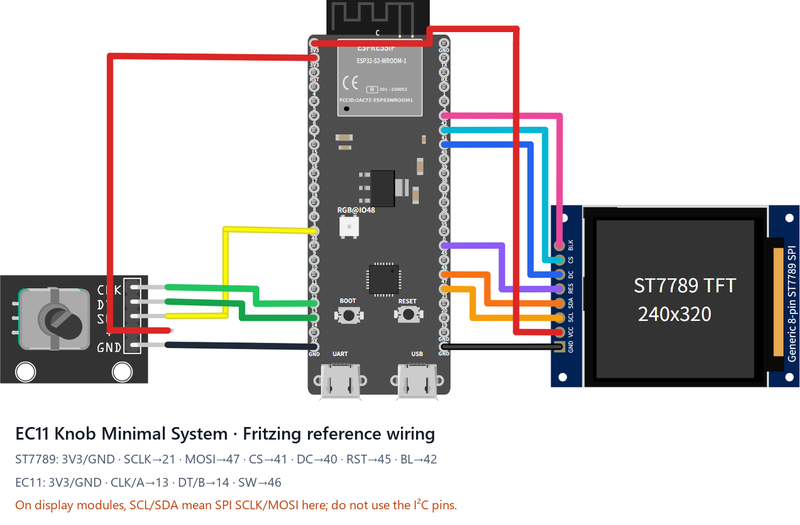
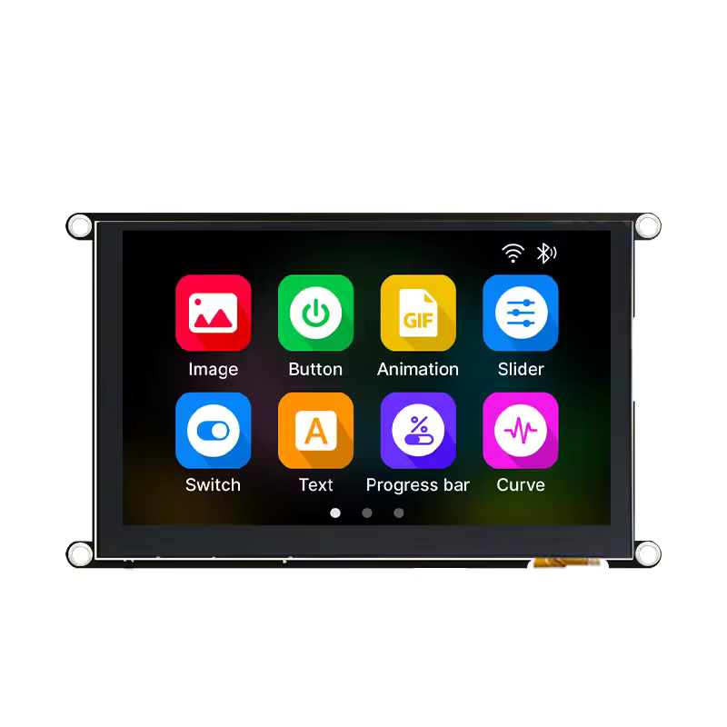
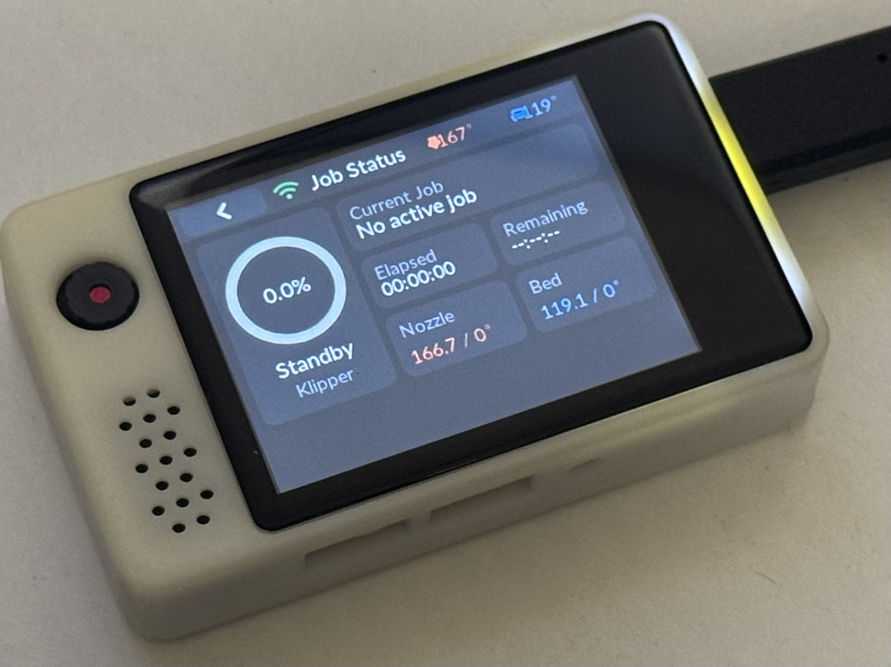

# ESP32-S3 boards

Boards built on ESP32-S3 modules with octal PSRAM (N16R8 / N8R8). Each section lists its flash package, wiring and pinout table.

## esp32s3-st7789-320_240-ec11

**Flash package**: [ESP-IDFv5.5-esp32s3-st7789-320_240-ec11.zip](https://github.com/umeiko/KlipperScreen-esp/releases/latest/download/ESP-IDFv5.5-esp32s3-st7789-320_240-ec11.zip)

This official reference can be assembled directly with jumper wires: **ESP32-S3-DevKitC-1 N16R8 + an 8-pin 240×320 ST7789 SPI display + a KY-040/EC11 encoder module**. Logical resolution is **320×240 landscape**.

Download and edit the [Fritzing source (.fzz)](../hardware/ec11_knob_minimal.fzz), or inspect the [SVG exported by Fritzing](../hardware/ec11_knob_minimal_breadboard.svg). The drawing uses a generic 8-pin ST7789 module with the same pin order; PCB shape, colour, and label placement vary between sellers.

| Module pin | ESP32-S3 pin | Purpose |
|---|---|---|
| ST7789 GND | GND | Ground |
| ST7789 VCC | 3V3 | Display power |
| ST7789 SCL / SCK | GPIO21 | SPI clock |
| ST7789 SDA / MOSI | GPIO47 | SPI data out |
| ST7789 CS | GPIO41 | Chip select |
| ST7789 DC / RS | GPIO40 | Data/command select |
| ST7789 RST / RES | GPIO45 | Display reset |
| ST7789 BL / LED / BLK | GPIO42 | Backlight, active high |
| EC11 CLK / A | GPIO13 | Encoder phase A |
| EC11 DT / B | GPIO14 | Encoder phase B |
| EC11 SW / KEY | GPIO46 | Encoder press |
| EC11 + / VCC | 3V3 | Module power |
| EC11 GND | GND | Ground |
| Screen-off button (add-on) | GPIO39 → button → GND | One-key screen off / wake; internal pull-up, active-low |

Power the DevKit from USB-C. Many SPI display boards label clock and data as `SCL` and `SDA`; here they still mean **SPI SCLK and MOSI**, not I2C. Rotation and press provide all navigation, and either action wakes the display after its timeout. This target has no touch layer and never enters touch calibration.

**Screen-off / wake buttons.** Wire a momentary button between GPIO39 and GND (the firmware enables the internal pull-up; the press pulls the pin low, release returns high). Press once to blank the screen, press again to wake. The DevKit's on-board BOOT key (GPIO0) works the same way — both buttons are active in parallel, and either one toggles the screen.

## esp32s3-st7796-480_320-xpt2046-ec11

**Flash package**: [ESP-IDFv5.5-esp32s3-st7796-480_320-xpt2046-ec11.zip](https://github.com/umeiko/KlipperScreen-esp/releases/latest/download/ESP-IDFv5.5-esp32s3-st7796-480_320-xpt2046-ec11.zip)

*A typical board for this target — the Makerbase MKS TS35 V2.0: 480×320 ST7796S display with XPT2046 resistive touch and an integrated EC11 encoder knob.*

A 480×320 resistive-touch build on the **same ESP32-S3-DevKitC-1 N16R8 base as esp32s3-st7789-320_240-ec11**: an ST7796S SPI display and an XPT2046 touch controller **sharing one SPI bus**, plus the EC11 encoder on the unchanged reference pins. Logical resolution **480×320 landscape** (same layout class as the E32R35T). Factory touch calibration is pre-installed; recalibrate any time via the serial CLI `caltouch` — the result is stored in `touch.json` and loaded on boot.

| Module pin | ESP32-S3 pin | Purpose |
|---|---|---|
| SCK | GPIO21 | SPI clock — display + touch shared |
| MOSI (SDA / DIN) | GPIO47 | SPI data out — display data + touch DIN shared |
| MISO (DOUT) | GPIO2 | SPI data in — XPT2046 coordinate readback |
| TFT_CS | GPIO41 | Display chip select |
| TFT_DC (RS / A0) | GPIO40 | Data/command select |
| TOUCH_CS | GPIO1 | Touch controller chip select |
| RST / RES | GPIO45 | Display reset; optional — tie to 3.3V or share the MCU reset (the driver also issues a software reset) |
| BL / LED / BLK | GPIO42 | Backlight, active high (LEDC PWM) |
| TOUCH_INT (T_IRQ) | — | Leave unconnected — the driver polls; touch wake/tap/drag all work without it |
| EC11 CLK / A | GPIO13 | Encoder phase A |
| EC11 DT / B | GPIO14 | Encoder phase B |
| EC11 SW / KEY | GPIO46 | Encoder press |
| EC11 + / VCC | 3V3 | Module power |
| EC11 GND / C | GND | Common contact of A/B/SW to GND |
| Screen-off button (add-on) | GPIO39 → button → GND | One-key screen off / wake; internal pull-up, active-low. The on-board BOOT key (GPIO0) works the same way |

Power the DevKit over USB-C. Both touch and the encoder work at the same time — the touch drives pointer gestures and the encoder drives the focus navigation. If your unit looks flipped, toggle **Settings → Display → 180° rotation** instead of rewiring.

This configuration drives the **Makerbase MKS TS35 V2.0** as-is — wire it according to this photo:

## esp32s3-ILI9488-480_320-xpt2046-ec11

**Flash package**: [ESP-IDFv5.5-esp32s3-ILI9488-480_320-xpt2046-ec11.zip](https://github.com/umeiko/KlipperScreen-esp/releases/latest/download/ESP-IDFv5.5-esp32s3-ILI9488-480_320-xpt2046-ec11.zip)

*A typical board for this target — the Makerbase MKS PI-TS35 V1.0: a 3.5" 480×320 ILI9488 SPI display with XPT2046 resistive touch (the stock screen of the MKS PI / SKIPR Klipper host boards). Any ILI9488 + XPT2046 SPI module works the same way.*

An ILI9488 twin of [esp32s3-st7796-480_320-xpt2046-ec11](#esp32s3-st7796-480_320-xpt2046-ec11): **same ESP32-S3-DevKitC-1 N16R8 base, same wiring** — the display and the XPT2046 share one SPI bus, the EC11 encoder sits on the unchanged reference pins. Logical resolution **480×320 landscape**. With no factory touch data for this panel, **first boot runs the two-point touch calibration automatically**; the result is stored in `touch.json`, and the serial CLI `caltouch` forces recalibration any time.

| Module pin | ESP32-S3 pin | Purpose |
|---|---|---|
| SCK | GPIO21 | SPI clock — display + touch shared |
| MOSI (SDA / DIN) | GPIO47 | SPI data out — display data + touch DIN shared |
| MISO (DOUT) | GPIO2 | SPI data in — XPT2046 coordinate readback |
| TFT_CS | GPIO41 | Display chip select |
| TFT_DC (RS / A0) | GPIO40 | Data/command select |
| TOUCH_CS | GPIO1 | Touch controller chip select |
| RST / RES | GPIO45 | Display reset; optional — tie to 3.3V or share the MCU reset (the driver also issues a software reset) |
| BL / LED / BLK | GPIO42 | Backlight, active high (LEDC PWM) |
| TOUCH_INT (T_IRQ) | — | Leave unconnected — the driver polls; touch wake/tap/drag all work without it |
| EC11 CLK / A | GPIO13 | Encoder phase A |
| EC11 DT / B | GPIO14 | Encoder phase B |
| EC11 SW / KEY | GPIO46 | Encoder press |
| EC11 + / VCC | 3V3 | Module power |
| EC11 GND / C | GND | Common contact of A/B/SW to GND |
| Screen-off button (add-on) | GPIO39 → button → GND | One-key screen off / wake; internal pull-up, active-low. The on-board BOOT key (GPIO0) works the same way |

ILI9488 specifics handled by the firmware:

- Over 4-wire SPI the ILI9488 only accepts **18-bit RGB666 pixels** (COLMOD=0x66). The panel driver ([atanisoft/esp_lcd_ili9488](https://components.espressif.com/components/atanisoft/esp_lcd_ili9488)) converts the framebuffer from RGB565 internally
- If the picture on your unit looks like a negative or is flipped, use **Settings → Display → Invert colours / 180° rotation / Mirror horizontally** — no reflash needed
- The PI-TS35 plugs into a 2×20 header on the MKS PI host; to wire it to the DevKit, match the header nets (SCK/MOSI/MISO/CS/DC/RST/BL/T_CS) to the table above using the [MKS-TFT-Hardware](https://github.com/makerbase-mks/MKS-TFT-Hardware) schematic

## esp32s3-ILI9341-320_240-xpt2046-ec11

**Flash package**: [ESP-IDFv5.5-esp32s3-ILI9341-320_240-xpt2046-ec11.zip](https://github.com/umeiko/KlipperScreen-esp/releases/latest/download/ESP-IDFv5.5-esp32s3-ILI9341-320_240-xpt2046-ec11.zip)

A 320×240 resistive-touch build on the **ESP32-S3-DevKitC-1 N16R8 base**: an ILI9341 SPI display and an XPT2046 touch controller **sharing one SPI bus**, plus an EC11 encoder on the side. Logical resolution **320×240 landscape**. With no factory touch data, **first boot runs the two-point touch calibration automatically**; the result is stored in `touch.json`, and the serial CLI `caltouch` forces recalibration any time.

| Module pin | ESP32-S3 pin | Purpose |
|---|---|---|
| SCK | GPIO21 | SPI clock — display + touch shared |
| MOSI (SDA / DIN) | GPIO47 | SPI data out — display data + touch DIN shared |
| MISO (DOUT) | GPIO2 | SPI data in — XPT2046 coordinate readback |
| TFT_CS | GPIO41 | Display chip select |
| TFT_DC (RS / A0) | GPIO40 | Data/command select |
| TOUCH_CS | GPIO1 | Touch controller chip select |
| RST / RES | GPIO45 | Display reset; optional — tie to 3.3V or share the MCU reset (the driver also issues a software reset) |
| BL / LED / BLK | GPIO42 | Backlight, active high (LEDC PWM) |
| TOUCH_INT (T_IRQ) | — | Leave unconnected — the driver polls; touch wake/tap/drag all work without it |
| EC11 CLK / A | GPIO13 | Encoder phase A |
| EC11 DT / B | GPIO14 | Encoder phase B |
| EC11 SW / KEY | GPIO46 | Encoder press |
| EC11 + / VCC | 3V3 | Module power |
| EC11 GND / C | GND | Common contact of A/B/SW to GND |
| Screen-off button (add-on) | GPIO39 → button → GND | One-key screen off / wake; internal pull-up, active-low. The on-board BOOT key (GPIO0) works the same way |

Power the DevKit over USB-C. The panel uses BGR colour order with inversion off; if the picture on your unit looks like a negative or is flipped, use **Settings → Display → Invert colours / 180° rotation / Mirror horizontally** — no reflash needed.

## JC8048W550

**Flash package**: [ESP-IDFv5.5-jc8048w550.zip](https://github.com/umeiko/KlipperScreen-esp/releases/latest/download/ESP-IDFv5.5-jc8048w550.zip)

*Guition 5" capacitive display module (ESP32-S3).* Photo: [openHASP hardware page](https://www.openhasp.com/0.7.0/hardware/guition/jc8048w550/)

Logical resolution **800×480**.

- MCU: ESP32-S3, 16MB flash + PSRAM (dual framebuffers, 2×768KB in PSRAM)
- Display: ST7262 RGB parallel (RGB565), PCLK **must be 16MHz**; custom rgb44 driver
- Touch: GT911 capacitive, I2C0, polled without INT, no calibration needed
- Backlight: GPIO2, active high

| Function | GPIO |
|---|---|
| LCD DE / VSYNC / HSYNC / PCLK | 40 / 41 / 39 / 42 |
| LCD B0..B4 | 8, 3, 46, 9, 1 |
| LCD G0..G5 | 5, 6, 7, 15, 16, 4 |
| LCD R0..R4 | 45, 48, 47, 21, 14 |
| LCD backlight | 2 |
| Touch SDA / SCL / RST | 19 / 20 / 38 |
| BOOT button (screen off / wake) | 0 |

## SenseCAP Indicator

**Flash package**: [ESP-IDFv5.5-esp32s3-sensecap-indicator.zip](https://github.com/umeiko/KlipperScreen-esp/releases/latest/download/ESP-IDFv5.5-esp32s3-sensecap-indicator.zip)

*Seeed SenseCAP Indicator (the D1/D1S/D1L/D1Pro variants share the same display hardware): a 4" 480×480 square capacitive display with an ESP32-S3 + RP2040 dual-MCU design. Hardware docs: [Seeed Wiki](https://wiki.seeedstudio.com/SenseCAP_Indicator_ESP32_4_inch_Touch_Screen/).*

Logical resolution **480×480**.

- MCU: ESP32-S3-WROOM-1-N8R8, 8MB QIO flash + 8MB Octal PSRAM @ 80MHz
- Display: ST7701S RGB parallel (RGB565), PCLK 12MHz (~42fps); same custom **rgb44** driver as JC8048W550 (LVGL DIRECT double framebuffer in PSRAM). Panel init runs over bit-banged 3-wire 9-bit SPI — SCK/MOSI are real GPIOs while CS/RST sit on the TCA9535 expander
- IO expander: TCA9535 on I2C0 (probed at 0x20, falls back to 0x39 for later batches); it also holds the RP2040 reset line (driven high to release it — the RP2040 runs its own factory firmware, unrelated to this project)
- Touch: FT5x06 capacitive, shares I2C0 with the expander, TP_RST also on the expander (pulsed before driver init), no calibration needed
- Backlight: GPIO45, LEDC PWM, active high
- Screen off / wake: side button (GPIO38, active low)
- Flash via the **"USB-SERIAL" (CH340) Type-C port** — the ESP32-S3 side, console on UART0 @ 115200. The other port is the RP2040's native USB: do **not** use it

| Function | GPIO | Notes |
|---|---|---|
| LCD HSYNC / VSYNC / DE / PCLK | 16 / 17 / 18 / 21 | RGB parallel |
| LCD B0..B4 | 15, 14, 13, 12, 11 | |
| LCD G0..G5 | 10, 9, 8, 7, 6, 5 | |
| LCD R0..R4 | 4, 3, 2, 1, 0 | |
| LCD backlight | 45 | LEDC PWM, active high |
| Init SPI SCK / MOSI | 41 / 48 | Bit-banged 3-wire 9-bit |
| LCD CS / LCD RST | TCA9535 P4 / P5 | IO expander, I2C 0x20 (0x39 on some batches) |
| TP RST / RP2040 RST | TCA9535 P7 / P8 | |
| Touch + expander SDA / SCL | 39 / 40 | I2C0 @ 100kHz |
| Side button (screen off / wake) | 38 | Active low, internal pull-up |

## JLC SZP ESP32-S3

**Flash package**: [ESP-IDFv5.5-esp32s3-JLC-SZP.zip](https://github.com/umeiko/KlipperScreen-esp/releases/latest/download/ESP-IDFv5.5-esp32s3-JLC-SZP.zip)

*LCSC "ShiZhanPai" (立创实战派) ESP32-S3 development board with an on-board 2.0" capacitive display.*

Logical resolution **320×240 landscape**.

- MCU: ESP32-S3-WROOM-1-N16R8, 16MB QIO flash + 8MB Octal PSRAM @ 80MHz
- Display: ST7789 (240×320 native), SPI3 @ 80MHz **mode 3**, DMA double buffering (2 × 40 lines); BGR, landscape MADCTL=0x68 (MX|MV|BGR), **INVON required**
- **LCD CS is not a GPIO**: it sits on a PCA9557 (I2C 0x19) P0, and the panel requires a **CS falling edge on every SPI transaction** — so this board does not use the esp_lcd panel driver; CS/DC are toggled manually around plain SPI-master transfers. No RST pin: the init sequence starts with SWRESET (0x01)
- Touch: FT6336 capacitive, on the same I2C0 bus as the PCA9557, polled without INT/RST, no calibration needed
- Backlight: GPIO42, LEDC PWM 10bit/5kHz, **active low** (driven with `output_invert`)
- Screen off / wake: on-board user button (GPIO0)

| Function | GPIO | Notes |
|---|---|---|
| LCD MOSI / SCLK / DC | 40 / 41 / 39 | SPI3 @ mode 3, no MISO |
| LCD CS | PCA9557 P0 (I2C 0x19) | Toggled per transaction (idle high); P1 left as input, P2=0 camera/TFT power |
| LCD RST | — | Not connected; init must issue SWRESET |
| LCD backlight | 42 | LEDC PWM, active low |
| Touch / PCA9557 SDA / SCL | 1 / 2 | I2C0 @ 100kHz |
| User button (screen off / wake) | 0 | Active low, internal pull-up |

## esp32s3-retro-go

**Flash package**: [ESP-IDFv5.5-esp32s3-retro-go.zip](https://github.com/umeiko/KlipperScreen-esp/releases/latest/download/ESP-IDFv5.5-esp32s3-retro-go.zip)

*Chaeng's retro-go ESP32-S3 handheld main board (T320-S3): 3.2" IPS display plus a full gamepad-style button cluster, no touch. Firmware source of the pinout: [retro-go_chaeng](https://github.com/Chaeng3/retro-go_chaeng) (`components/retro-go/targets/t320-s3`); open hardware page: [oshwhub.com/chaeng/project_jofcnupz](https://oshwhub.com/chaeng/project_jofcnupz).*

Logical resolution **320×240 landscape**.

- MCU: ESP32-S3 (dual-core 240MHz), 16MB QIO flash + 8MB Octal PSRAM @ 80MHz
- Display: T320B7-C12-16 3.2" IPS (ST7789, native 240×320), SPI2 @ 40MHz, DMA double buffering (2 × 40 lines); RGB colour order, landscape MADCTL (MV|MY), **INVON required**
- Input: no touch layer — navigation runs entirely on the on-board GPIO buttons through the semantic 6-key layer (up / down / left / right / OK / back). OK is bound to **A, START and SELECT in parallel** (any of the three confirms), BACK is **B**. All buttons use the internal pull-up and are active-low. **KEY_MENU (GPIO18), KEY_OPTION (GPIO8) and KEY_BOOT (GPIO0) are reserved and unmapped**
- Backlight: GPIO39, LEDC PWM 8bit/5kHz, active high
- The SD slot, I2S speaker, microphone, battery ADC and WS2812 status LED exist on the board but are **unused by this firmware**

| Function | GPIO | Used by this firmware |
|---|---|---|
| TFT MOSI / CLK | 12 / 48 | Yes — SPI2 @ 40MHz |
| TFT CS / DC / RST | 14 / 47 / 3 | Yes |
| TFT backlight | 39 | Yes — active high |
| UP / DOWN / LEFT / RIGHT | 7 / 20 / 19 / 6 | Yes — focus navigation |
| A / START / SELECT | 15 / 17 / 16 | Yes — all three are OK (confirm) |
| B | 5 | Yes — BACK |
| MENU / OPTION / BOOT | 18 / 8 / 0 | No — reserved, unmapped |
| SD CMD(MOSI) / CLK / DATA(MISO) / CD(CS) | 11 / 13 / 9 / 10 | No (SDSPI on SPI3) |
| Speaker DOUT / BCLK / LRCK | 40 / 41 / 42 | No (I2S) |
| MIC WS / SCK / DIN | 1 / 2 / 21 | No |
| Battery voltage ADC | 4 | No (ADC1_CH3) |
| STATUS_LED (WS2812) | 38 | No |

Direction keys move the focus, OK activates the focused control, and BACK closes dialogs or returns to the previous panel — the same behaviour as the desktop keyboard. After the screen blanks on timeout, the first button press only wakes it.
