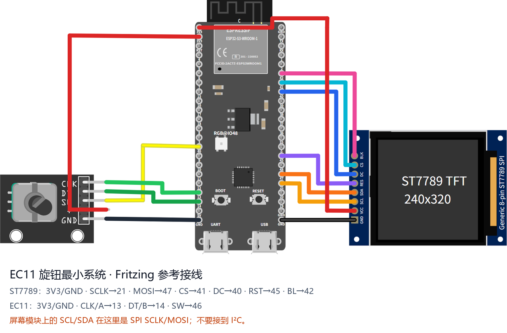

# ESP32-S3 板型

基于 ESP32-S3 模组（N16R8 / N8R8，带 Octal PSRAM）的板型。每节给出刷机包、接线与引脚表。

## esp32s3-st7789-320_240-ec11

**刷机包**: [ESP-IDFv5.5-esp32s3-st7789-320_240-ec11.zip](https://github.com/umeiko/KlipperScreen-esp/releases/latest/download/ESP-IDFv5.5-esp32s3-st7789-320_240-ec11.zip)

这是一个可以直接用杜邦线搭起来的官方参考机型：**ESP32-S3-DevKitC-1 N16R8 + 8 针 240×320 ST7789 SPI 屏 + KY-040/EC11 旋钮模块**。逻辑分辨率为 **320×240 横屏**。

可下载并修改 [Fritzing 源文件（.fzz）](../hardware/ec11_knob_minimal.fzz)，也可以查看 [Fritzing 导出的 SVG](../hardware/ec11_knob_minimal_breadboard.svg)。图中的 ST7789 是引脚顺序相同的通用 8 针模块；不同卖家的 PCB 外形、颜色和丝印位置可能不同。

| 模块引脚 | 接到 ESP32-S3 | 用途 |
|---|---|---|
| ST7789 GND | GND | 地 |
| ST7789 VCC | 3V3 | 屏幕供电 |
| ST7789 SCL / SCK | GPIO21 | SPI 时钟 |
| ST7789 SDA / MOSI | GPIO47 | SPI 数据输出 |
| ST7789 CS | GPIO41 | 片选 |
| ST7789 DC / RS | GPIO40 | 数据/命令选择 |
| ST7789 RST / RES | GPIO45 | 屏幕复位 |
| ST7789 BL / LED / BLK | GPIO42 | 背光，高电平点亮 |
| EC11 CLK / A | GPIO13 | 编码器 A 相 |
| EC11 DT / B | GPIO14 | 编码器 B 相 |
| EC11 SW / KEY | GPIO46 | 旋钮按下 |
| EC11 + / VCC | 3V3 | 模块供电 |
| EC11 GND | GND | 地 |
| 息屏按钮（外挂） | GPIO39 ── 按键 ── GND | 一键息屏/唤醒，内部上拉、低电平有效 |

开发板本身从 USB-C 供电。很多 SPI 屏把时钟和数据写成 `SCL`、`SDA`，这里仍然是 **SPI SCLK、MOSI**，不要接到 I2C 引脚。EC11 的旋转与按下都能导航，屏幕自动熄灭后再次操作旋钮即可唤醒；本机型没有触摸层，也不会进入触摸校准。

**息屏/唤醒按钮。** 在 GPIO39 与 GND 之间接一个轻触按键即可（固件开启内部上拉、下拉关闭：松开为高电平 1，按下接地为低电平 0，低电平有效）。按一下息屏，再按一下唤醒。开发板板载的 BOOT 键（GPIO0）功能相同——两个按钮同时生效，任意一个都能切换息屏/唤醒。

## esp32s3-st7796-480_320-xpt2046-ec11

**刷机包**: [ESP-IDFv5.5-esp32s3-st7796-480_320-xpt2046-ec11.zip](https://github.com/umeiko/KlipperScreen-esp/releases/latest/download/ESP-IDFv5.5-esp32s3-st7796-480_320-xpt2046-ec11.zip)

*本机型的典型板子——MKS TS35 V2.0：480×320 ST7796S 屏 + XPT2046 电阻触摸，板载 EC11 旋钮。*

与 esp32s3-st7789-320_240-ec11 **同款 ESP32-S3-DevKitC-1 N16R8 底座**的 480×320 电阻屏机型：ST7796S SPI 屏与 XPT2046 触摸**共用一条 SPI 总线**，EC11 旋钮沿用不变的参考引脚。逻辑分辨率 **480×320 横屏**（与 E32R35T 同一布局档）。出厂触摸校准已内置；个体差异可用串口 CLI `caltouch` 强制重校，校准结果存 `touch.json`，之后开机直接加载。

| 模块引脚 | 接到 ESP32-S3 | 用途 |
|---|---|---|
| SCK | GPIO21 | SPI 时钟——屏 + 触摸共用 |
| MOSI（SDA / DIN） | GPIO47 | SPI 数据出——屏数据 + 触摸 DIN 共用 |
| MISO（DOUT） | GPIO2 | SPI 数据入——XPT2046 坐标回读 |
| TFT_CS | GPIO41 | 屏幕片选 |
| TFT_DC（RS / A0） | GPIO40 | 数据/命令选择 |
| TOUCH_CS | GPIO1 | 触摸芯片片选 |
| RST / RES | GPIO45 | 屏幕复位；可省——接 3.3V 常高或共用 MCU 复位（驱动内另有软件复位） |
| BL / LED / BLK | GPIO42 | 背光，高电平点亮（LEDC PWM） |
| TOUCH_INT（T_IRQ） | — | 悬空不接——驱动轮询不依赖中断，触摸唤醒/点击/滑动全部照常 |
| EC11 CLK / A | GPIO13 | 编码器 A 相 |
| EC11 DT / B | GPIO14 | 编码器 B 相 |
| EC11 SW / KEY | GPIO46 | 旋钮按下 |
| EC11 + / VCC | 3V3 | 模块供电 |
| EC11 GND / C | GND | A/B/SW 公共端接地 |
| 息屏按钮（外挂） | GPIO39 ── 按键 ── GND | 一键息屏/唤醒，内部上拉、低电平有效；板载 BOOT 键（GPIO0）功能相同 |

开发板从 USB-C 供电。触摸与旋钮可同时使用——触摸走指针手势，旋钮走焦点导航。个别单元画面颠倒时，在 **设置 → 显示 → 180° 旋转** 里切换即可，不用改接线。

这套配置正好可以直接驱动 **Makerbase MKS TS35 V2.0**——接线参考下图：

## esp32s3-ILI9488-480_320-xpt2046-ec11

**刷机包**: [ESP-IDFv5.5-esp32s3-ILI9488-480_320-xpt2046-ec11.zip](https://github.com/umeiko/KlipperScreen-esp/releases/latest/download/ESP-IDFv5.5-esp32s3-ILI9488-480_320-xpt2046-ec11.zip)

*本机型的典型板子——MKS PI-TS35 V1.0：3.5" 480×320 ILI9488 SPI 屏 + XPT2046 电阻触摸（MKS PI / SKIPR Klipper 上位机板的配屏）。任何 ILI9488 + XPT2046 的 SPI 模组都同样适用。*

[esp32s3-st7796-480_320-xpt2046-ec11](#esp32s3-st7796-480_320-xpt2046-ec11) 的 ILI9488 孪生机型：**同款 ESP32-S3-DevKitC-1 N16R8 底座、同款接线**——屏与 XPT2046 共用一条 SPI 总线，EC11 旋钮沿用不变的参考引脚。逻辑分辨率 **480×320 横屏**。本面板无出厂触摸数据，**首次开机自动进入两点触摸校准**；结果存 `touch.json`，之后开机直接加载，个体差异可用串口 CLI `caltouch` 强制重校。

| 模块引脚 | 接到 ESP32-S3 | 用途 |
|---|---|---|
| SCK | GPIO21 | SPI 时钟——屏 + 触摸共用 |
| MOSI（SDA / DIN） | GPIO47 | SPI 数据出——屏数据 + 触摸 DIN 共用 |
| MISO（DOUT） | GPIO2 | SPI 数据入——XPT2046 坐标回读 |
| TFT_CS | GPIO41 | 屏幕片选 |
| TFT_DC（RS / A0） | GPIO40 | 数据/命令选择 |
| TOUCH_CS | GPIO1 | 触摸芯片片选 |
| RST / RES | GPIO45 | 屏幕复位；可省——接 3.3V 常高或共用 MCU 复位（驱动内另有软件复位） |
| BL / LED / BLK | GPIO42 | 背光，高电平点亮（LEDC PWM） |
| TOUCH_INT（T_IRQ） | — | 悬空不接——驱动轮询不依赖中断，触摸唤醒/点击/滑动全部照常 |
| EC11 CLK / A | GPIO13 | 编码器 A 相 |
| EC11 DT / B | GPIO14 | 编码器 B 相 |
| EC11 SW / KEY | GPIO46 | 旋钮按下 |
| EC11 + / VCC | 3V3 | 模块供电 |
| EC11 GND / C | GND | A/B/SW 公共端接地 |
| 息屏按钮（外挂） | GPIO39 ── 按键 ── GND | 一键息屏/唤醒，内部上拉、低电平有效；板载 BOOT 键（GPIO0）功能相同 |

固件已处理的 ILI9488 特性：

- ILI9488 走 4 线 SPI 时只收 **18-bit RGB666 像素**（COLMOD=0x66）。面板驱动（[atanisoft/esp_lcd_ili9488](https://components.espressif.com/components/atanisoft/esp_lcd_ili9488)）内部从 RGB565 转换
- 个别个体画面呈底片或方向不对时，用**设置 → 显示 → 反色 / 180° 旋转 / 水平镜像**修正即可，不用重刷固件
- PI-TS35 原生插 MKS PI 上位机板的 2×20 排母；接到 DevKit 时按 [MKS-TFT-Hardware](https://github.com/makerbase-mks/MKS-TFT-Hardware) 原理图把排母上的 SCK/MOSI/MISO/CS/DC/RST/BL/T_CS 网络对应到上面的引脚表

## esp32s3-ILI9341-320_240-xpt2046-ec11

**刷机包**: [ESP-IDFv5.5-esp32s3-ILI9341-320_240-xpt2046-ec11.zip](https://github.com/umeiko/KlipperScreen-esp/releases/latest/download/ESP-IDFv5.5-esp32s3-ILI9341-320_240-xpt2046-ec11.zip)

**ESP32-S3-DevKitC-1 N16R8 底座**的 320×240 电阻触摸机型：ILI9341 SPI 屏与 XPT2046 触摸**共用一条 SPI 总线**，外挂 EC11 旋钮。逻辑分辨率 **320×240 横屏**。无出厂触摸数据，**首次开机自动进入两点触摸校准**；结果存 `touch.json`，之后开机直接加载，个体差异可用串口 CLI `caltouch` 强制重校。

| 模块引脚 | 接到 ESP32-S3 | 用途 |
|---|---|---|
| SCK | GPIO21 | SPI 时钟——屏 + 触摸共用 |
| MOSI（SDA / DIN） | GPIO47 | SPI 数据出——屏数据 + 触摸 DIN 共用 |
| MISO（DOUT） | GPIO2 | SPI 数据入——XPT2046 坐标回读 |
| TFT_CS | GPIO41 | 屏幕片选 |
| TFT_DC（RS / A0） | GPIO40 | 数据/命令选择 |
| TOUCH_CS | GPIO1 | 触摸芯片片选 |
| RST / RES | GPIO45 | 屏幕复位；可省——接 3.3V 常高或共用 MCU 复位（驱动内另有软件复位） |
| BL / LED / BLK | GPIO42 | 背光，高电平点亮（LEDC PWM） |
| TOUCH_INT（T_IRQ） | — | 悬空不接——驱动轮询不依赖中断，触摸唤醒/点击/滑动全部照常 |
| EC11 CLK / A | GPIO13 | 编码器 A 相 |
| EC11 DT / B | GPIO14 | 编码器 B 相 |
| EC11 SW / KEY | GPIO46 | 旋钮按下 |
| EC11 + / VCC | 3V3 | 模块供电 |
| EC11 GND / C | GND | A/B/SW 公共端接地 |
| 息屏按钮（外挂） | GPIO39 ── 按键 ── GND | 一键息屏/唤醒，内部上拉、低电平有效；板载 BOOT 键（GPIO0）功能相同 |

开发板从 USB-C 供电。面板为 BGR 色彩顺序、不开反色；个别个体画面呈底片或方向不对时，用**设置 → 显示 → 反色 / 180° 旋转 / 水平镜像**修正即可，不用重刷固件。

## JC8048W550

**刷机包**: [ESP-IDFv5.5-jc8048w550.zip](https://github.com/umeiko/KlipperScreen-esp/releases/latest/download/ESP-IDFv5.5-jc8048w550.zip)

*Guition 5" 电容屏模组（ESP32-S3）。* 图：[openHASP 硬件页](https://www.openhasp.com/0.7.0/hardware/guition/jc8048w550/)

逻辑分辨率 **800×480**。

- 主控：ESP32-S3，16MB Flash + PSRAM（双帧缓冲 2×768KB 放在 PSRAM）
- 显示：ST7262 RGB 并口（RGB565），PCLK **必须 16MHz**；自研 rgb44 驱动
- 触摸：GT911 电容屏，I2C0，轮询无 INT，无需校准
- 背光：GPIO2，高电平点亮

| 功能 | GPIO |
|---|---|
| LCD DE / VSYNC / HSYNC / PCLK | 40 / 41 / 39 / 42 |
| LCD B0..B4 | 8, 3, 46, 9, 1 |
| LCD G0..G5 | 5, 6, 7, 15, 16, 4 |
| LCD R0..R4 | 45, 48, 47, 21, 14 |
| LCD 背光 | 2 |
| 触摸 SDA / SCL / RST | 19 / 20 / 38 |
| BOOT 按键（息屏/唤醒） | 0 |

## SenseCAP Indicator

**刷机包**: [ESP-IDFv5.5-esp32s3-sensecap-indicator.zip](https://github.com/umeiko/KlipperScreen-esp/releases/latest/download/ESP-IDFv5.5-esp32s3-sensecap-indicator.zip)

*Seeed SenseCAP Indicator（D1/D1S/D1L/D1Pro 显示部分硬件相同）：4" 480×480 方形电容屏，ESP32-S3 + RP2040 双主控设计。硬件资料：[Seeed Wiki](https://wiki.seeedstudio.com/cn/SenseCAP_Indicator_ESP32_4_inch_Touch_Screen/)。*

逻辑分辨率 **480×480**。

- 主控：ESP32-S3-WROOM-1-N8R8，8MB QIO Flash + 8MB Octal PSRAM @ 80MHz
- 显示：ST7701S RGB 并口（RGB565），PCLK 12MHz（约 42fps）；与 JC8048W550 同款自研 **rgb44** 驱动（LVGL DIRECT 双帧缓冲放 PSRAM）。面板初始化走位 bang 3 线 9-bit SPI——SCK/MOSI 是真 GPIO，CS/RST 挂在 TCA9535 扩展器上
- IO 扩展器：TCA9535，I2C0（先探 0x20，后期批次回退 0x39）；还挂着 RP2040 的复位线（拉高释放——RP2040 跑出厂固件，与本项目无关）
- 触摸：FT5x06 电容屏，与扩展器共用 I2C0，TP_RST 也在扩展器上（建驱动前先手动复位），无需校准
- 背光：GPIO45，LEDC PWM，高电平点亮
- 息屏/唤醒：侧键（GPIO38，低电平有效）
- 烧录请用 **"USB-SERIAL"（CH340）那个 Type-C 口**——ESP32-S3 侧，控制台 UART0 @ 115200。另一个口是 RP2040 的原生 USB，**不要**用它

| 功能 | GPIO | 备注 |
|---|---|---|
| LCD HSYNC / VSYNC / DE / PCLK | 16 / 17 / 18 / 21 | RGB 并口 |
| LCD B0..B4 | 15, 14, 13, 12, 11 | |
| LCD G0..G5 | 10, 9, 8, 7, 6, 5 | |
| LCD R0..R4 | 4, 3, 2, 1, 0 | |
| LCD 背光 | 45 | LEDC PWM，高电平点亮 |
| 初始化 SPI SCK / MOSI | 41 / 48 | 位 bang 3 线 9-bit |
| LCD CS / LCD RST | TCA9535 P4 / P5 | IO 扩展器，I2C 0x20（部分批次 0x39） |
| TP RST / RP2040 RST | TCA9535 P7 / P8 | |
| 触摸 + 扩展器 SDA / SCL | 39 / 40 | I2C0 @ 100kHz |
| 侧键（息屏/唤醒） | 38 | 低电平有效，内部上拉 |

## 立创实战派（JLC SZP ESP32-S3）

**刷机包**: [ESP-IDFv5.5-esp32s3-JLC-SZP.zip](https://github.com/umeiko/KlipperScreen-esp/releases/latest/download/ESP-IDFv5.5-esp32s3-JLC-SZP.zip)

*立创"实战派" ESP32-S3 开发板，板载 2.0" 电容触摸屏。*

逻辑分辨率 **320×240 横屏**。

- 主控：ESP32-S3-WROOM-1-N16R8，16MB QIO Flash + 8MB Octal PSRAM @ 80MHz
- 显示：ST7789（原生 240×320），SPI3 @ 80MHz **mode 3**，DMA 双缓冲（2 × 40 行）；BGR，横屏 MADCTL=0x68（MX|MV|BGR），**必须 INVON（反色开启）**
- **LCD CS 不是 GPIO**：在 PCA9557（I2C 0x19）P0 上，且面板要求**每笔 SPI 交易都有 CS 下降沿**，故本板不用 esp_lcd 面板驱动，直接 SPI master + 手动控 CS/DC；无 RST 脚，初始化以 SWRESET(0x01) 开始
- 触摸：FT6336 电容屏，与 PCA9557 同一条 I2C0 总线，轮询无 INT/RST，无需校准
- 背光：GPIO42，LEDC PWM 10bit/5kHz，**低电平点亮**（`output_invert` 方式驱动）
- 息屏/唤醒：板载用户键（GPIO0）

| 功能 | GPIO | 备注 |
|---|---|---|
| LCD MOSI / SCLK / DC | 40 / 41 / 39 | SPI3 @ mode 3，无 MISO |
| LCD CS | PCA9557 P0（I2C 0x19） | 逐笔交易翻转（空闲高）；P1 保持输入，P2=0 摄像头/TFT 电源 |
| LCD RST | — | 未连接，初始化必须 SWRESET |
| LCD 背光 | 42 | LEDC PWM，低电平点亮 |
| 触摸 / PCA9557 SDA / SCL | 1 / 2 | I2C0 @ 100kHz |
| 用户键（息屏/唤醒） | 0 | 低电平有效，内部上拉 |

## esp32s3-retro-go

**刷机包**: [ESP-IDFv5.5-esp32s3-retro-go.zip](https://github.com/umeiko/KlipperScreen-esp/releases/latest/download/ESP-IDFv5.5-esp32s3-retro-go.zip)

*Chaeng 的 retro-go ESP32-S3 掌机主板（T320-S3）：3.2" IPS 屏 + 全套掌机按键，无触摸。引脚依据上游固件 [retro-go_chaeng](https://github.com/Chaeng3/retro-go_chaeng)（`components/retro-go/targets/t320-s3`）核对；硬件开源页：[oshwhub.com/chaeng/project_jofcnupz](https://oshwhub.com/chaeng/project_jofcnupz)。*

逻辑分辨率 **320×240 横屏**。

- 主控：ESP32-S3（双核 240MHz），16MB QIO Flash + 8MB Octal PSRAM @ 80MHz
- 显示：T320B7-C12-16 3.2" IPS（ST7789，原生 240×320），SPI2 @ 40MHz，DMA 双缓冲（2 × 40 行）；RGB 颜色序，横屏 MADCTL（MV|MY），**必须 INVON**
- 输入：无触摸层——导航全部走板载 GPIO 按键，经 6 键语义层（上/下/左/右/确定/返回）驱动。确定键并联 **A、START、SELECT** 三键（任一个都是确认），返回键为 **B**；全部内部上拉、低电平有效。**KEY_MENU（GPIO18）、KEY_OPTION（GPIO8）、KEY_BOOT（GPIO0）本固件保留未映射**
- 背光：GPIO39，LEDC PWM 8bit/5kHz，高电平点亮
- 板上的 SD 卡槽、I2S 喇叭、麦克风、电池电量 ADC、WS2812 状态灯**本固件均未使用**

| 功能 | GPIO | 本固件是否使用 |
|---|---|---|
| TFT MOSI / CLK | 12 / 48 | 是——SPI2 @ 40MHz |
| TFT CS / DC / RST | 14 / 47 / 3 | 是 |
| TFT 背光 | 39 | 是——高电平点亮 |
| UP / DOWN / LEFT / RIGHT | 7 / 20 / 19 / 6 | 是——焦点导航 |
| A / START / SELECT | 15 / 17 / 16 | 是——三键同为确定 |
| B | 5 | 是——返回 |
| MENU / OPTION / BOOT | 18 / 8 / 0 | 否——保留未映射 |
| SD CMD(MOSI) / CLK / DATA(MISO) / CD(CS) | 11 / 13 / 9 / 10 | 否（SDSPI，SPI3） |
| 喇叭 DOUT / BCLK / LRCK | 40 / 41 / 42 | 否（I2S） |
| MIC WS / SCK / DIN | 1 / 2 / 21 | 否 |
| 电池电压 ADC | 4 | 否（ADC1_CH3） |
| STATUS_LED（WS2812） | 38 | 否 |

方向键移动焦点，确定激活聚焦控件，返回关闭弹层或退回上一面板——与桌面端键盘行为一致。屏幕超时熄灭后，第一次按键只负责唤醒。
