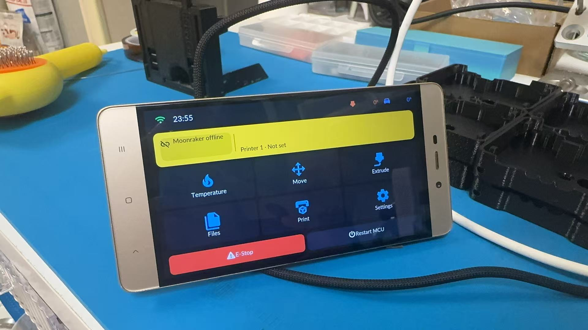

# Linux 客户端

**软件包**：[desktop-linux-x86_64.tar.gz](https://github.com/umeiko/KlipperScreen-esp/releases/latest/download/desktop-linux-x86_64.tar.gz) / [desktop-linux-arm64.tar.gz](https://github.com/umeiko/KlipperScreen-esp/releases/latest/download/desktop-linux-arm64.tar.gz) / [desktop-linux-armhf.tar.gz](https://github.com/umeiko/KlipperScreen-esp/releases/latest/download/desktop-linux-armhf.tar.gz)



*不用 ESP32——直接在打印机的 Linux 上位机上跑同一套 UI（图：退役红米4 手机，aarch64 Ubuntu 24.04，weston kiosk 后端）。手机/平板刷 Linux chroot/proot 也一样能用。*

桌面构建面向 Debian/Ubuntu 系 Linux 上位机（glibc ≥ 2.35，x86_64 与 arm64），是 KlipperScreen 的轻量替代——预编译二进制静态链接 SDL2/cJSON，上位机不需要编译任何东西。

### 一行安装

```bash
curl -fsSL https://raw.githubusercontent.com/umeiko/KlipperScreen-esp/main/scripts/linux/install.sh | bash
```

安装脚本自动识别架构、从最新 release 下载匹配的预编译包，然后询问安装形态：

- **独占显示服务（默认）**——写入 `KlipperScreen-esp.service` systemd 单元，开机自启全屏显示，图形后端可选 Wayland（weston kiosk shell）或 X11（裸 xinit），所需软件包（`weston` 或 `xinit`）自动安装。检测到 `KlipperScreen.service` 时会询问是否停用它，避免两个程序抢屏幕
- **桌面 App**——只装二进制 + 应用菜单里的启动快捷方式

文件装在 `~/.local/share/KlipperScreen-esp/`，配置存放在 `~/.config/KlipperScreen-esp/`。

### 手动安装

从 [Releases](https://github.com/umeiko/KlipperScreen-esp/releases/latest) 下载 `desktop-linux-x86_64.tar.gz` 或 `desktop-linux-arm64.tar.gz`，解压后运行 `./install.sh`。脚本化部署可用非交互环境变量：

```bash
SERVICE=n ./install.sh                  # 只装桌面 App
KR_BACKEND=x11 ./install.sh             # 服务模式，强制 X11
KR_BACKEND=wayland KR_START=0 ./install.sh
```

卸载用包内附带的 `./uninstall.sh`。

### 说明

- 720p 及以上分辨率自动切换到加大字号/图标档；高分辨率 Linux 上位机跳过开机动画，启动更快。
- 触摸走内核 evdev/libinput，weston 和 xinit 后端都会透传。
- Klipper 上位机（存在 `~/printer_data`）下，配置放在 `~/printer_data/config/KlipperScreen-esp/`，fluidd/mainsail 可直接查看编辑；服务日志写到 `~/printer_data/logs/KlipperScreen-esp.log`，网页端可直接下载。每次应用写配置会同步刷新 `.bak` 检查点——主文件被手改损坏时自动还原到最近一次已知良好的内容，不会崩。首次开机会把打印机槽 1 预填为本机 Moonraker（`127.0.0.1`，名称沿用登录用户名）。
- 想从源码构建见 [从源码构建](../building.md)。

---
