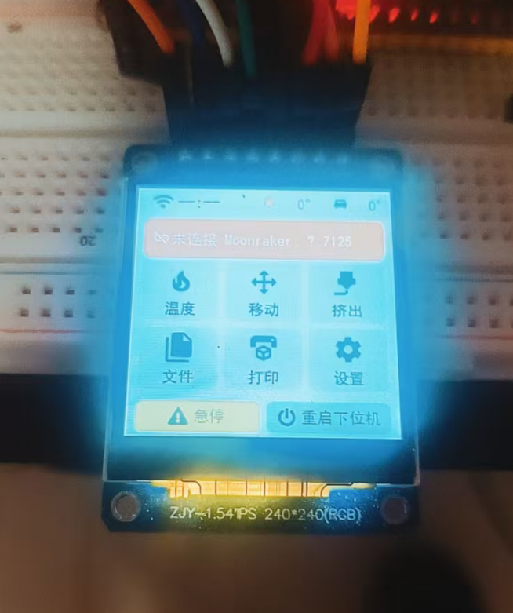

# 移植到自己的开发板（零基础教程）

这篇教程面向第一次给 ESP32 接屏幕的人。目标不是让你复制一块已有板子的代码，而是让你按顺序证明每一层都能工作，最后得到一个容易维护的新板型。

请从 `templates/board/` 开始。模板里的显示部分是一个**常见 SPI + ST7789 示例**，不是所有屏幕的通用答案。你的屏幕如果使用 ILI9341、ST7796、I80 并口、RGB 并口、QSPI 或 MIPI，显示部分必须按本章选择对应路线。

第 5 步的输入先做一级选择：纯旋钮板走“无触摸”路线；带触摸的板走“有触摸”路线，再按控制器区分“电阻屏”或“电容屏”。旋钮可以叠加到任意有触摸路线，触摸与旋钮可以共存。



整个移植分成七步，每一步都有一个明确的成功标准：

1. 准备环境，并成功编译已有板型。
2. 查清硬件，先判断屏幕接口属于哪一类。
3. 创建并登记一个干净的板型骨架。
4. **只点亮屏幕**，显示稳定的纯色测试图。
5. 把已经验证的显示代码接入 BSP 和 LVGL，再加入输入。
6. 编译并分层验证正式固件。
7. 按现象排错，准备贡献 PR。

!!! warning "一次只解决一层"
    点屏阶段不要同时加入触摸、WiFi、Moonraker 和完整 UI。背光亮起也不等于屏幕已经工作：背光 LED 和液晶像素通常是两套独立电路。

---

## 第 0 步：准备环境

### 0.1 安装 ESP-IDF v5.5.5

本项目固定使用 ESP-IDF v5.5.5。

- Windows：用乐鑫安装器安装 v5.5.5。默认会得到 `C:\esp\v5.5.5\esp-idf` 和 `C:\Espressif\tools`。
- Linux/macOS：使用对应版本 ESP-IDF 自带的 `install.sh`。

仓库里的 `tools/idf.ps1`、`tools/idf-env.bat` 和构建脚本会负责激活环境，不需要自己长期修改 PATH。

### 0.2 拉取项目并验证工具链

```bash
git clone https://github.com/umeiko/KlipperScreen-esp.git
cd KlipperScreen-esp
bash tools/build-esp32.sh cyd_2432s028r
```

末尾出现 `Project build complete`，并且应用没有超过 `Smallest app partition`，才说明工具链正常。第一次构建需要下载依赖，通常比后续增量构建慢很多。

**本步成功标准**：不修改源码也能编译一个已有板型。做不到就先修环境，不要开始改显示驱动。

---

## 第 1 步：先把硬件资料查完整

### 1.1 建立一张板型资料卡

从原理图、厂商示例、屏幕排线丝印和芯片手册里填写下面的表。商品标题经常只写屏幕尺寸，不能代替这些信息。

| 项目 | 你要记录的内容 | 例子 |
|---|---|---|
| ESP 芯片 | 精确型号 | ESP32、ESP32-S3、ESP32-P4 |
| Flash / PSRAM | 容量、模式、频率 | 16MB Flash、8MB OPI PSRAM |
| 显示控制器或时序芯片 | 完整型号 | ILI9341、ST7789、ST7796、ST7262 |
| **像素接口** | SPI、I80、RGB、QSPI、MIPI DSI | SPI |
| 原生分辨率 | 面板未旋转时的宽 × 高 | 240×320 |
| 显示引脚 | 全部信号名和 GPIO | SCLK、MOSI、CS、DC、RST |
| 显示参数 | SPI mode / 频率，或 RGB 时序 | 40MHz、mode 0 |
| 背光 | GPIO、有效电平、是否支持 PWM | GPIO21，高电平点亮 |
| 触摸（可选） | 控制器、接口、共用总线情况 | XPT2046，独立 SPI |
| 旋钮（可选） | A、B、按键 GPIO | GPIO4/5/6 |

资料优先级建议是：**能稳定运行的同板厂商示例 > 原理图和屏幕规格书 > 同控制器参考代码 > 商品页 > 猜测**。

### 1.2 先根据引脚名字判断接口

“并口屏”不是一种实现。I80 和 RGB 都有很多数据线，但工作方式完全不同。

| 常见引脚 | 接口类型 | 屏幕如何收图 | 本项目中的起点 |
|---|---|---|---|
| `SCLK/MOSI/CS/DC/RST` | SPI 命令屏 | MCU 发送命令和像素，屏内 GRAM 保存画面 | 板型模板、CYD、E32R35T |
| `D0..D7/15 + WR/RD/CS/DC` | I80/8080 命令并口 | 和 SPI 类似，只是一次并行传 8/16 位 | ESP-IDF I80 示例 + 匹配的 panel driver |
| `R0..B4 + PCLK/HSYNC/VSYNC/DE` | RGB/DOTCLK 并口 | MCU 必须连续输出整帧，屏通常不替你保存画面 | ESP-IDF RGB panel 示例；JC8048 仅作特殊案例 |
| `CLK + D0..D3 + CS` | QSPI | 用 4 条数据线传命令或像素，协议依控制器而定 | 对应控制器驱动或厂商示例 |
| `D0P/D0N、CLKP/CLKN` | MIPI DSI | 高速差分链路 | 仅在芯片支持 DSI 时从 ESP-IDF DSI 示例开始 |

!!! tip "控制器型号和接口是两个问题"
    同一种 ST7789 控制器可以接 SPI，也可以接 I80。选择哪套总线代码要看板子实际接出了哪些引脚，不能只看“ST7789”这个名字。

### 1.3 判断内存是否够用

RGB565 每个像素占 2 字节：

```text
一帧字节数 = 宽 × 高 × 2
320 × 240  = 153,600 字节
480 × 320  = 307,200 字节
800 × 480  = 768,000 字节
```

SPI/I80 命令屏通常只需要 20～40 行的局部 DMA 缓冲。RGB 屏通常需要至少一块完整帧缓冲，双缓冲则需要两倍空间。大分辨率 RGB 屏基本离不开 PSRAM，还要考虑 PSRAM 与显示 DMA 是否争用带宽。

**本步成功标准**：你能明确说出自己的接口类型，并把所有显示引脚和关键参数写进资料卡。接口还不确定时不要复制 BSP。

---

## 第 2 步：创建并登记板型骨架

先复制干净模板：

```bash
cp templates/board/bsp_board_template.c src/bsp/esp32/bsp_myboard.c
cp templates/board/sdkconfig.defaults.board_template src/ports/esp32/sdkconfig.defaults.myboard
```

替换 `BOARD_TEMPLATE`、`board_template` 和全部 `TODO(board)`。此时显示部分仍可以暂时保留示例 ST7789 transport；第 3 步会在硬件测试前替换它。

需要修改以下位置：

| 文件 | 要做什么 |
|---|---|
| `src/bsp/Kconfig.projbuild` | 在 board choice 中添加 `CONFIG_BOARD_MYBOARD` |
| `src/bsp/CMakeLists.txt` | 添加 `bsp_myboard.c`；登记新显示/触摸组件依赖 |
| `src/ports/esp32/entry/idf_component.yml` | 添加组件注册表中的新 driver 依赖 |
| `src/ports/esp32/sdkconfig.defaults.myboard` | 芯片、Flash、PSRAM、板型和旋钮默认项 |
| `src/ui/ui_layout.c` | 为分辨率选择小/大字体档 |
| `tools/build-esp32.sh` | 增加 target、build 目录和 sdkconfig 名称 |

板型默认配置从模板开始，只从同芯片板型复制芯片/Flash/PSRAM 配置。不要复制另一个板子的显示 GPIO 或触摸配置。

!!! warning "sdkconfig 容易让人误判"
    第一次构建后会生成完整的 `sdkconfig.myboard`。之后只改 `sdkconfig.defaults.myboard` 不会更新旧 sdkconfig。调配置时要么同步修改两者，要么确认可以丢弃旧配置后重新生成。`# CONFIG_XXX is not set` 也会覆盖 defaults。

---

## 第 3 步：单独点亮屏幕

这一章只解决一件事：让屏幕稳定显示红、绿、蓝、白、黑五条色带。只修改第 2 步新建板型文件中的显示 transport；LVGL 和输入留到后面。

### 3.1 先分清“背光”和“画面”

- 背光亮、整屏白色：通常只证明背光供电正常，显示控制器可能没有初始化。
- 背光不亮、串口日志正常：先检查背光 GPIO、电平和供电；像素可能已经在刷新，只是你看不见。
- 背光亮、颜色条稳定：显示总线、初始化序列和最基本的像素传输已经成立。

点屏时先让背光固定 100%，暂时不要加入亮度滑杆和自动息屏。

### 3.2 找一个“已知能亮”的最小参考

优先使用同一块板子的厂商例程。先原样编译、烧录并确认它真的稳定，再抄出这些参数：

- 显示接口和引脚；
- 复位、背光和显示使能电平；
- SPI mode、SPI 时钟，或 RGB PCLK 与 porch/pulse 时序；
- 控制器初始化命令；
- RGB/BGR、反色、旋转和坐标偏移；
- 缓冲放在内部 RAM 还是 PSRAM。

如果厂商例程也不亮，应先解决接线、供电或资料错误。本项目的 UI 无法补救错误的硬件参数。

### 3.3 所有接口都遵循同一个点屏顺序

1. 配置供电、背光和复位 GPIO。
2. 初始化像素总线。
3. 创建 panel 或时序驱动。
4. 复位屏幕。
5. 发送初始化序列。
6. 打开显示输出。
7. 推送五色测试图。
8. 保持静止至少 30 秒，观察闪烁、偏移和撕裂。

只有第 2、3、5、7 步会随屏幕类型大幅变化。

### 3.4 路线 A：SPI 命令屏

适合 ILI9341、ST7789、ST7796 等通过 SPI 接线的屏幕。模板就是这条路线。

#### 先改什么

1. 把模板中的引脚改成原理图数值。没有 MISO 很正常，显示通常只写不读。
2. 从 10～20MHz 开始验证，稳定后再逐步提高到厂商确认的频率。
3. 按厂商示例填写 `spi_mode`，不要靠反复试四种模式代替查资料。
4. 把 `esp_lcd_new_panel_st7789()` 换成真实控制器的构造函数。
5. 如果该驱动不在当前依赖中，在 `idf_component.yml` 和 BSP 的 CMake 依赖里登记它。
6. 按实际需要设置 `swap_xy`、`mirror`、`invert_color` 和 `set_gap`。

总线、panel IO 和控制器是三层不同的东西：

```text
GPIO/SPI host
    └─ esp_lcd_new_panel_io_spi()     负责怎么发送字节
          └─ esp_lcd_new_panel_xxx()  负责发送什么初始化命令
                └─ draw_bitmap()      负责把一个矩形像素块写进屏幕 GRAM
```

换了控制器时，通常不只是换头文件。初始化命令、颜色格式、可见区域偏移和休眠/唤醒命令都可能不同。

#### SPI 屏适合的 LVGL 模式

使用 `LV_DISPLAY_RENDER_MODE_PARTIAL`，准备两块 20～40 行的 `MALLOC_CAP_DMA` 缓冲。flush 把 `area` 对应的矩形交给 `esp_lcd_panel_draw_bitmap()`。

DMA 传输是异步的。只有确认传输完成后，才能调用 `lv_display_flush_ready()` 让 LVGL 复用缓冲。模板用 `on_color_done` + 信号量完成这个等待。

#### 常见 SPI 特有问题

- 全白：CS/DC/RST 错、控制器驱动错、初始化命令没发出。
- 整体图像平移或边缘缺失：需要 `esp_lcd_panel_set_gap()`。
- 红蓝互换：切换 RGB/BGR。
- 像照片负片：切换 `esp_lcd_panel_invert_color()`。
- 颜色像随机雪花：先降 SPI 时钟，再检查 RGB565 字节顺序。
- 第一帧正常，动画后破碎：DMA 缓冲在传完以前被释放或重写。

### 3.5 路线 B：I80/8080 命令并口

I80 屏有 `WR`、`RD`、`CS`、`DC` 和 8/16 根数据线。它虽然叫并口，工作模型仍接近 SPI 命令屏：屏内有 GRAM，MCU 把矩形区域写进去后，屏幕自己保持画面。

与 SPI 路线相比，主要替换两层：

```text
esp_lcd_new_i80_bus()
esp_lcd_new_panel_io_i80()
```

后面的 `esp_lcd_new_panel_xxx()`、`esp_lcd_panel_draw_bitmap()`、传输完成回调和 LVGL PARTIAL 缓冲思路通常仍可复用。数据位宽、`WR` 时钟、数据线顺序和最大传输字节数必须来自原理图或已知可用示例。

!!! warning "不要把 I80 当成 RGB"
    I80 有 `WR/DC/CS`，RGB 有 `PCLK/HSYNC/VSYNC/DE`。二者的驱动、缓冲和时序不可互换。

### 3.6 路线 C：RGB/DOTCLK 并口

RGB 屏有多根颜色数据线和 `PCLK/HSYNC/VSYNC/DE`。屏幕按像素时钟不停扫描；如果数据停止，画面通常也不能像 SPI 屏那样继续由 GRAM 保持。

#### 必须从可靠来源得到的参数

- 每根 R/G/B 数据线对应的 GPIO，顺序不能错；
- `PCLK` 频率以及在哪个边沿采样；
- HSYNC/VSYNC 的 pulse width、back porch、front porch；
- 是否使用 DE，及其有效电平；
- 分辨率和一行/一帧的总时序；
- 帧缓冲位置、数量及 PSRAM 配置。

先从 ESP-IDF v5.5.5 的 `examples/peripherals/lcd/rgb_panel` 或同板厂商例程做最小色带测试。普通 RGB 板应先尝试官方 `esp_lcd_new_rgb_panel()`。不要一开始就复制 JC8048W550 的 `rgb44`。

#### RGB 屏适合的 LVGL 模式

RGB 屏通常由完整帧缓冲驱动，常见组合是：

| 方案 | 内存 | 特点 |
|---|---:|---|
| 单全帧缓冲 | 1 帧 | 省内存，但边扫描边写可能撕裂 |
| 双全帧缓冲 | 2 帧 | 离屏渲染后在 VSYNC 换页，画面更稳 |
| bounce buffer | 全帧 + 小块内部 RAM | 可缓解某些 PSRAM/DMA 限制，但参数敏感 |

本项目的 JC8048W550 使用 `rgb44` + LVGL DIRECT 双缓冲，是针对这块 ESP32-S3/800×480 板经过实测得到的特殊路径。它还要求 VSYNC 换页、等待换页完成，以及在自管 PSRAM 帧缓冲时正确处理 cache 写回。完整原因见 [JC8048W550 RGB 屏专项指南](jc8048w550-rgb-display-guide.md)。

只有在下面三件事都成立时，才考虑借用这条特殊路径：

1. 厂商最小例程稳定；
2. 官方 RGB panel 最小例程在相同硬件参数下出现可重复的欠载、错位或撕裂；
3. 你已经测量并确认问题在传输模型，而不是 PCLK、时序、引脚或 UI 负载。

#### 常见 RGB 特有问题

- 面板循环显示自检色：PCLK 或同步时序不被面板接受。
- 整屏斜着滚、周期错位：一行/一帧总时序错误。
- 颜色通道错乱：R/G/B 数据线顺序或位宽错误。
- 静态正常，滑动时抽动：PSRAM 带宽、DMA 欠载或 cache 一致性问题。
- 小块更新不出现，大面积更新偶尔出现：检查自管帧缓冲的 cache 写回和换页同步。

调 RGB 屏时每次只改一个变量，并记录厂商例程和当前固件的对应参数。

### 3.7 路线 D：QSPI、MIPI 或不认识的接口

QSPI 不是“把 SPI 的 MOSI 改成四根线”；MIPI DSI 也不能套用 RGB 时序。先确认 ESP 芯片是否具有对应外设，再从 ESP-IDF 同版本的官方示例或控制器厂商驱动开始。

本仓库目前没有可直接复制的 QSPI/MIPI 板型模板。此时仍可复用 BSP 公共接口、UI、输入和配置层，但显示 transport 是一个新的适配工作。PR 中应附上数据手册、已知可用最小例程和色带测试结果，避免后来的人再次猜协议。

### 3.8 用统一的五色色带验收

先实现 `bsp_lcd_push(x, y, w, h, pixels)`，然后在 panel/帧缓冲初始化完成后、`lv_init()` 之前临时调用下面的测试。它只使用 20 行缓冲，适合小内存板：

```c
static void display_smoke_test(void)
{
    static const uint16_t colors[] = {
        0xF800,  /* red   */
        0x07E0,  /* green */
        0x001F,  /* blue  */
        0xFFFF,  /* white */
        0x0000,  /* black */
    };
    const int lines = 20;
    uint16_t *buf = heap_caps_malloc(LCD_H_RES * lines * 2, MALLOC_CAP_DMA);
    ESP_ERROR_CHECK(buf ? ESP_OK : ESP_ERR_NO_MEM);

    for (int band = 0; band < 5; band++) {
        int y1 = band * LCD_V_RES / 5;
        int y2 = (band + 1) * LCD_V_RES / 5;
        for (int y = y1; y < y2; y += lines) {
            int h = y + lines <= y2 ? lines : y2 - y;
            for (int i = 0; i < LCD_H_RES * h; i++) buf[i] = colors[band];
            bsp_lcd_push(0, y, LCD_H_RES, h, buf);
        }
    }
    while (1) vTaskDelay(pdMS_TO_TICKS(1000));
}
```

`bsp_lcd_push()` 必须吸收具体传输差异：SPI/I80 路线写 panel GRAM 并等待 DMA；RGB 路线把像素写入当前测试帧缓冲并确保扫描端能看到它。

验收时检查：

- 五条颜色顺序和颜色本身正确；
- 色带覆盖完整可见区域，没有固定偏移；
- 画面方向符合产品安装方向；
- 静止 30 秒不闪、不滚动、不出现随机线；
- 重启十次都能点亮。

通过后保存一张照片和串口日志，删除无限循环，再进入下一步。

### 3.9 把已验证参数写在 BSP 顶部

至少留下这些注释：资料来源、原生分辨率、接口、稳定频率/时序、颜色顺序、方向和任何非默认初始化命令。以后出现显示回归时，这份记录就是基线。

**本步成功标准**：不启动 LVGL，也能稳定显示五色色带。未通过时不要继续。

---

## 第 4 步：把显示接入 BSP 和 LVGL

### 4.1 先分清哪些保留、哪些替换

继续使用第 2 步创建的板型文件。不要整份复制已有 BSP；它可能包含别的板子的触摸校准、显示时序、内存策略和硬件补丁。

模板分成两类内容：

- **公共生命周期**：锁、存储、重启、LVGL 任务、息屏契约。通常保留。
- **显示 transport**：总线、panel、`bsp_lcd_push`、`flush_cb`、缓冲和渲染模式。必须使用第 3 步已经验证的方案。

如果是 SPI/ST7789，可以直接从模板逐项修改。如果是其他 SPI 控制器，替换 panel driver 和初始化差异。如果是 I80 或 RGB，应删除模板的 SPI transport，再放入对应实现；不要同时保留两套。

### 4.2 上层只要求这些显示边界

| BSP 接口 | 上层用途 | 新板需要保证什么 |
|---|---|---|
| `bsp_lcd_push()` | LVGL 启动前的开机动画 | 调用返回时，传入缓冲已经可以安全复用 |
| `bsp_get_display()` | UI 查询默认显示器 | 返回 `lv_display_create()` 创建的默认 display |
| `bsp_screen_power_init()` | 注册背光实现 | 传入板级 `backlight_apply(0..100)` 和毫秒时钟 |
| `bsp_fade_out()` | 重启前渐暗 | 至少安全关闭背光；能清帧则更好 |
| `bsp_disp_can_*()` | 是否显示反色/旋转设置 | 硬件或当前 transport 不支持就返回 false |

`bsp_lcd_push()` 的“返回即安全”很重要。开机动画会复用同一块像素内存；异步 DMA 没结束就返回会产生条带和随机色块。

### 4.3 选择 LVGL 缓冲模式

| 显示 transport | 推荐起点 | 缓冲放置 | flush 的责任 |
|---|---|---|---|
| SPI 命令屏 | PARTIAL，双 20～40 行 | 内部 DMA RAM | 写脏矩形，等传输完成，再 `flush_ready` |
| I80 命令屏 | PARTIAL，双局部缓冲 | 对应 DMA 可访问内存 | 与 SPI 相同，只是总线不同 |
| RGB 并口 | 官方驱动建议的全帧方案 | 常在 PSRAM | 维护持续扫描、cache 和换页同步 |
| 自管双帧 RGB | DIRECT，双全帧 | 按芯片能力选择 | 只在最后一个 flush 请求换页，完成后再 `flush_ready` |

不要因为 FULL、DIRECT 看起来“更快”就随意切换。渲染模式必须和物理屏幕的传输模型及缓冲所有权一致。

### 4.4 分三次把完整 UI 接回来

1. **LVGL 基础测试**：只创建 display，画一个纯色背景和一个矩形。
2. **项目开机动画**：确认 `bsp_lcd_push()` 连续更新稳定。
3. **完整 `ui_app_create()`**：检查页面切换、列表滚动和大面积重绘。

每次只增加一层。若第 1 层正常、第 2 层坏，重点检查 `bsp_lcd_push` 的缓冲生命周期；若前两层正常、完整 UI 滑动才坏，重点检查刷新吞吐、DMA/PSRAM 带宽和换页。

### 4.5 公共 BSP 函数

下面这些通常与显示控制器无关，可以保留模板实现：

- `bsp_lvgl_lock()` / `bsp_lvgl_unlock()`：保护 LVGL；
- `bsp_delay_ms()` / `bsp_restart()`：延时和重启；
- NVS 与 LittleFS 初始化：保存网络、Moonraker 和界面配置；
- `lvgl_task()`：周期调用 `lv_timer_handler()` 和 `bsp_screen_power_poll()`；
- `bsp_screen_activity()`、亮度记忆、自动息屏和唤醒：由公共 `bsp_screen_power` 实现，新板不要复制一套状态变量。

板型只实现 `static void backlight_apply(int percent)`：把公共状态机给出的 0～100 转成真实 PWM、GPIO 或背光 IC 命令。有效电平和非线性曲线留在这个函数里；不要在板型 BSP 再保存用户亮度或 `screen_off`。

```c
static void backlight_apply(int percent)
{
    /* TODO(board)：只在这里把 0..100 换算成真实硬件信号。 */
    ledc_set_duty(LEDC_LOW_SPEED_MODE, LEDC_CHANNEL_0,
                  percent * 255 / 100);
    ledc_update_duty(LEDC_LOW_SPEED_MODE, LEDC_CHANNEL_0);
}

static uint64_t screen_now_ms(void)
{
    return (uint64_t)(esp_timer_get_time() / 1000);
}

/* 背光硬件初始化完成后调用一次。 */
bsp_screen_power_init(backlight_apply, screen_now_ms);
```

**本步成功标准**：开机动画和完整 UI 都能稳定显示，连续滚动不会出现花屏、撕裂或错位。

---

## 第 5 步：最后加入输入

显示没通过第 4 步之前，不要调触摸坐标。

### 5.1 先只回答一个问题：这个产品有没有触摸？

输入路线只有下面两条。旋钮是两条路线都能追加的可选输入，不会改变触摸驱动的写法。

- **没有触摸**：不要创建 LVGL pointer，也不要放入任何触摸初始化或校准代码。纯旋钮产品只需启用第 5.6 节的旋钮 Kconfig。
- **有触摸**：只创建一个 LVGL pointer，然后根据实际控制器在“电阻触摸实现”和“电容触摸实现”中二选一。需要旋钮时再额外启用第 5.6 节；触摸和旋钮可以同时存在。

```text
没有触摸 ──> 不创建 pointer ──> 可选：启用旋钮

有触摸 ───> 选择且只选择一种触摸实现 ──> 创建 pointer
                                      └──> 可选：同时启用旋钮
             ├─ 电阻控制器：原始坐标 ──> 校准/映射 ──┐
             └─ 电容控制器：屏幕坐标 ──────────────┴─> LVGL
```

不要同时实现下面两套示例。它们是同一个触摸适配器接口的两种替代实现。

### 5.2 两种触摸最终都交给同一个 LVGL pointer

无论控制器是电阻还是电容，板型 BSP 最终只需要创建一个触摸适配器：

```c
#if BOARD_HAS_TOUCH
ESP_ERROR_CHECK(board_touch_input_create(display, &touch_config));
#endif
```

`board_touch_input_create()` 负责初始化真实触摸芯片、创建 `LV_INDEV_TYPE_POINTER`，并注册一个读取回调。控制器差异应藏在这个适配器内部。给 LVGL 的最后一段逻辑基本相同：

这里的 `board_touch_input_create()`、`touch_read_screen_point()` 等名字用于说明接口形状，不是要求逐字复制的公共 API。可直接对照仓库中的电阻屏实现
[`bsp_cyd_2432s028r.c`](../src/bsp/esp32/bsp_cyd_2432s028r.c)、
[`bsp_e32r35t.c`](../src/bsp/esp32/bsp_e32r35t.c)，以及电容屏实现
[`bsp_jc8048w550.c`](../src/bsp/esp32/bsp_jc8048w550.c) 和
[`touch_input_board_template.c`](../templates/board/touch_input_board_template.c)。

```c
static void touch_read_cb(lv_indev_t *indev, lv_indev_data_t *data)
{
    static bool swallow_until_release;
    uint16_t x, y;

    if (!touch_read_screen_point(&x, &y)) {
        swallow_until_release = false;
        data->state = LV_INDEV_STATE_RELEASED;
        return;
    }

    if (bsp_screen_activity())
        swallow_until_release = true;   /* 本次按下只用于唤醒 */

    if (swallow_until_release) {
        data->state = LV_INDEV_STATE_RELEASED;
        return;
    }

    data->point.x = x;
    data->point.y = y;
    data->state = LV_INDEV_STATE_PRESSED;
}
```

这里的 `touch_read_screen_point()` 是需要二选一的部分：电阻屏实现先读原始 ADC 坐标再做校准映射；电容屏实现通常直接读取屏幕坐标。

### 5.3 怎样判断是电阻还是电容实现？

看触摸控制器型号和驱动输出，不要根据 LCD 型号猜。

| 典型控制器 | 驱动通常返回 | 项目侧校准 |
|---|---|---|
| XPT2046、ADS7846 | 原始 ADC 坐标 | 通常需要 |
| GT911、CST816S、FT5x06 | 已换算的屏幕坐标 | 通常不需要 |

最终判断标准是驱动输出：如果同一个物理点在不同机器上得到明显不同的原始数值，就需要保存校准参数；如果驱动已经稳定返回 `0..宽-1`、`0..高-1` 的坐标，就不应再套两点校准。

### 5.4 电阻触摸实现：读取原始值，再映射成屏幕坐标

下面是 XPT2046 一类控制器的核心形状。`xpt2046_read_raw()` 只读取硬件，`touch_cal` 属于这个电阻触摸适配器，不属于公共 BSP：

```c
typedef struct {
    float x_mul, x_add;
    float y_mul, y_add;
} touch_cal_t;

static touch_cal_t touch_cal;

static bool touch_read_screen_point(uint16_t *x, uint16_t *y)
{
    uint16_t raw_x, raw_y;
    if (!xpt2046_read_raw(&raw_x, &raw_y))
        return false;

    int32_t sx = lroundf(raw_x * touch_cal.x_mul + touch_cal.x_add);
    int32_t sy = lroundf(raw_y * touch_cal.y_mul + touch_cal.y_add);
    *x = LV_CLAMP(0, sx, LCD_H_RES - 1);
    *y = LV_CLAMP(0, sy, LCD_V_RES - 1);
    return true;
}
```

触摸可能与显示共用 SPI，也可能使用独立 SPI，必须按原理图确认。共用总线时复用已经创建的 SPI host，不能再次初始化同一个 host。

#### 5.4.1 电阻屏已经有可靠的出厂校准值

这仍然需要“校准映射”，只是用户不需要看见校准页面。没有已保存数据时装入该板实测过的默认值：

```c
xpt2046_init();

if (!touch_cal_load(&touch_cal)) {
    touch_cal = BOARD_FACTORY_TOUCH_CAL;  /* 必须来自该板真机测量 */
    touch_cal_save(&touch_cal);
}

board_touch_register_pointer(display);
```

不要从另一种板型复制默认值。同一个 XPT2046，因为面板尺寸、安装方向和 ADC 范围不同，参数也可能完全不同。

#### 5.4.2 电阻屏没有可靠的出厂值，需要用户校准

先让触摸硬件能够返回原始坐标；找不到已保存参数时才显示校准点，计算映射并保存：

```c
xpt2046_init();

if (!touch_cal_load(&touch_cal)) {
    touch_cal_run(&touch_cal);   /* 显示校准点并采集 raw_x/raw_y */
    touch_cal_save(&touch_cal);
}

board_touch_register_pointer(display);
```

`touch_cal_load/run/save()` 是电阻触摸适配器自己的函数，不是每块板都必须实现的 BSP 接口。校准流程使用显示和原始触摸采样，因此应留在电阻屏代码旁边。

#### 5.4.3 完全不需要校准时，代码是什么样？

不需要校准就完全不要出现 `touch_cal_*` 或 `touch.json`：

```c
touch_controller_init();
board_touch_register_pointer(display);
```

这种路线通常用于电容屏，或者用于已经在驱动内部完成坐标换算的特殊控制器。不要为了“接口完整”创建空校准函数。

### 5.5 电容触摸实现：直接读取屏幕坐标

GT911、CST816S、FT5x06 一类控制器通常直接报告屏幕坐标。适配器只需初始化控制器，按安装方向设置 swap/mirror，并把坐标交给第 5.2 节的公共 pointer 回调；不读取 `touch.json`，也不进入校准页面。

仓库提供了一个可以直接阅读和复制的 CST816S 实现：

- `templates/board/touch_input_board_template.h`：板型 BSP 看到的小接口；
- `templates/board/touch_input_board_template.c`：I2C、CST816S、中断后读取、坐标上报和息屏唤醒。

模板 BSP 的调用只有这一条路线：

```c
board_template_touch_input_config_t touch_config = {
    .h_res = LCD_H_RES,
    .v_res = LCD_V_RES,
    .reset_gpio = PIN_TOUCH_RST,
    .interrupt_gpio = PIN_TOUCH_INT,
    .swap_xy = false,
    .mirror_x = false,
    .mirror_y = false,
};

ESP_ERROR_CHECK(board_template_touch_input_create(
    display, touch_i2c_bus, &touch_config));
```

接入新板时：

1. 复制 `touch_input_board_template.c/.h`，把文件名及 `board_template` 改成板名。
2. 在 `src/bsp/CMakeLists.txt` 的 `SRCS` 加入 `.c` 文件。
3. 在 `src/ports/esp32/entry/idf_component.yml` 加入匹配的触摸驱动。
4. 先把 swap/mirror 全设为 false，用四角测试页只调整实际需要的方向。

CST816S 在触摸事件后才短暂响应 I2C，所以示例使用 INT 和信号量，只在中断后读取。商品资料写 **CST816T** 时应先核对丝印和数据手册；名字接近不代表寄存器和中断行为兼容。换成另一个 `esp_lcd_touch` 控制器时，通常替换头文件、IO 配置宏、创建函数和必要的读取策略，第 5.2 节的 LVGL pointer 形状可以保留。

如果确认是 CST816S，但初始化停在读取芯片 ID，可按驱动说明尝试：

```ini
CONFIG_ESP_LCD_TOUCH_CST816S_DISABLE_READ_ID=y
```

### 5.6 可选的旋转编码器

编码器与“有没有触摸”是两个独立选择。共享 `bsp_input_init()` 根据 Kconfig 创建 encoder，不要把 GPIO 中断、PCNT 或焦点遍历写进板型 BSP。

```ini
CONFIG_INPUT_ROTARY_ENCODER=y
CONFIG_INPUT_ROTARY_GPIO_A=4
CONFIG_INPUT_ROTARY_GPIO_B=5
CONFIG_INPUT_ROTARY_GPIO_BUTTON=6
CONFIG_INPUT_ROTARY_COUNTS_PER_DETENT=4
CONFIG_INPUT_ROTARY_PHASE_PULLUPS=y
CONFIG_INPUT_ROTARY_BUTTON_ACTIVE_LOW=y
```

裸编码器公共脚通常接 GND，A/B 和按键接对应 GPIO。模块已有外部上拉时关闭内部相位上拉；方向反了启用 `CONFIG_INPUT_ROTARY_REVERSE`；一格跳过多个控件时把 counts 从 4 降到 2 或 1。

纯旋钮板会使用专用交互：Moonraker 主机地址按四个 0～255 段输入，温度直接在卡片内旋转调节。域名或 API Key 等任意文本需要由出厂配置、维护接口或触摸键盘提供；常见同局域网部署也可使用 Moonraker `trusted_clients`。

### 5.7 息屏唤醒属于公共策略

触摸和旋钮都调用 `bsp_screen_activity()`。它返回“这次操作是否刚刚唤醒屏幕”，各自的适配器再按输入形态吞掉本次点击、旋转或按压。独立息屏键调用 `bsp_screen_toggle()`，不作为 LVGL 输入。

**本步成功标准**：无触摸板完全没有 pointer 和校准流程；有触摸板只编译一种匹配控制器的实现；电容屏永不进入校准；电阻屏能装入该板的出厂参数或完成一次校准；可选旋钮能与两条路线正常组合。

---

## 第 6 步：编译、烧录和分层验收

```bash
bash tools/build-esp32.sh myboard
bash tools/build-esp32.sh myboard flash COM6
```

按下面顺序验收，不要只看“主界面出现了”：

1. **构建**：产物没有超过应用分区。
2. **重复上电**：十次都能点亮，不偶发白屏。
3. **静态画面**：一分钟没有随机线、闪烁或颜色跳变。
4. **高负载显示**：快速切页和滚动列表仍稳定。
5. **输入**：触摸、旋钮或二者并存都符合声明。
6. **网络**：配置 Moonraker，能接收状态并发出一次低风险控制。
7. **息屏**：超时熄灭，第一次输入只唤醒。

再构建至少一个已有板型，确认共享 UI 和 BSP 接口没有被新板修改破坏。

---

## 第 7 步：按现象排错

### 7.1 显示问题快速表

| 现象 | 先查什么 |
|---|---|
| 背光不亮 | 背光供电、GPIO、有效电平、PWM |
| 背光亮但整屏白/黑 | 复位、CS/DC、panel driver、初始化序列 |
| 完全无规律噪点 | 接线、供电、时钟过高、字节顺序 |
| 画面固定偏移 | 原生分辨率和 `set_gap` |
| 红蓝互换 | RGB/BGR 或 RGB 数据线顺序 |
| 颜色像负片 | invert 设置 |
| 镜像或转了 90° | swap_xy 与 mirror；先画带方向标记的测试图 |
| 第一帧对，动画花 | DMA 未完成就复用缓冲 |
| RGB 屏整幅滚动 | PCLK、HSYNC/VSYNC、porch |
| RGB 静态稳、滑动抽 | DMA 欠载、PSRAM 带宽、cache/换页同步 |
| 编译找不到 panel 构造函数 | driver 依赖和头文件没有登记 |

### 7.2 输入问题快速表

| 现象 | 先查什么 |
|---|---|
| 电阻触摸位置乱 | 原始轴对应关系和两点校准 |
| 电容屏进入校准 | 错误复制了电阻屏流程 |
| 触摸完全没反应 | 控制器型号、总线、CS/IRQ、共用总线方式 |
| 旋钮方向反 | `CONFIG_INPUT_ROTARY_REVERSE` |
| 一格跳多项 | `COUNTS_PER_DETENT` |
| 唤醒同时误点 | 是否使用 `bsp_screen_activity()` 的返回值 |

仍未解决时，回到最近一个成功阶段做 A/B。提交问题时附上板型资料卡、五色色带照片、串口日志、已知可用厂商例程和每次只改一个变量的记录。

准备贡献新板型时，再阅读 [贡献新板型（PR 指南）](contributing-board.zh.md)。
