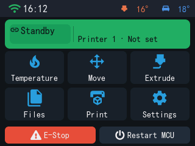
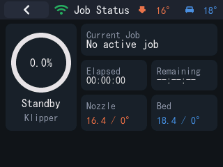
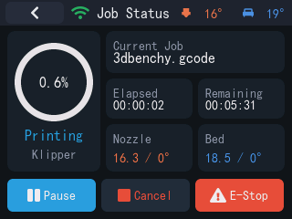
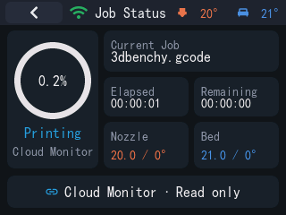
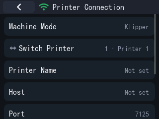
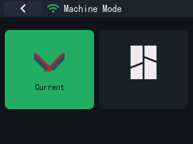
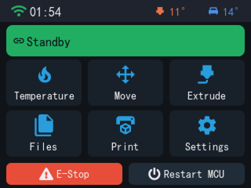
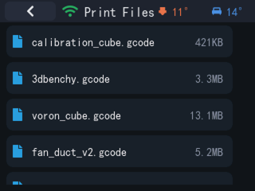
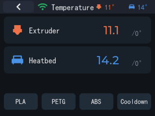
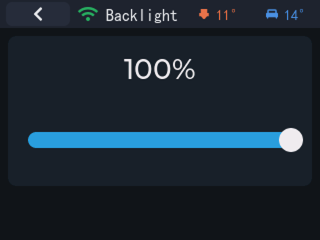

# 界面展示

全部为英文界面截图（当前桌面模拟器，使用隔离的 `KLIPPER_CONFIG_DIR`，320×240 基准分辨率）。截图使用本地 mock 打印机数据，不包含真实账号、设备、IP 或密钥信息。英文和中文导航沿用同一组界面截图。

## 当前桌面端参考截图

下面的旧图库仍可用于查看控制和显示设置；Windows 产品和模拟器文档优先使用上面的当前参考截图。

